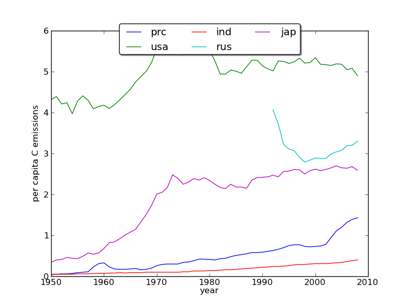
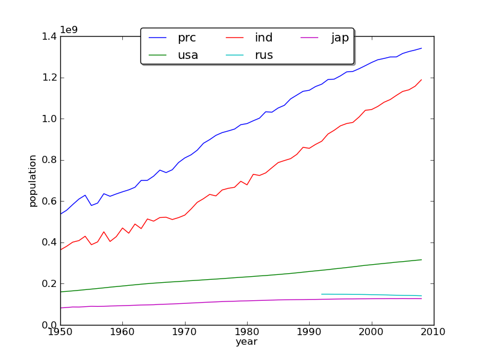
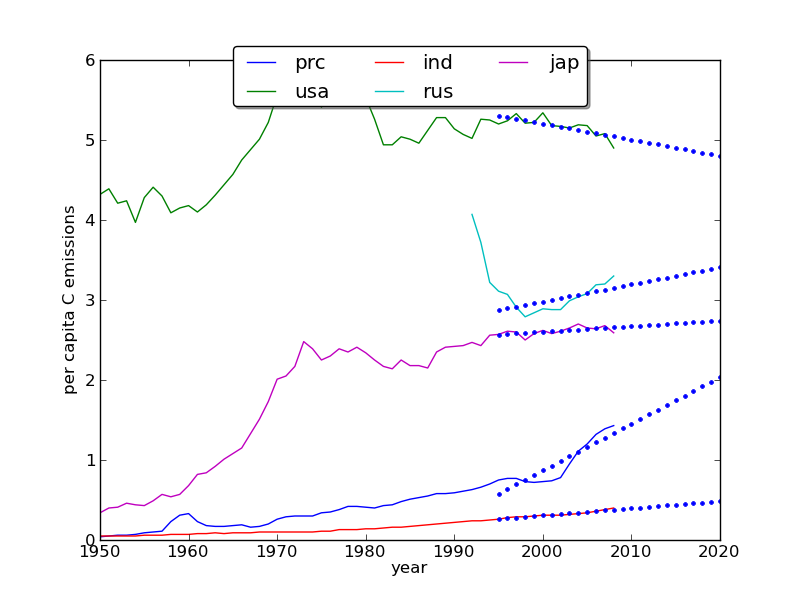

Per capita emissions
====================

The graph below shows that global per capita emissions have not grown greatly since the 1970s.

.. figure:: http://cdiac.ornl.gov/trends/emis/graphics/global.percap.gif
    :align: center
    :target: http://cdiac.ornl.gov/trends/emis/glo.html
    :width: 50%

However, the per capita emissions rates of  some of the top 20 emitting countires has grown rapidly in recent years. For example, for `China, the per capita rate grew from 0.95 in 2003 to 1.43 in 2008 <http://cdiac.ornl.gov/ftp/trends/emissions/prc.dat>`_. At the same time, per capita emissions from the `USA  dropped slightly over that same period <http://cdiac.ornl.gov/ftp/trends/emissions/usa.dat>`_.

::

    import numpy as np
    import pylab as plt
    
    def getfiles(files=['usa.dat','prc.dat'],server='cdiac.ornl.gov',dir='pub/trends/emissions'):
        '''
        Retrieve some files (list) from the directory dir on the ftp server
        '''
        from ftplib import FTP
    
        # get some files from the server
        ftp = FTP(server)
        ftp.login()
        ftp.cwd(dir)
    
        for file in files:
            ftp.retrbinary('RETR '+file,open(file, 'wb').write)
        ftp.quit()
    
    
    files=['prc.dat','usa.dat','ind.dat','rus.dat','jap.dat']
    getfiles(files=files)
    
    data = {}
    population = {}
    # get columns 0,1 and 7 of the file
    # which are Year, Total Fossil-Fuel Emissions (thousand metric tons of carbon)
    # and Per Capita Emission Rate
    # but convert '.' in col 7 to nan (see header of file)
    # skip the 1st 30 rows as comments
    plt.figure(1)
    for file in files:
        data[file] = np.loadtxt(file,skiprows=30,comments='*',usecols=[0,1,7],\
    		converters={7:lambda x:(x=='.' and np.nan) or float(x)})
        # infer population
        population[file] = 1000.*data[file][:,1]/data[file][:,2]
        plt.plot(data[file][:,0],data[file][:,2],'-',label=file.split('.')[0])
    plt.legend(loc='upper center', bbox_to_anchor=(0.5, 1.05),\
    		ncol=3, fancybox=True, shadow=True)
    plt.xlabel('year')
    plt.ylabel('per capita C emissions')
    plt.savefig('figures/perCapitaEmissions.png')
    
    plt.figure(2)
    # plot population
    for file in files:
        plt.plot(data[file][:,0],population[file],'-',label=file.split('.')[0])
    plt.legend(loc='upper center', bbox_to_anchor=(0.5, 1.05),\
                    ncol=3, fancybox=True, shadow=True)
    plt.xlabel('year')
    plt.ylabel('population')
    plt.savefig('figures/population.png')
    
    

**Exercise 1**

Identify those countries in the top twenty emitting nations lists which have increasing trends in
(a) population and (b) per capita emissions rates. Rank them in order.

**Modelling emissions**

::

    # now find the trends in population and per capita emissions rates
    # since 1995
    # and extrapolate to 2020
    
    from scipy import polyval, polyfit
    plt.figure(3)
    
    print '2020 per captia emissions estimates per country (metric tons of carbon per capita)'
    print 'estimate based on linear extrapolation for data from 1995 to 2008'
    
    
    for file in files:
        year = data[file][:,0]
        perCap = data[file][:,2]
        pop = population[file]
        # pick the data for the years we want
        ww = np.where((year >= 1995) * (year <=2008)) 
        # linear interpolation info the 1 can be changed 
        # to provide other orders of polynomial
        (ar,br)=polyfit(year[ww],perCap[ww],1)
        perCapNew = polyval([ar,br],np.arange(1995,2021))
        print file.split('.')[0],perCapNew[-1]
        plt.plot(data[file][:,0],data[file][:,2],'-',label=file.split('.')[0])
        plt.plot(np.arange(1995,2021),perCapNew,'b.')
    
    plt.legend(loc='upper center', bbox_to_anchor=(0.5, 1.05),\
                    ncol=3, fancybox=True, shadow=True)
    plt.xlabel('year')
    plt.ylabel('per capita C emissions')
    plt.savefig('figures/percap2.png')
    
    
    

::

    2020 per captia emissions estimates per country (metric tons of carbon per capita)
    estimate based on linear extrapolation for data from 1995 to 2008
    prc 2.03593406593
    usa 4.80347252747
    ind 0.48589010989
    rus 3.40857142857
    jap 2.74134065934
    

**Exercise 2**

The code above provides linear extrapolation estimates for per captia emissions for the year 2020 based on
data for 1995 to 2008. 

* Adapt the code so that it provides estimates of Total Fossil-Fuel Emissions for 2020 for the top 20 emitting countries, *assuming population does not increase*.
* Adapt the code so that it provides estimates of Total Fossil-Fuel Emissions for 2020 for the top 20 emitting countries, *assuming a linear trend in population*.
* Use these two sets of figures to estimate the impact of population growth on total (global) Fossil-Fuel Emissions for 2020 (i.e. what proiortion of the change in estimated emissions can be attributed to population growth?). You can assume that the proportion of emissions from the top 20 countries remains at 63% if you need that information.
* What impact does the time period over which you perform the linear regression have (e.g. change it to start at 2000)?
* If you have time, you might try to estimate the uncertainty on these estimates.
* Criticise the model developed. What factors might come into play that we have not accounted for here (a starter: global economic conditions; also, have we missed any important countries)?
