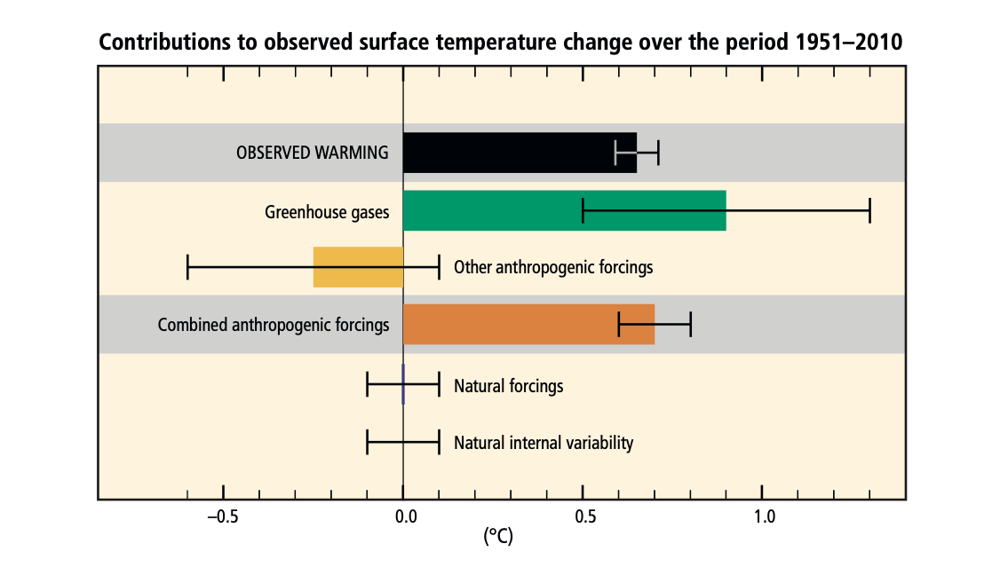
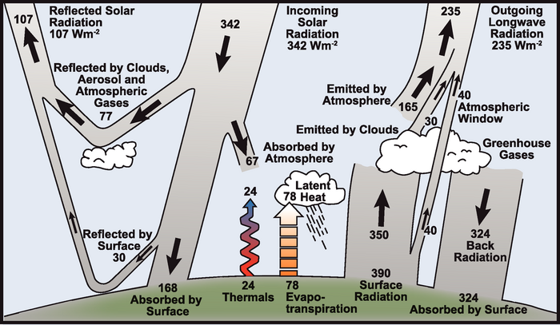
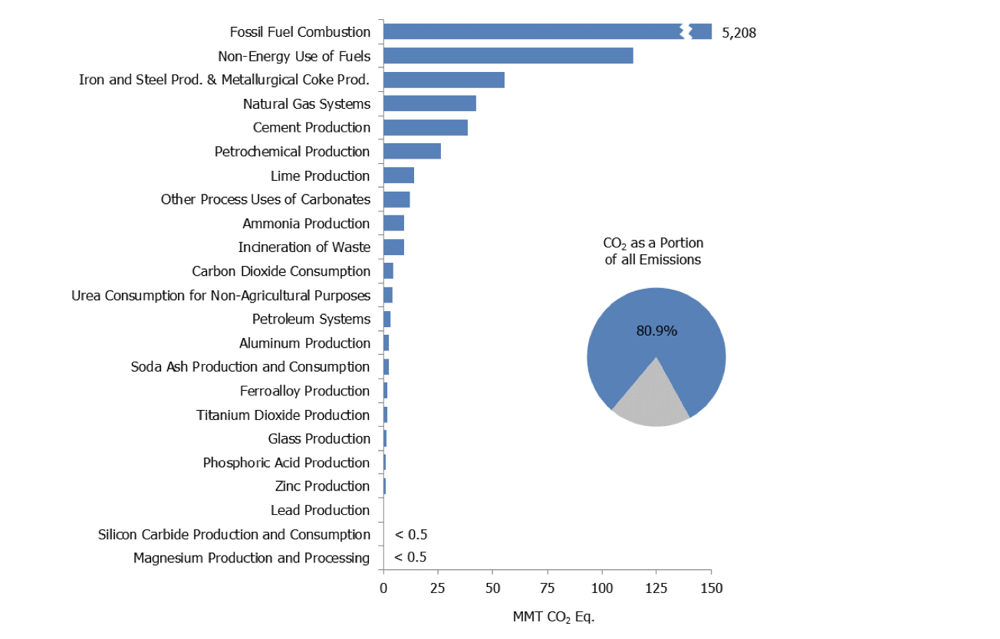
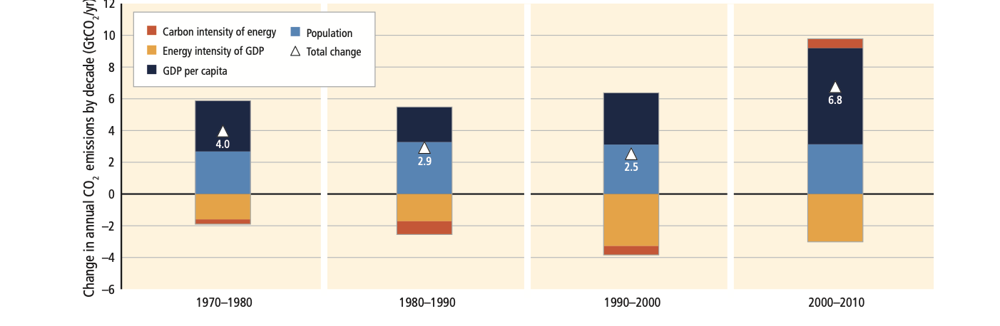
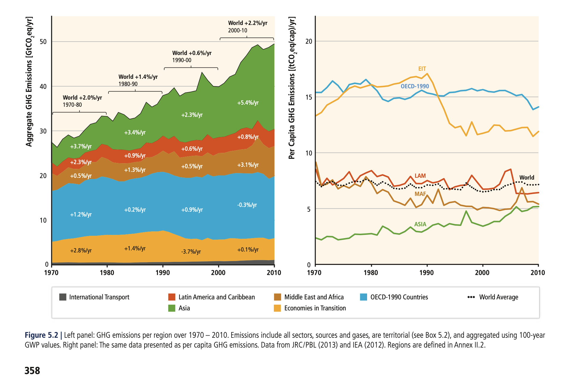
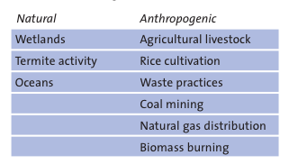

The Terrestrial Carbon Cycle
============================

Purpose of this section
------------------------
This is the first section of the MSc module 'Terrestrial Carbon: modelling and monitoring'. 

Students attending this course come from a range of different disciplines, so the major purpose of this introductory section is to introduce the basic concepts relating to climate and the terrestrial carbon cycle needed for the rest of this course.

In this lecture, we will:

* consider the importance of understanding the science of climate change
* look at basic principles of energy transfer in the earth system
* examine greenhouse gases and their sources

You will need to do a considerable amount of reading as follow-up for this section, as it forms the basis of the rest of the course.

A good place to start is the latest IPCC Synthesis Report (SYR). This is the `Sixth (AR6) <https://www.ipcc.ch/assessment-report/ar6/>`_.

Terrestrial Climate and Climate Change
--------------------------------------

This is a course on Terrestrial Carbon. Why then, of all of the factors affecting climate should we be interested in this?

What we mean by the term 'terrestrial carbon' is the carbon that is stored in the vegetation and soils of the Earth's land surface (so, not that in the oceans or atmosphere for example). The Earth Systems Science view of the climate is that we must maintain a focus on interactions between the different spheres, but we must also understand what processes and interactions go on within each sphere.

Our focus here on terrestrial carbon is mainly because of the major role it plays in anthropogenic climate change. Additional parts of the context of this course are: the role that terrestrial vegetation plays in biodiversity; and the role of vegetation in providing food and fuel.

Human influence on the climate system
~~~~~~~~~~~~~~~~~~~~~~~~~~~~~~~~~~~~~

*"(C)limate change is a defining issue of our generation. Our responses to the challenges of climate change - accurate prediction, equitable adaptation, and efficient mitigation - will influence the quality of life for ... the world, for generations to come."* (`NASA, 2010 <https://github.com/UCL-EO/geog0133/tree/main/docs/pdf/Climate_Architecture_Final.pdf>`_).

.. raw:: html

    

    <i>
     The best estimate of the human-induced contribution to warming is similar to the observed warming over this period (Figure SPM.3).

    Figure SPM.3 | Assessed likely ranges (whiskers) and their mid-points (bars) for warming trends over the 1951–2010 period from well-mixed greenhouse gases, other anthropogenic forcings (including the cooling effect of aerosols and the effect of land use change), combined anthropogenic forcings, natural forcings and natural internal climate variability (which is the element of climate variability that arises spontaneously within the climate system even in the absence of forcings). The observed surface temperature change is shown in black, with the 5 to 95% uncertainty range due to observational uncertainty. The attributed warming ranges (colours) are based on observations combined with climate model simulations, in order to estimate the contribution of an individual external forcing to the observed warming. The contribution from the combined anthropogenic forcings can be estimated with less uncertainty than the contributions from greenhouse gases and from other anthropogenic forcings separately. This is because these two contributions partially compen- sate, resulting in a combined signal that is better constrained by observations. {Figure 1.9}
    

    

    

    </i>

From the IPCC AR5 (synthesis report) we can state:

**Observed changes and their causes** 

* Human influence on the climate system is clear, and recent anthropogenic emissions of greenhouse gases are the highest in history. Recent climate changes have had widespread impacts on human and natural systems.

**Future Climate Changes, Risks and Impacts** 

* Continued emission of greenhouse gases will cause further warming and long-lasting changes in all components of the climate system, increasing the likelihood of severe, pervasive and irreversible impacts for people and ecosystems. Limiting climate change would require substantial and sustained reductions in greenhouse gas emissions which, together with adaptation, can limit climate change risks.

**Future Pathways for Adaptation, Mitigation and Sustainable Dewvelopment**

* Adaptation and mitigation are complementary strategies for reducing and managing the risks of climate change. Substantial emissions reductions over the next few decades can reduce climate risks in the 21st century and beyond, increase prospects for effective adaptation, reduce the costs and challenges of mitigation in the longer term, and contribute to climate-resilient pathways for sustainable development.

**Adaptation and Mitigation**

* Many adaptation and mitigation options can help address climate change, but no single option is sufficient by itself. Effective implementation depends on policies and cooperation at all scales, and can be enhanced through integrated responses that link adaptation and mitigation with other societal objectives.

It is instructive to compare some of the materials between AR4 to AR5. For example, from the IPCC AR4 (synthesis report) we can state that there is `general agreement among scientists <https://archive.ipcc.ch/report/ar4/syr>`_ with regard to the following:

* Global GHG emissions due to human activities have grown since pre-industrial times, with an increase of 70% between 1970 and 2004. 
* Global atmospheric concentrations of CO2, methane (CH4) and nitrous oxide (N2O) have increased markedly as a result of human activities since 1750 and now far exceed pre-industrial values determined from ice cores spanning many thousands of years.
* Most of the observed increase in global average temperatures since the mid-20th century is very likely due to the observed increase in anthropogenic GHG concentrations. It is likely that there has been significant anthropogenic warming over the past 50 years averaged over each continent (except Antarctica). 
* Anthropogenic warming over the last three decades has likely had a discernible influence at the global scale on observed changes in many physical and biological systems. 

Not surprisingly, in AR5 you will find much the same material, but our scientific understanding in many of the processes and/or scientific concensus has strengthened as new studies are preformed and new evidence presented. For example, in AR5, for the attribution of climate changes to human influences we are now able to state "Anthropogenic greenhouse gas emissions have increased since the pre-industrial era, driven largely by economic and population growth, and are now higher than ever. This has led to atmospheric concentrations of carbon dioxide, methane and nitrous oxide that are unprecedented in at least the last 800,000 years. Their effects, together with those of other anthropogenic driv- ers, have been detected throughout the climate system and are extremely likely to have been the dominant cause of the observed warming since the mid-20th century.". In this context, 'extremely likely' means 95-100% confidence.

Advances since the Third Assessment Report (TAR) show that discernible human influences extend beyond average temperature to other aspects of climate. (`IPCC Third Assessment Report <http://www.grida.no/publications/other/ipcc_tar/>`_)

Earth System Science 
~~~~~~~~~~~~~~~~~~~~~

The Earth's climate can be seen as the result of a complex set of process interactions. To be able to rise to the challenges facing us, we need to better understand and monitor the processes governing climate and the ways in which they interact. 

One way of expressing and trying to understand this is through an Earth System Science approach, in which we recognise and stress the importance of interactions in the way we apply science to tackling this. The inclusion of the Anthrosphere (or Anthroposphere) (`the part of the environment that is made or modified by humans for use in human activities and human habitats <http://en.wikipedia.org/wiki/Anthrosphere>`_) is critical for this view of the Earth's climate as a set of interacting spheres of influence.

.. figure:: figures/home_earth_spheres.jpg
    :align: center

.. raw:: html

    

    <i>The 'spheres' of influence on the climate system. Source: <a href="http://www.icess.ucsb.edu/">Institute for Computational Earth System Science(ICESS)</a>
    

    </i>

------------

It is clear then that the climate system and its dynamics are things that we as scientistc need to better understand, particularly as climate change is something that will affect us all in some way or other.

Energy transfer
---------------

Basic Principles
~~~~~~~~~~~~~~~~

.. raw:: html

    

    <i>Midnight sun, Reykjavik, Iceland. </i> (Photo P. Lewis)
    

------------

The Earth's climate is driven by (shortwave) solar radiation. Around 31% of this incoming radiation is reflected by clouds, aerosols and gases in the atmosphere and by the land surface. The remaining 69% is absorbed, with almost 50% of the incoming radiation being absorbed at the Earth surface. 

.. raw:: html

    
    
    <i>"Estimate of the Earth's annual and global mean energy balance. Over the long term, the amount of incoming solar radiation absorbed by the Earth and atmosphere is balanced by the Earth and atmosphere releasing the same amount of outgoing longwave radiation. About half of the incoming solar radiation is absorbed by the Earth's surface. This energy is transferred to the atmosphere by warming the air in contact with the surface (thermals), by evapotranspiration and by longwave radiation that is absorbed by clouds and greenhouse gases. The atmosphere in turn radiates longwave energy back to Earth as well as out to space. <a href="https://github.com/UCL-EO/geog0133/tree/main/docs/pdf/Kiehl_Trenberth_Radiative_Balance_BAMS_1997.pdf">Kiehl and Trenberth (1997).</a>
    

    </i>

------------

The shortwave radiation absorbed at the surface is, in the long term, transferred back to the atmosphere, so that around 69% of the incoming energy flux is re-rediated to space as longwave radiation. 

The energy absorbed at the surface drives thermals (`atmospheric convection <http://www.theweatherprediction.com/habyhints/52>`_) and evapo-transpiration (`latent heat transfer: change of state of water <http://www.fao.org/docrep/x0490e/x0490e04.htm>`_). The rest of the energy balance is maintained by thermal (longwave) radiation emitted by the surface, the atmosphere and clouds. 

As part of the energy cycle illustrated above though, a large proportion of the longwave radiation emitted by the surface is re-radiated back to the surface (and absorbed by the surface) by clouds and so-called greenhouse gases. This mechanism, the 'trapping' of longwave radiation in the atmosphere is what naturally maintains the temperature maintained on Earth -- the 'natural greenhouse effect'. Without this, the temperature at the Earth surface and in the atmosphere would be much less that it presently is: if the Earth were an ideal thermally conductive blackbody (that still reflected around 31% of the incoming shortwave radiation) the effective temperature would be around -19 C to emit the same energy flux required to balance the incoming radiation. 

Atmospheric absorption
~~~~~~~~~~~~~~~~~~~~~~

.. figure:: http://upload.wikimedia.org/wikipedia/commons/7/7c/Atmospheric_Transmission.png
    :align: center
    :target: http://upload.wikimedia.org/wikipedia/commons/7/7c/Atmospheric_Transmission.png
    :width: 75%

.. raw:: html

    
<i>Radiation transmitted by the atmosphere at shortwave and longwave wavelengths</i>

------------

The figure above shows the major absorbing (and scattering, other than aerosols) constituents of the atmosphere for shortwave and longwave wavelengths and their impact on atmospheric transmission. 

Obviously the atmospheric transmission depends on the concentrations of these constituents, but the figures given might be taken as typical. In the Ultraviolet, Ozone is primarily responsible for solar radiation absorption. At visible wavelengths, the main factors are Rayleigh scattering and aerosols. At thermal wavelengths, water vapour and CO2 are the most important constituents. 

`Clouds <http://earthobservatory.nasa.gov/Features/Clouds/>`_ also affect atmospheric transmission. Low, thick cloud primarily reflect shortwave radiation, whereas high thin clouds allow most shortwave radiation through but absorb longwave radiation.

`Aerosols <http://earthobservatory.nasa.gov/Features/Aerosols/page3.php>`_ have a range of complicated effects on radiation. Whilst many aerosols such as sulfates and nitrates reflect most shortwave radiation, black carbon absorbs most of it. Another important role of aerosols is to act as `cloud condensation nuclei <https://www.sciencedirect.com/topics/earth-and-planetary-sciences/cloud-condensation-nucleus>`_ which enable water vapour in the atmosphere to condense and coalesce. Interesting biogenic sources include volatile organic compounds (VOCs) and other materials emitted from forests (`Spracklen et al., 2008 <http://rsta.royalsocietypublishing.org/content/366/1885/4613.full>`_). 

Radiative Forcing
~~~~~~~~~~~~~~~~~

Radiative forcing (RF) is a measure of the *radiative* impact of components of the climate system (e.g. Greenhouse Gases (GHGs)) in terms of a warming impact (if positive). Formally, it is "a measure of the influence a factor has in altering the balance of incoming and outgoing energy in the Earth-atmosphere system and is an index of the importance of the factor as a potential climate change mechanism. ... radiative forcing values are for changes relative to preindustrial conditions defined at 1750 and are expressed in watts per square meter (W/m^2)." (`IPCC AR4 Synthesis Report <https://archive.ipcc.ch/publications_and_data/ar4/syr/en/main.html>`_). (see also `"AR5 Climate Change 2013: Working Group I: The Physical Science Basis, Chapter 8: Anthropogenic and Natural Radiative Forcing" <https://www.ipcc.ch/site/assets/uploads/2018/02/WG1AR5_Chapter08_FINAL.pdf>`_). The related concept of Effective Radiative Forcing (ERF), the "change in net TOA downward radiative flux after allowing for atmospheric temperatures, water vapour and clouds to adjust, but with surface temperature or a portion of surface conditions unchanged" (WG1AR5 Chapter08, Box 8.1).

Various important conclusions of IPCC AR5 are phrased in terms of (E)RF. For example:

* The total anthropogenic ERF over the Industrial Era is positive, with a value of 2.3 (1.1 to 3.3) W m–2.
* The best estimate of RF due to total solar irradiance (TSI) changes representative for the 1750 to 2011 period is 0.05 (to 0.10) W m–2. This is substantially smaller than the AR4 estimate. The contrast between this and the anthropogenic ERF stress the role of anthropogenic influence. 
* Due to increased concentrations, RF from WMGHGs (Well-mixed GHGs, CO2, CH4, N2O, SF6) has increased by 0.20 (0.18 to 0.22) W m–2 (8%) since the AR4 estimate for the year 2005
* The net forcing by WMGHGs other than CO2 shows a small increase since the AR4 estimate for the year 2005
* Ozone and stratospheric water vapour contribute substantially to RF.
* There is robust evidence that anthropogenic land use change has increased the land surface albedo, which leads to an RF of –0.15 ± 0.10 W m–2
* The RF of volcanic aerosols is well understood and is greatest for a short period (~2 years) following volcanic eruptions. 
* There is very high confidence that industrial-era natural forcing is a small fraction of the anthropogenic forcing except for brief periods following large volcanic eruptions. 

`Rockstrom et al. (2009) <http://www.nature.com/nature/journal/v461/n7263/full/461472a.html>`_ propose that "human changes to atmospheric CO2 concentrations should not exceed 350 parts per million by volume, and that radiative forcing should not exceed 1 watt per square metre above pre-industrial levels. Transgressing these boundaries will increase the risk of irreversible climate change, such as the loss of major ice sheets, accelerated sea- level rise and abrupt shifts in forest and agricultural systems. Current CO2 concentration stands at 387 p.p.m.v. and the change in radiative forcing is 1.5 W m^-2"

  .. figure:: figures/rf.png
    :align: center
    :width: 75%

  .. raw:: html

   
<i> "Radiative forcing of climate change during the industrial era (1750–2011). Bars show radiative forcing from well-mixed greenhouse gases (WMGHG), other anthropogenic forcings, total anthropogenic forcings and natural forcings. The error bars indicate the 5 to 95% uncertainty. Other anthropogenic forcings include aerosol, land use surface reflectance and ozone changes. Natural forcings include solar and volcanic effects. The total anthropogenic radiative forcing for 2011 relative to 1750 is 2.3 W/m2 (uncertainty range 1.1 to 3.3 W/m2). This corresponds to a CO2-equivalent concentration (see <a href="https://www.ipcc.ch/site/assets/uploads/2018/02/AR5_SYR_FINAL_Annexes.pdf">Glossary</a>) of 430 ppm (uncertainty range 340 to 520 ppm). {Data from WGI 7.5 and Table 8.6}"</i>

The figure below from IPCC AR5 gives global mean radiative forcings (and 95% confidence intervals (CIs)) for some of the most significant GHGs and other components of the system. We see that the most significant anthropogenic positive RF term is CO2 followed by CH4, Tropospheric O3, Halocarbons, NO2, (natural) Solar irradiance variations, and black carbon effects on snow (lowering snow albedo). On the other hand, there are significant negative RF effects from aerosols (both directly in increasing the shortwave atmospheric albedo and indirectly through increasing cloud cover and cloud albedo) and surface albedo effects due to land use change (increasing albedo, e.g. through deforestation). 

 .. figure:: figures/Global-mean-radiative-forcings-ar5.png
    :align: center
    :width: 75%

.. raw:: html

    
<i> "Bar chart for RF (hatched) and ERF (solid) for the period 1750–2011, where the total ERF is derived from Figure 8.16. Uncertainties (5 to 95% confidence range) are given for RF (dotted lines) and ERF (solid lines)." </i> 

------------

 .. figure:: figures/erf_ar5.png
    :align: center
    :width: 75%

.. raw:: html

    
<i> "Figure 8.16 | Probability density function (PDF) of ERF due to total GHG, aerosol forcing and total anthropogenic forcing. The GHG consists of WMGHG, ozone and stratospheric water vapour. The PDFs are generated based on uncertainties provided in Table 8.6. The combination of the individual RF agents to derive total forcing over the Industrial Era are done by Monte Carlo simulations and based on the method in Boucher and Haywood (2001). PDF of the ERF from surface albedo changes and combined con- trails and contrail-induced cirrus are included in the total anthropogenic forcing, but not shown as a separate PDF. We currently do not have ERF estimates for some forcing mechanisms: ozone, land use, solar, etc. For these forcings we assume that the RF is representative of the ERF and for the ERF uncertainty an additional uncertainty of 17% has been included in quadrature to the RF uncertainty. See Supplementary Material Sec- tion 8.SM.7 and Table 8.SM.4 for further description on method and values used in the calculations. Lines at the top of the figure compare the best estimates and uncertainty ranges (5 to 95% confidence range) with RF estimates from AR4." </i> 

------------

Carbon in the Earth System
--------------------------

Carbon, its name deriving from the Latin *carbo* for charcoal, is the `4th most abundant element in the universe <http://earthobservatory.nasa.gov/Features/CarbonCycle/>`_. It is able to bond with itself and many other elements and forms over 10 million known compounds. It is present in the atmosphere as carbon dioxide (CO2) and other compounds such as methane (CH4), in all natural waters as dissolved CO2, in various carbonates in rocks, and as organic molecules in living and dead organisms in the biosphere (`Encyclopedia of Earth <https://editors.eol.org/eoearth/wiki/Carbon_cycle>`_). We have seen above that carbon is also important in radiative forcing directly in terms of `Halocarbons <http://archive.ipcc.ch/publications_and_data/ar4/wg1/en/ch2s2-3-4.html>`_ in the atmosphere and `black carbon deposits on snow <http://archive.ipcc.ch/publications_and_data/ar4/wg1/en/ch2s2-5-4.html>`_, as well as indirectly elsewhere (e.g. `land cover change <http://archive.ipcc.ch/publications_and_data/ar4/wg1/en/ch2s2-5-4.html#2-5-5>`_).

Aerosol (E)RF is generally negative, although evidence is presented in AR5 for changing spatial patterns of RF (`IPCC WG1 Ch 8 <https://www.ipcc.ch/site/assets/uploads/2018/02/WG1AR5_Chapter08_FINAL.pdf>`_)

Atmospheric Carbon and Greenhouse Gases
~~~~~~~~~~~~~~~~~~~~~~~~~~~~~~~~~~~~~~~~

`Blasing (2016) "Recent Greenhouse Gas Concentrations" <https://cdiac.ess-dive.lbl.gov/pns/current_ghg>`_ provides a table of greenhouse gases and their recent and pre-industrial atmospheric concentrations. It also provides an indication of the 'Greenhouse Warming Potential (GWP)', atmospheric lifetime and radiative forcing of the various gases. GWP is a measure of the radiative effects of emissions of greenhouse gases relative to an equal mass of CO2 emissions (so the GWP for CO2 is 1). We see that methane have a significantly higher GWP (25) over a 100 year horizon than CO2 but a shorter residency in the atmosphere.

GWP can be a useful tool, for instance for considering mitigation strategies, but it should be noted that various emission-based metrics of this nature can be used, and it is important to consider the time period over which the measure is considered (`Box 3.2, AR5 <https://www.ipcc.ch/site/assets/uploads/2018/02/SYR_AR5_FINAL_full.pdf>`)

.. figure:: https://www.esrl.noaa.gov/gmd/aggi/aggi.fig2.png
    :align: center
    :target: http://www.esrl.noaa.gov/gmd/aggi/
    :width: 75%

.. raw:: html

    

    <i>
    "Global average abundances of the major, well-mixed, long-lived greenhouse gases - carbon dioxide, methane, nitrous oxide, CFC-12 and CFC-11 - from the NOAA global air sampling network are plotted since the beginning of 1979. These gases account for about 96% of the direct radiative forcing by long-lived greenhouse gases since 1750. The remaining 4% is contributed by an assortment of 15 minor halogenated gases (see text). Methane data before 1983 are annual averages from Etheridge et al. (1998), adjusted to the NOAA calibration scale [Dlugokencky et al., 2005]." This source: <a href="http://www.esrl.noaa.gov/gmd/aggi/">THE NOAA ANNUAL GREENHOUSE GAS INDEX (AGGI)</a>.
    

    </i>

------------

The figure above shows global abundances of CO2, CH4, N2O and major GHG chlorofluorocarbons (CFCs) in the atmosphere since 1979. 

The temporal pattern of atmospheric CO2 shows a significant annual cycle, with a peak in Northern latitude Spring and a trough in Autumn.

.. figure:: http://www.esrl.noaa.gov/gmd/webdata/ccgg/trends/co2_trend_mlo.png
    :align: center
    :target: http://www.esrl.noaa.gov/gmd/ccgg/trends/
    :width: 50%
    

.. raw:: html

    

    <i>
    "The graph shows recent monthly mean carbon dioxide measured at Mauna Loa Observatory, Hawaii.

    The last four complete years of the Mauna Loa CO2 record plus the current year are shown. Data are reported as a dry air mole fraction defined as the number of molecules of carbon dioxide divided by the number of all molecules in air, including CO2 itself, after water vapor has been removed. The mole fraction is expressed as parts per million (ppm). Example: 0.000400 is expressed as 400 ppm.

    In the above figure, the dashed red line with diamond symbols represents the monthly mean values, centered on the middle of each month. The black line with the square symbols represents the same, after correction for the average seasonal cycle. The latter is determined as a moving average of SEVEN adjacent seasonal cycles centered on the month to be corrected, except for the first and last THREE and one-half years of the record, where the seasonal cycle has been averaged over the first and last SEVEN years, respectively.

    The last year of data are still preliminary, pending recalibrations of reference gases and other quality control checks. The Mauna Loa data are being obtained at an altitude of 3400 m in the northern subtropics, and may not be the same as the globally averaged CO2 concentration at the surface. 
    </i>Source: <a href="http://www.esrl.noaa.gov/gmd/ccgg/trends/">NOAA ESRL</a> 

------------

`Carbon dioxide <https://www.epa.gov/ghgemissions/overview-greenhouse-gases>`_ is emitted as part of the carbon cycle and by anthropgenic activities such as the burning of fossil fuels. We will deal with the carbon cycle below, but briefly examine direct anthropogenic emissions here. 

.. raw:: html

    

    <i>a breakdown of sources of CO2 emissions in the U.S. in 2014.
    </i> Source <a href="https://www.epa.gov/sites/production/files/2017-04/documents/us-ghg-inventory-2016-main-text.pdf">EPA, 2016, Inventory of U.S. Greenhouse Gas Emissions and Sinks: 1990 – 2014</a>
    

------------

By far the largest direct anthropogenic source of CO2 emissions is fossil fuel combustion, which is in turn driven by economic and population growth (`AR5 p.5 <https://www.ipcc.ch/site/assets/uploads/2018/02/SYR_AR5_FINAL_full.pdf>`).

.. raw:: html

    

    <i>
    Figure 1.8 | Decomposition of the change in total annual carbon dioxide (CO2) emissions from fossil fuel combustion by decade and four driving factors: population, income (gross domestic product, GDP) per capita, energy intensity of GDP and carbon intensity of energy. The bar segments show the changes associated with each individual factor, holding the respective other factors constant. Total emission changes are indicated by a triangle. The change in emissions over each decade is measured in gigatonnes of CO2 per year (GtCO2/yr); income is converted into common units, using purchasing power parities. {WGIII SPM.3}
    </i>
    

The figure below shows estimated global total CO2 emissions since 1750, by world region.

.. raw:: html

    <iframe src="https://ourworldindata.org/grapher/annual-co-emissions-by-region?time=earliest..2018" loading="lazy" style="width: 100%; height: 600px; border: 0px none;"></iframe>

------------

.. raw:: html

    Looking at more recent years (post 1970) (<a href="https://www.ipcc.ch/site/assets/uploads/2018/02/ipcc_wg3_ar5_chapter5.pdf">Fig 5.2 p.358, AR5 WG3, Chapter 5</a>) emphasises how this is in some ways tied to population, in that global per capita emissions are relatively constant over the last 50 years. Such broad-scale analysis however hides many regional disparities and trends.

------------

`Methane <https://www.epa.gov/gmi/importance-methane>`_ arises from both natural and anthrogenic sources. 
The annual cycles seen in the figure above are attributed to removal by the hydroxyl radical OH (`ECI, Oxford, "Climate science of methane. <http://www.eci.ox.ac.uk/research/energy/downloads/methaneuk/chapter02.pdf>`_) which is the major mechanism for the breakdown of CH4 in the troposphere.

.. raw:: html

    

    <i>Sources of global methane emissions</i>. This source <a href="http://www.eci.ox.ac.uk/research/energy/downloads/methaneuk/chapter02.pdf">Climate science of methane</a>. See also: <a href="http://www.eci.ox.ac.uk/research/energy/downloads/methaneuk/chapter01.pdf">Methane and climate change</a>.
    

------------

Anthropogenic activity accounts for around 44-53% of N2O, with tropical soils and oceanic release account for the majority of the remainder (`Davidson and Kanter, 2014 <https://iopscience.iop.org/article/10.1088/1748-9326/9/10/105012/pdf>`_).

Whilst natural sources of halocarbons exist, their use as refrigerants, propellants and solvents since the early to middle twentieth century is mainly responsible for the current atmospheric concentrations (`Butler et al. (1999) <http://www.nature.com/nature/journal/v399/n6738/pdf/399749a0.pdf>`_).  `Halocarbons <http://en.wikipedia.org/wiki/Halocarbon>`_ (especially chlorofluorocarbons CFC-12 and CFC-11) have been of major concern for their role in RF (among other impacts) although levels of these are mainly now controlled under the `Montreal Protocol on substances that deplete the Ozone Layer <https://ozone.unep.org/treaties/montreal-protocol>`_ (see also `AR4 Climate Change 2007: Working Group I: The Physical Science Basis, 2.3.4 Montreal Protocol Gases <http://archive.ipcc.ch/publications_and_data/ar4/wg1/en/ch2s2-3-4.html>`_). Despite control, their continued presence in the atmosphere is of continuing concern for `Ozone depletion <https://www.unep.org/news-and-stories/video/unep-executive-director-message-world-ozone-day-2020>`_ as well as their role as GHGs.  

Terrestrial Carbon
~~~~~~~~~~~~~~~~~~

This is a course on Terrestrial Carbon. Why then, of all of the factors affecting climate should we be interested in this? 

What we mean by the term 'terrestrial carbon' is the carbon that is stored in the vegetation and soils of the Earth's land surface (so, not that in the oceans or atmosphere for example). The Earth Systems Science view of the climate is that we must maintain a focus on interactions between the different spheres, but we must also understand what processes and interactions go on within each sphere. 

Our focus here on terrestrial carbon is mainly because of the major role it plays in anthropogenic climate change. Additional parts of the context of this course are: the role that terrestrial vegetation plays in biodiversity; and the role of vegetation in providing food and fuel.

To understand the role of carbon in the earth system, we must gain some understanding of the general processes at work. We will consider first the biogeochemichal (concentrating on carbon), and then biogeophysical (albedo and evapotranspiration) processes in the following sections.

Summary
-------

In this lecture, we have:

* considered the importance of understanding the science of climate change
* looked at basic principles of energy transfer in the earth system
* examined greenhouse gases and their sources

Reading for this lecture
------------------------

This course cannot cover all aspects of climate science and related biological, chemical and physical/meteorological aspects in great detail. The emphasis of the course is on students developing an understanding of monitoring and modelling terrestrial carbon, so we provide only a brief overview of other aspects.

For further reading, some references are provided. Students are encouraged to fill the gaps in their knowledge in other areas using:

* Monteith, J.L. and Unsworth, M., (2007), `Principles of Environmental Physics <http://www.amazon.co.uk/Principles-Environmental-Physics-John-Monteith/dp/0125051034/ref=sr_1_1?ie=UTF8&qid=1325699791&sr=8-1>`_, Academic Press
* `AIP essay on Simple Models of Climate Change <https://history.aip.org/climate/simple.htm>`_
* Grace, J., (2001) Carbon Cycle, in *Encyclopedia of Biodiversity*, Vol. 1, Academic Press
* `Stevens, A. (2011) Introduction to the Basic Drivers of Climate. Nature Education Knowledge 2(2):6 <http://www.nature.com/scitable/knowledge/library/introduction-to-the-basic-drivers-of-climate-13368032>`_
* `Stevens, A. N. (2011) Factors Affecting Global Climate. Nature Education Knowledge 2(1):5 <http://www.nature.com/scitable/knowledge/library/factors-affecting-global-climate-17079163>`_

Texts of particular importance to this lecture are:

* IPCC Sixth Assessment Report: `Working Group I: The Physical Science Basis <https://www.ipcc.ch/report/sixth-assessment-report-working-group-i>`_ 
* `Radiative forcing <https://www.nap.edu/download/11175>`_
* Friedlingstein et al 2023 `Global Carbon Budget 2023 <https://essd.copernicus.org/articles/15/5301/2023/>`_
* Carbonbrief: `AR6 Q&A <https://www.carbonbrief.org/in-depth-qa-the-ipccs-sixth-assessment-report-on-climate-science>`_
* AR6 `Technical summary <https://www.ipcc.ch/report/ar6/wg1/downloads/report/IPCC_AR6_WGI_TS.pdf>`_
* Myhre, G., D. Shindell, F.-M. Bréon, W. Collins, J. Fuglestvedt, J. Huang, D. Koch, J.-F. Lamarque, D. Lee, B. Mendoza, T. Nakajima, A. Robock, G. Stephens, T. Takemura and H. Zhang, 2013: `Anthropogenic and Natural Radiative Forcing <https://www.ipcc.ch/site/assets/uploads/2018/02/WG1AR5_Chapter08_FINAL.pdf>`_. In: Climate Change 2013: The Physical Science Basis. Contribution of Working Group I to the Fifth Assessment Report of the Intergovernmental Panel on Climate Change [Stocker, T.F., D. Qin, G.-K. Plattner, M. Tignor, S.K. Allen, J. Boschung, A. Nauels, Y. Xia, V. Bex and P.M. Midgley (eds.)]. Cambridge University Press, Cambridge, United Kingdom and New York, NY, USA.
* Rockstrom, Johan; Steffen, Will; Noone, Kevin; Persson, Asa; Chapin, F. Stuart; Lambin, Eric F.; et al., TM; Scheffer, M et al. (2009). `"A safe operating space for humanity". Nature 461 (7263): 472-475. doi:10.1038/461472a <http://www.nature.com/nature/journal/v461/n7263/full/461472a.html>`_
* FAO `Global Forest Resource Assessment 2020  <http://www.fao.org/forest-resources-assessment/2020>`_

You should also explore the `IPCC interactive atlas <https://interactive-atlas.ipcc.ch/>`_
