The Carbon Cycle
============================

Introduction
----------------

In this section, we will:

* look in detail at the terrestrial carbon cycle
* provide an overview of relevant biogeochemical processes

The Carbon Cycle
----------------

.. figure:: https://earthobservatory.nasa.gov/ContentFeature/CarbonCycle/images/carbon_cycle.jpg
    :align: center
    :target: https://earthobservatory.nasa.gov/Features/CarbonCycle/
    :width: 75%

.. raw:: html

    

    <i>"This diagram of the fast carbon cycle shows the movement of carbon between land, atmosphere, and oceans. Yellow numbers are natural fluxes, and red are human contributions in gigatons of carbon per year. White numbers indicate stored carbon. Diagram adapted from U.S. DOE, <a href="http://genomicscience.energy.gov/">Biological and Environmental Research Information System.</a>)"</i>. Source: <a href="http://earthobservatory.nasa.gov/Features/CarbonCycle/">NASA Earth Observatory</a> </i> 

------------

The carbon cycle describes the flow of carbon between resevoirs in the Earth system. The largest pools of carbon are fossil carbon, deep ocean and reactive sediments, soil carbon, carbon at the ocean surface, and that in the atmosphere. After these comes that stored in plant biomass. Processes of photosynthesis, respiration and decomposition, as well as gas interchange at the ocean surface move carbon between the different pools. On top of that, we have the impact of anthropogenic emissions, which as we have seen above is injecting around 9 (8.749 using the 2008 figures above) Gigatons of carbon a year into the atmosphere from fossil fuel combustion.

A small aside on units:

8.749 * 3.667 * 1000 = 32082.6 Tg CO2 equivalent which is the figure quoted above. See `CDIAC information on reporting units for details <https://cdiac.ess-dive.lbl.gov/units.html>`_). Using 5.137 x 1018 kg as the mass of the atmosphere (Trenberth, 1981 JGR 86:5238-46), 1 ppmv of CO2 = 2.13 Gt of carbon (`CDIAC FAQ <https://cdiac.ess-dive.lbl.gov/pns/faq.html>`_). So, 8.749 Gt of carbon is equivalent to 4.11 ppmv of CO2. 

.. figure:: http://www.esrl.noaa.gov/gmd/webdata/ccgg/trends/co2_data_mlo_anngr.png
    :align: center
    :target: http://www.esrl.noaa.gov/gmd/ccgg/trends/
    :width: 50%

.. raw:: html

    

    <i>"Annual Mean Growth Rate for Mauna Loa, Hawaii"</i>. This source: <a href="http://www.esrl.noaa.gov/gmd/ccgg/trends/">NOAA Trends in Atmospheric Carbon Dioxide</a>.
    

------------

The annual mean growth rate of CO2 in the atmosphere is currently over 2 ppmv of CO2, from which it can be inferred that just over 2 ppmv of CO2 must enter other fast pools of carbon.

------------

A view of the carbon cycle with more detail, from the `IPCC AR5 <https://www.ipcc.ch/site/assets/uploads/2018/02/Fig6-01-2.jpg>`_ is:

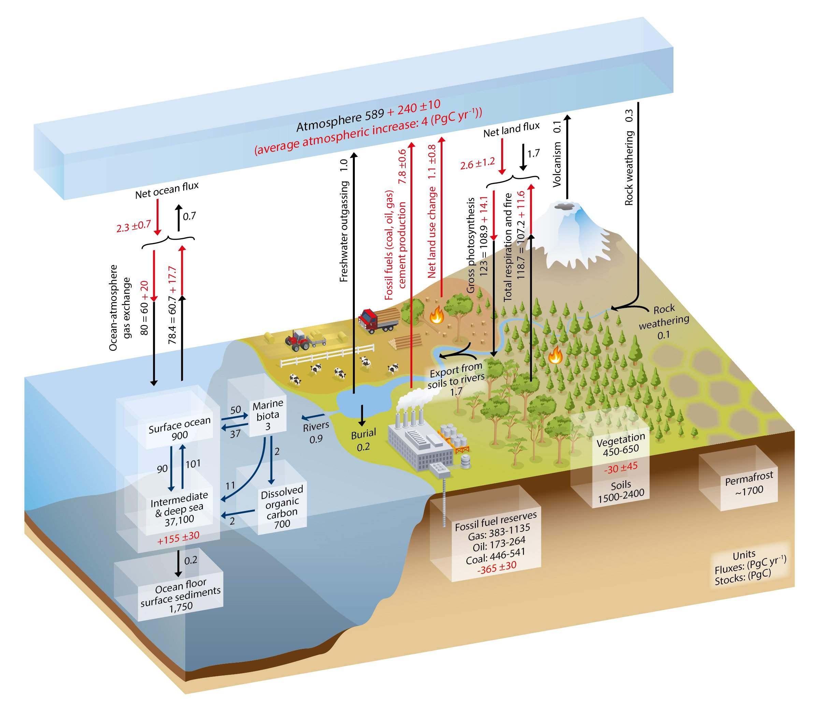

.. raw:: html

    

    <i>"Simplified schematic of the global carbon cycle. Numbers represent reservoir mass, also called ‘carbon stocks’ in PgC (1 PgC = 1015 gC) and annual carbon exchange fluxes (in PgC yr–1). Black numbers and arrows indicate reservoir mass and exchange fluxes estimated for the time prior to the Industrial Era, about 1750. Red arrows and numbers indicate annual ‘anthropogenic’ fluxes averaged over the 2000–2009 time period. These fluxes are a perturbation of the carbon cycle during Industrial Era post 1750. The uptake of anthropogenic CO2 by the ocean and by terrestrial ecosystems, often called ‘carbon sinks’ are the red arrows part of Net land flux and Net ocean flux. Red numbers in the reservoirs denote cumulative changes of anthropogenic carbon over the Industrial Period 1750–2011. By convention, a positive cumulative change means that a reservoir has gained carbon since 1750. Uncertainties are reported as 90% confidence intervals."</i>
    

------------

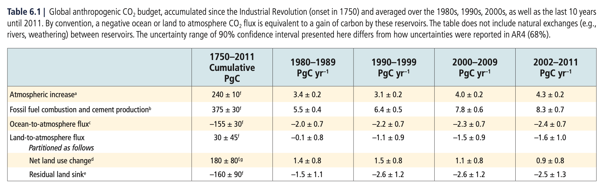

.. raw:: html

    

    <i>"Global anthropogenic CO2 budget, accumulated since the Industrial Revolution (onset in 1750) and averaged over the 1980s, 1990s, 2000s, as well as the last 10 years until 2011. By convention, a negative ocean or land to atmosphere CO2 flux is equivalent to a gain of carbon by these reservoirs. The table does not include natural exchanges (e.g., rivers, weathering) between reservoirs. The uncertainty range of 90% confidence interval presented here differs from how uncertainties were reported in AR4 (68%)."</i>
    

------------

The increase in atmospheric CO2 is around 4.3 (+/- 0.2) PgCy^-1 (2002-2011 figures). The table above shows how this is partitioned from the main sources and sinks. Despite being the smallest flux, the Land-to-atmosphere flux has the largest uncertainty. Note that the 'Residual land sink' is calculated to balance the budget, rather than being a direct caclulation.

Uncertainties
~~~~~~~~~~~~~

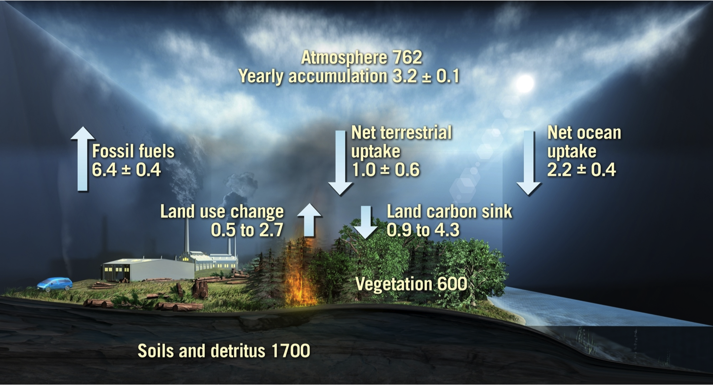

.. raw:: html

    

    <i>Figure showing information from above table for the global carbon cycle for thr 1990, figures in Gt carbon yr-1"
    </i>Source: S. Quegan, BIOMASS: ESA User Consultation Meeting, Lisbon, Portugal, 20-21 Jan 2009
    

------------

The figure above illustrate what is currently known about both the magnitudes and uncertainties of what the global carbon cycle fluxes were in the 1990s. The increase in atmospheric carbon is less than that emitted from burning fossil fuels as discussed above. The balance is made up of net flows to the ocean and land. The largest uncertainty is in the net terrestrial uptake even though this is the smallest component of the flux. The land sink involves emissions from fire and land use change and a land carbon sink which has the greatest uncertainty of the sub components(0.9 to 4.3 Gt carbon yr-1). Estimates stocks of land carbon are also shown, which indicate a terrestrial vegetation pool of around 600 Gt of carbon (similar order of magnitude to that in the atmosphere) and a much larger but less mobile (on decadal to annual time scales) soil and detritus pool. 

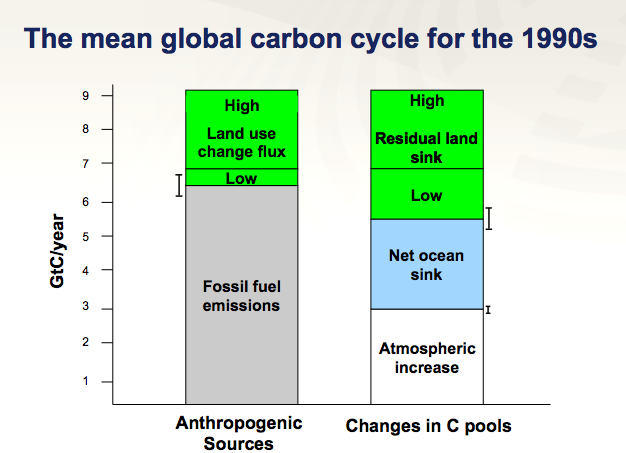

.. raw:: html

    

    <i> This figure shows current estimates of the carbon cycle for the 1990s. Where available, error bars are given. The cycle is a balance between emissions from anthropogenic sources and changes in the pools of the components of the carbon cycle. The anthropogenic source list is incomplete here as it does not include land use change (mainly tropical deforestation). The AR4 contains no estimate of uncertainty on this (figures above), just a range. The figures illustrated here show both the 'low' estimate of land use change fluxes, implying a low(ish) residual carbon sink, and the 'high' estimates, implying a high residual sink. The large 'uncertainty' (range of estimates) for the land use change flux therefore dominate the total error budgets. The residual sink term is mainly implied from estimates of the land use change term, although this certainly contains some uptake into global biomass.
    </i>Source: S. Quegan, BIOMASS: ESA User Consultation Meeting, Lisbon, Portugal, 20-21 Jan 2009
    

------------

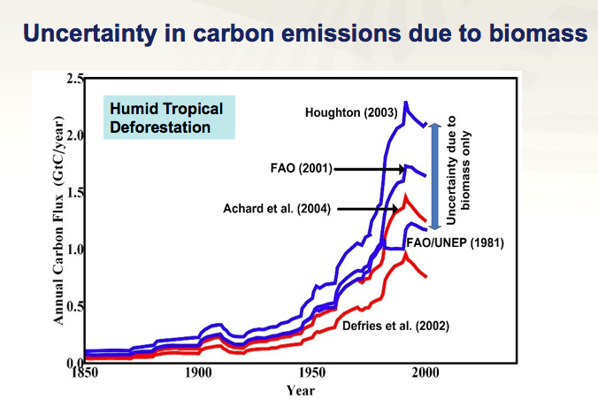

.. raw:: html

    

    <i> This figure gives an indication of the uncertainty in carbon emissions that is due to uncertainty in knowledge of biomass (ca. 1 Gt carbon yr-1) due to the way in which biomass and land use change fluxes are currently calculated
    </i>Source: S. Quegan, BIOMASS: ESA User Consultation Meeting, Lisbon, Portugal, 20-21 Jan 2009
    

------------

The figure below shows net and gross CO2 fluxes from the land, separating these into Agriculture, Forestry and Other Land Use (AFOLU) and indirect emissions and removals. The uncertainty on the gross indirect fluxes is particularly high. The total net land flux (removal) is currently estimated to be on average (2007-2016) around 6.0 +/- 2.0 GtCO2y^-1  (`AR5 <https://www.ipcc.ch/srccl/chapter/chapter-2/>`_). One ton of carbon equals 3.67 tons of carbon dioxide, so this equates to 1.63 +/- 0.54 GtCy-1.

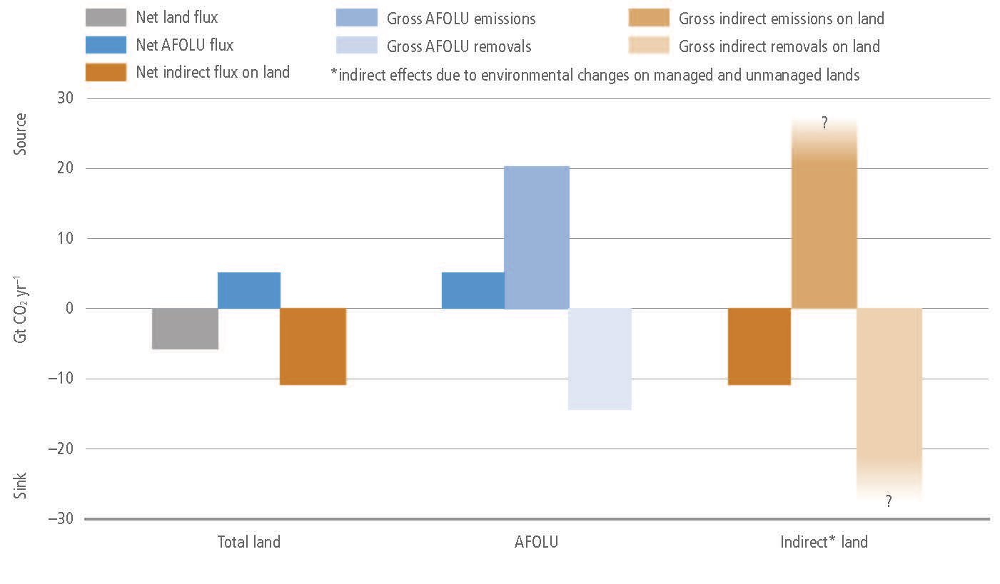

.. raw:: html

    

    <i>
    Net and gross fluxes of CO2 from land (annual averages for 2008–2017).Left: The total net flux of CO2 between land and atmosphere (grey) is shown with its two component fluxes, (i) net AFOLU emissions (blue), and (ii) the net land sink (brown), due to indirect environmental effects and natural effects on managed and unmanaged lands. Middle: The gross emissions and removals contributing to the net AFOLU flux. Right: The gross emissions and removals contributing to the land sink
    

    

    </i>
    

Trying to reconcile the net land sink is complicated then, partly because of the large and competing components and also through a lack of real constraint on indirect fluxes. Further, even though countries report their annual AFOLU (and other) fluxes to the UN (GHG inventory), these are currently quite different from other estimates of the fluxes, from modelling or from bookkeeping models:

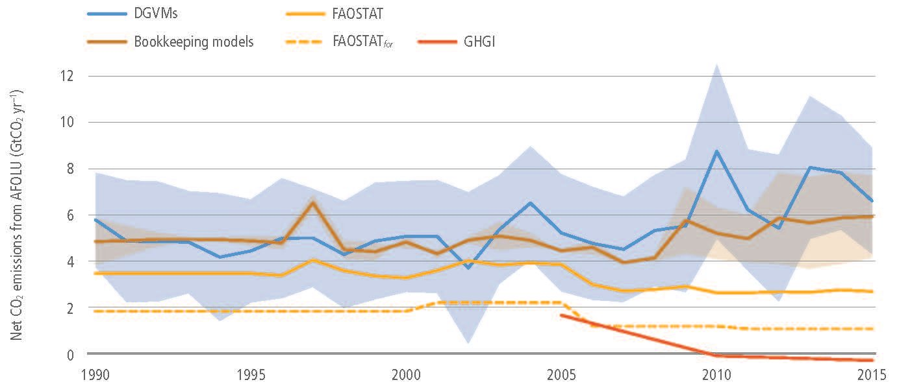

.. raw:: html

    

    <i>
    Global net CO2 emissions due to AFOLU from different approaches (in GtCO2 yr–1).Brown line: the mean and individual estimates (brown shading) from two bookkeeping models (Houghton and Nassikas 2017; Hansis et al. 2015). Blue line: the mean from DGVMs run with the same driving data with the pale blue shading showing the ±1 standard deviation range. Yellow line: data downloaded from FAOSTAT website (Tubiello et al. 2013576); the dashed line is primarily forest-related emissions, while the solid yellow line also includes emissions from peat fires and peat draining. Orange line: Greenhouse Gas Inventories (GHGI) based on country reports to UNFCCC (Grassi et al. 2018), data are shown only from 2005 because reporting in many developing countries became more consistent/reliable after this date.
    </i>
    

------------

Biogeochemical processes
-------------------------

Net Ecosystem CO2 flux
~~~~~~~~~~~~~~~~~~~~~~~

As we saw above, the global annual flux of carbon to the atmosphere from microbial respiration and decomposition is thought to be around 120 Gt of carbon per year. This is approximately balanced by the process of photosynthesis that currently draws down around 123 Gt of carbon per year, including around 3 Gt attributed to anthropogenic inputs into the atmosphere that goes into the land sink.

Arriving at figures like that is complex for many reasons, so we have to think carefully about what we measure and model and also precisely define the terms we use. `Lovett et al., (2006) <https://www.caryinstitute.org/sites/default/files/public/reprints/Lovett_et_al_2006_Ecosystems.pdf>`_ provides a useful discussion of carbon flows in an ecosystem and the terms you will need to be aware of.

We can consider CO2 fluxes at the `ecosystem <http://www.globalchange.umich.edu/globalchange1/current/lectures/kling/ecosystem/ecosystem.html>`_ level:

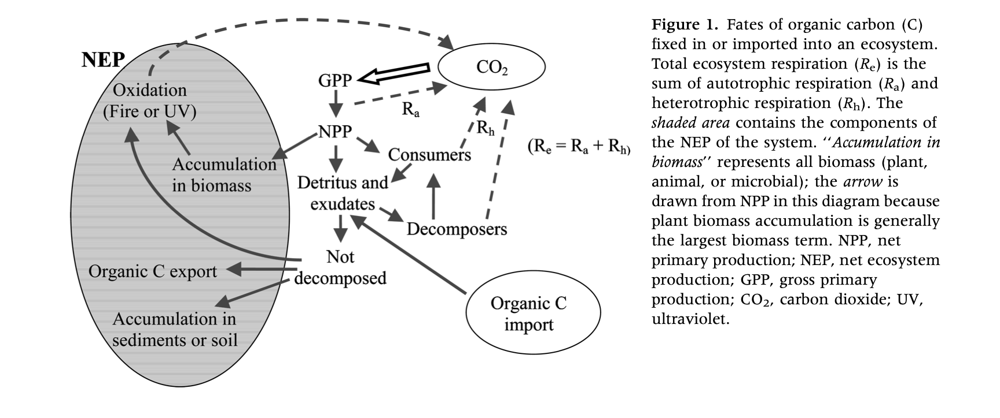
 

Gross Primary Productivity (GPP) is the amount of carbon (per unit area per unit time) taken up by green vegetation in the ecosystem, which is simply the photosynthetic rate (at the ecosystem level). Photosynthesis involves the use of (solar) energy to convert CO2 and H20 to glucose (C6H12O6) and oxygen (O2). 

Plants use (metabolise) energy (burn carbohydrates) to maintain growth, reproduction and other life processes. This is the process of (autotrophic) respiration (:math:`R_a`), which releases CO2 (and water) to the atmosphere. Additional respiration by soil micro-organisms and soil animals (consumers and decomposers) in the decomposition of soil organic matter is known as heterotrophic respiration (:math:`R_h`). The total ecosystem respiration then, :math:`R_e` is the sum of :math:`R_a` and :math:`R_h`.

The net ecosystem productivity (NEP) is defined:

.. math:: NEP = GPP - R_e

In this way, it represents the organic C available for storage within the ecosystem or that can be transported out of the ecosystem as a loss (e.g. fire or harvest). The sign of NEP indicates whether there is a net input to (positive NEP) or output from (negative NEP) the system. `Lovett et al., (2006) <https://www.caryinstitute.org/sites/default/files/public/reprints/Lovett_et_al_2006_Ecosystems.pdf>`_ note that this is *not* quite the same as the change in C storage, as that should include any imports and exports of organic C (e.g. fertilizer, wood harvesting) and non-biological oxidation of C.  

The related term, Net Ecosystem Exchange (NEE), is essentially equal to NEP but opposite in sign (i.e. NEE is negative when GPP is higher than :math:`R_e`). Technically, it also includes sources and sinks for CO2 that do not involve conversion to or from organic C (e.g. weathering reactions), but these will tend to be minor for terrestrial ecosystems, and NEE is mostly treated and -NEP.

.. math:: NEE \approx -NEP

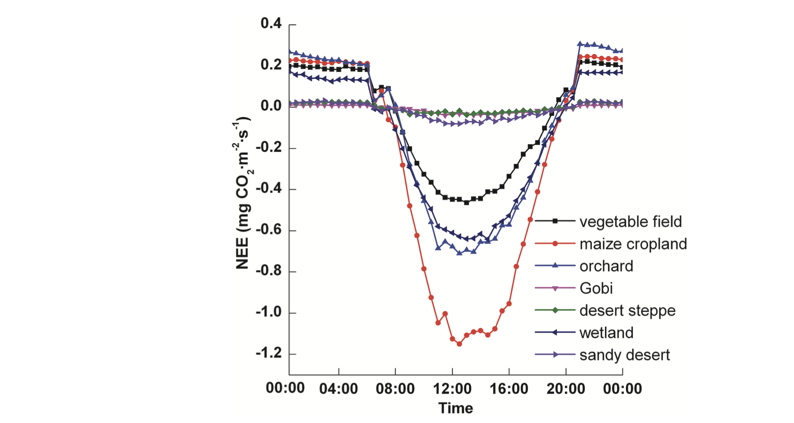

.. raw:: html

    

    <i>
    Diurnal variations in NEE over some different vegetation canopies (source: <a href="https://www.researchgate.net/publication/274088250_Diurnal_and_Seasonal_Variations_in_Carbon_Dioxide_Exchange_in_Ecosystems_in_the_Zhangye_Oasis_Area_Northwest_China">Zhang et al., 2015</a>)
    

    </i>

------------

The figure above shows typical diurnal variations in CO2 fluxes over some vegetation canopies. The measure given is `Net Ecosystem Exchange <https://www.sciencedirect.com/topics/earth-and-planetary-sciences/net-ecosystem-exchange>`_ (net CO2 flux) (units: mg CO2 m-2 s-1). During the daytime, the fluxes are negative (i.e. there is a flow from the atmosphere to the ecosystem) and at nighttime, the flux (to the atmosphere) is positive (so the ecosystem loses CO2 to the atmosphere). 

Ecosystem-level measures are of great value as they integrate all of the processes involved with plants, animals and soil, over some specified spatial and temporal domain. They are also things that we can measure, e.g. using eddy covariance towers, as we shall see later.

However, we also need to be able to model, measure and understand the processes underlying this which means considering the plant level. This is often not considered practically possible, so we group plants together that we want to consider as a set, or that we believe operate in a similar manner. Of course several, or many individual plants will form part of an ecosystem. This may sometimes then be considered as a 'layer' of vegetation (e.g. a tree canopy) or as several layers (canopy and understory). Such 'layer' separation can be important if the responses and timing of events in the different layers varies, as is often the case for a tree canopy and understory.

Taking all green plants in the ecosystem together then, we can try to isolate and define some of the 'plant-scale' processes. A critical term in this sense is net primary productivity (NPP), which is effectively the rate of biomass production. This is defined as ecosystem GPP minus plant respiration losses (:math:`R_a`):

.. math:: NPP = GPP - R_a 

The ratio of NPP to GPP is known as the `carbon use efficiency (CUE) <http://www.nature.com/scitable/knowledge/library/terrestrial-primary-production-fuel-for-life-17567411>`_. This is the fraction of carbon absorbed by an ecosystem that is used in biomass production, and is quite similar across ecosystems, typically assumed to be around 0.5. DeLucia et al. (2007) for example confirm an average value of 0.53 across many forest ecosystems, but they note that individual values of CUE can range from 0.23 to 0.83.

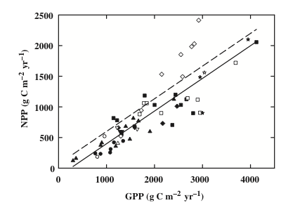a
    :width: 75%

.. raw:: html

    

    <i>
    "The relationship between net primary production (NPP) and gross primary production (GPP) for different forest types. Closed symbols represent values of GPP that were derived from estimates of NPP and Ra; open symbols represent values of GPP that were estimated independently from NPP. Symbols for the different forest types are: boreal (circles), West Coast Maritime (triangles), temperate conifer (squares), temperate deciduous (diamonds), temperate mixed (inverted triangles), and Tropical (stars). The intercept of the relationship between NPP and derived estimates of GPP (solid line) was significantly lower than the intercept for the relationship between NPP and independent estimates of GPP (dashed line; see results in paper for details)"
    (source: <a href="http://www.google.com.mx/url?sa=t&rct=j&q=carbon%20use%20efficiency&source=web&cd=1&ved=0CB0QFjAA&url=http%3A%2F%2Fwww.life.illinois.edu%2Fdelucia%2FGCB_1365.pdf&ei=xRcOT9TjEcTEsQKelrniBQ&usg=AFQjCNFSOD1vZsAP1iKJmHgO6PAb5mzAxg&sig2=1_vtYt9hg1ANExckO-x44A&cad=rja">DeLucia et al. (2007), GCB</a>
    

    </i>

------------

Similarly, `Zhang et al. (2009)  <https://onlinelibrary.wiley.com/doi/full/10.1111/j.1466-8238.2008.00442.x>`_ showed that CUE exhibited a pattern depending on the main climatic characteristics such as temperature and precipitation and geographical factors such as latitude and altitude.

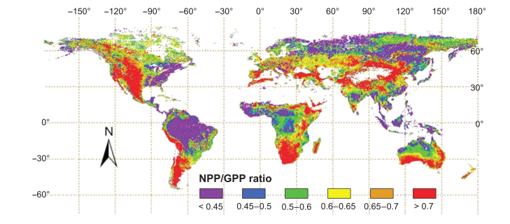
.. raw:: html

    

    <i>Global spatial pattern of the average NPP/GPP ratio.</i>
    This source: <a href="https://onlinelibrary.wiley.com/doi/full/10.1111/j.1466-8238.2008.00442.x">Zhang et al. GCB 2009</a>

------------

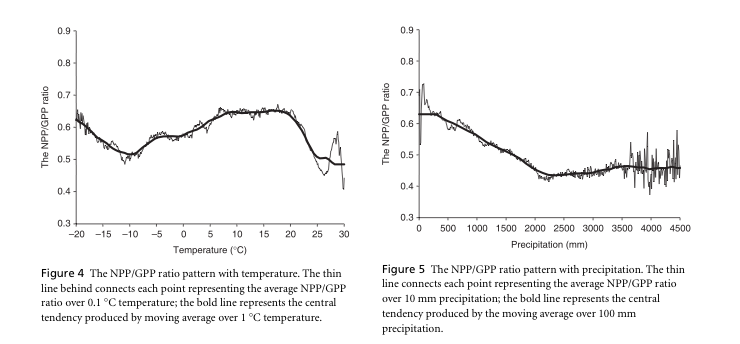

.. raw:: html

    

    This source: <a href="https://onlinelibrary.wiley.com/doi/full/10.1111/j.1466-8238.2008.00442.x">Zhang et al. GCB 2009</a>
    

------------

NPP varies over the year as the factors affecting the processes involed (essentially, light, temperature and water availability) vary over the growing seasdon.  Nutrient availability also affects NPP but this is likely to vary over longer time periods. NPP can very quite significantly from one year to the next and over decadal timescales depending on climatic factors.

.. figure:: https://www.nature.com/scitable/content/ne0000/ne0000/ne0000/ne0000/17650031/f3_gough_ksm.jpg
    :align: center
    :target: https://www.nature.com/scitable/knowledge/library/terrestrial-primary-production-fuel-for-life-17567411

.. raw:: html

    

    <i>
    "Patterns of terrestrial NPP at different timescales in a temperate forest: Daily net primary production (NPP) changes during the growing season in response to climate variables including solar radiation and precipitation, while the duration of NPP during the growing season (i.e., spring green-up to autumn leaf fall) is largely a function of photoperiod. Annual NPP changes from one year to the next in response to longer-term trends in climate, including shifts in total solar radiation caused by differences in cloud cover from year to year. Decadal patterns of NPP track changes in ecological succession (Gough et al. 2007, 2008).". </i>This source: <a href="http://www.nature.com/scitable/knowledge/library/terrestrial-primary-production-fuel-for-life-17567411">Gough, C. M. (2011) Terrestrial Primary Production: Fuel for Life. Nature Education Knowledge 2(2):1</a>
    </i>

------------

NPP varies quite considerably between biomes. The following table shows typical values of GPP, total Global NPP and NPP per unit area for the main biomes.

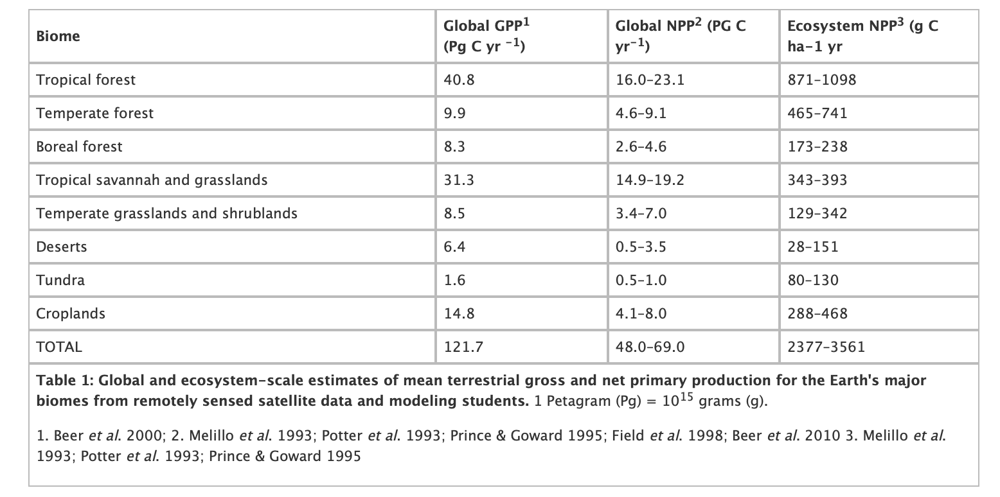

.. raw:: html

    

    Source: <a href="http://www.nature.com/scitable/knowledge/library/terrestrial-primary-production-fuel-for-life-17567411">Gough, C. M. (2011) Terrestrial Primary Production: Fuel for Life. Nature Education Knowledge 2(2):1</a>
    

------------

Globally then, the most productive biomes are tropical forests, savannah and grassland which together account for around half of global NPP, and the predominance of the tropics can be seen in the figure below. But per unit area, tropical and temperate forests are the most productive.

.. figure:: http://eoimages.gsfc.nasa.gov/images/globalmaps/data/MOD17A2_M_PSN/MOD17A2_M_PSN_2006-07.JPEG
    :align: center
    :target: http://earthobservatory.nasa.gov/GlobalMaps/view.php?d1=MOD17A2_M_PSN
    :width: 90%

------------

.. figure:: http://eoimages.gsfc.nasa.gov/images/globalmaps/data/CERES_NETFLUX_M/CERES_NETFLUX_M_2006-07.JPEG
    :align: center
    :target: http://earthobservatory.nasa.gov/GlobalMaps/view.php?d1=CERES_NETFLUX_M
    :width: 90%

------------

.. figure:: https://eoimages.gsfc.nasa.gov/images/globalmaps/data/GPM_3IMERGM/GPM_3IMERGM_2006-07.JPEG
    :align: center
    :target: http://earthobservatory.nasa.gov/GlobalMaps/view.php?d1=GPM_3IMERGM
    :width: 90%

.. raw:: html

    

    Global patterns of NPP, Net radiation, and rainfall, N. Hemisphere summer.
    

------------

The figures above show global NPP distribution and related climatic and land surface properties for Northern hemisphere summer. The dataset 'NPP' broadly relates the abundance of vegetation, which relates to the total capacity of vegetation to photosynthesise. The primary driver of GPP (so NPP in broad terms) is the amount of vegetation and the amount of downwelling solar radiation. Although we do not have an image of the latter here, it is broadly in-line with the net radiation shown. There are of course many more subtle controls on NPP that we will consider later, but clearly these would include temperature range and water availability.

In Northern hemisphere summer then, NPP is most strongly spatially weighted  to the Northern hemisphere because of these various drivers.

.. figure:: http://eoimages.gsfc.nasa.gov/images/globalmaps/data/MOD17A2_M_PSN/MOD17A2_M_PSN_2006-12.JPEG
    :align: center
    :target: http://earthobservatory.nasa.gov/GlobalMaps/view.php?d1=MOD17A2_M_PSN

------------

.. figure:: http://eoimages.gsfc.nasa.gov/images/globalmaps/data/CERES_NETFLUX_M/CERES_NETFLUX_M_2006-12.JPEG
    :align: center
    :target: http://earthobservatory.nasa.gov/GlobalMaps/view.php?d1=CERES_NETFLUX_M

------------

.. figure:: https://eoimages.gsfc.nasa.gov/images/globalmaps/data/GPM_3IMERGM/GPM_3IMERGM_2006-12.JPEG
    :align: center
    :target: http://earthobservatory.nasa.gov/GlobalMaps/view.php?d1=GPM_3IMERGM
    :width: 90%
.. raw:: html

    

    Global patterns of NPP, Net radiation, and rainfall, N. Hemisphere winter.
    

------------

In Northern hemisphere winter, the distribution of NPP shifts to the Southern hemisphere, for the same reasons as indicated above. 

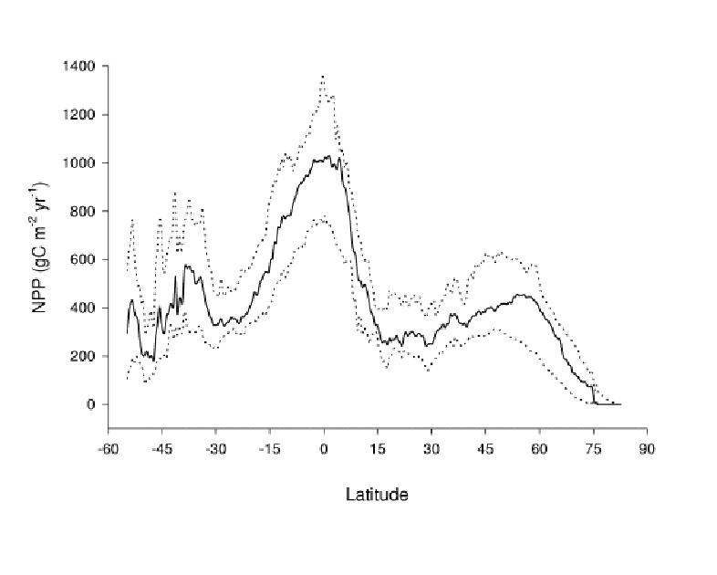

.. raw:: html

    
<i>
    "Comparison of the latitudinal distribution of the median (solid line), and 10th and 90th percentiles (dotted lines) of areally- weighted mean annual net primary productivity estimated by fifteen models within a 0.5o latitudinal band."</i>
    Source: <a href="https://www.researchgate.net/publication/237587016_NET_PRIMARY_PRODUCTIVITY_MODEL_INTERCOMPARISON_ACTIVITY_NPP_By_Wolfgang_Cramer_and_the_participants_of_the_Potsdam_'95_NPP_model_intercomparison_workshop/download">Cramer et al., 1995, "IGBP/GAIM REPORT SERIES REPORT #5" </a>
    

------------

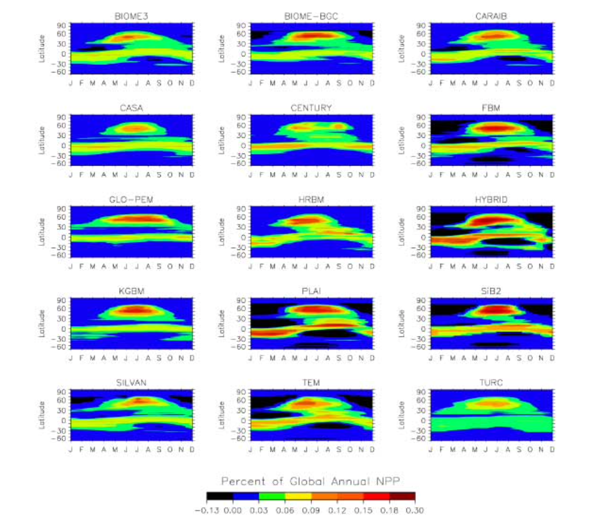

.. raw:: html

    
<i> 
    "Relative distribution (%) of global annual net primary productivity across latitudes and months."</i>
    Source: <a href="https://www.researchgate.net/publication/237587016_NET_PRIMARY_PRODUCTIVITY_MODEL_INTERCOMPARISON_ACTIVITY_NPP_By_Wolfgang_Cramer_and_the_participants_of_the_Potsdam_'95_NPP_model_intercomparison_workshop/download">Cramer et al., 1995, "IGBP/GAIM REPORT SERIES REPORT #5" </a>
    

    <left>

------------

Since the total landmass (and in particular the vegetated landmass) in the Southern hemisphere is less than that of the Northern hemisphere, global NPP  comes predominantly from Northern latitudes. Referring back to the plots of the annual cycle of atmospheric CO2 above, we noted a peak in May and a trough  in October, largely then in response to global NPP increases in Spring and decreases in Autumn: the larger NPP in Northern hemisphere summer gradually decreases the atmospheric CO2 concentration. This is however complicated by the timing and spatial distribution of other CO2 sources and sinks.

Net Ecosystem Productivity
~~~~~~~~~~~~~~~~~~~~~~~~~~

The NEP then is NPP minus other losses to the atmosphere. These will generally include respiration by heterotrophs (organisms --  fungi, animals and bacteria in the soil), but there may be other losses to the ecosystem such as through harvesting or fire.  

Anthropogenic and wildfire carbon emissions (as well as ocean and soil fluxes) as well as atmospheric circulation also significantly affect the global distribution of CO2, so the global patterns of CO2 are not as 'simple' as just the NPP fluxes. 

.. figure:: http://www.esrl.noaa.gov/gmd/webdata/ccgg/CT2010/co2wx/glb/co2wx_hammer-glb_20060715.png
    :align: center
    :target: http://www.esrl.noaa.gov/gmd/ccgg/carbontracker/co2weather.php?region=glb&date=2006-07-15#imagetable

------------

.. figure::  http://www.esrl.noaa.gov/gmd/webdata/ccgg/CT2010/co2wx/glb/co2wx_hammer-glb_20061215.png
    :align: center
    :target: http://www.esrl.noaa.gov/gmd/ccgg/carbontracker/co2weather.php?region=glb&date=2006-12-15#imagetable

.. raw:: html

    
<i>"CO2 weather. We depict the daily average of the pressure-weighted mean mole fraction of carbon dioxide in the free troposphere as modeled by CarbonTracker. Units are micromoles of CO2 per mole of dry air (μmol mol-1), and the values are given by the color scale depicted under the graphic. The "free troposphere" in this case is levels 5 through 10 of the TM5 model before 2005, and levels 6 through 10 after (due to an improvement in the vertical resolution for 2006 onwards). This corresponds to about 1.2km above the ground to about 5.5km above ground, or in pressure terms, about 850 hPa to about 500 hPa. Gradients in CO2 concentration in this layer are due to exchange between the atmosphere and the earth surface, including fossil fuel emissions, air-sea exchange, and the photosynthesis, respiration, and wildfire emissions of the terrestrial biosphere. These gradients are subsequently transported by weather systems, even as they are gradually erased by atmospheric mixing."
    </i> Source: <a href="http://www.esrl.noaa.gov/gmd/ccgg/carbontracker/co2weather.php">NOAA carbontracker</a>

------------

Summary
-------

In this lecture, we have:

* looked in detail at the terrestrial carbon cycle
* provided an overview of relevant biogeochemical processes

Reading for this lecture
------------------------

Texts of particular importance to this lecture are:

* Ryu et al., 2019, What is global photosynthesis? History, uncertainties and opportunities,Remote  Sensing of Environment, https://doi.org/10.1016/j.rse.2019.01.016.
* Heimann, M., Reichstein, M. Terrestrial ecosystem carbon dynamics and climate feedbacks. Nature 451, 289–292 (2008). https://doi.org/10.1038/nature06591
* Forests and Climate Change: Forcings, Feedbacks, and the Climate Benefits of Forests, G.B. Bonan, Science 320, 1444 (2008), DOI: 10.1126/science.1155121
* IPCC AR5, `Chapter 6: Carbon and Other Biogeochemical Cycles <https://www.ipcc.ch/report/ar5/wg1/carbon-and-other-biogeochemical-cycles/>`_
* Monteith, J.L. and Unsworth, M., (2007), `Principles of Environmental Physics <http://www.amazon.co.uk/Principles-Environmental-Physics-John-Monteith/dp/0125051034/ref=sr_1_1?ie=UTF8&qid=1325699791&sr=8-1>`_, Academic Press
* `Forseth, I. (2010) Terrestrial Biomes. Nature Education Knowledge 1(8):12 <http://www.nature.com/scitable/knowledge/library/terrestrial-biomes-13236757>`_
* Grace, J., (2001) Carbon Cycle, in *Encyclopedia of Biodiversity*, Vol. 1, Academic Press
* DeLucia et al. (2007) Forest carbon use efficiency: is respiration a constant fraction of gross primary production? Global Change Biology (2007) 13, 1157–1167, `doi: 10.1111/j.1365-2486.2007.01365.x <http://www.life.illinois.edu/delucia/GCB_1365.pdf>`_
* Lovett, G.M. et al., (2006) Is Net Ecosystem Production Equal to Ecosystem Carbon Accumulation? Ecosystems (2006) 9: 1–4 `DOI: 10.1007/s10021-005-0036-3 <https://www.caryinstitute.org/sites/default/files/public/reprints/Lovett_et_al_2006_Ecosystems.pdf>`_
* `Gough, C. M. (2011) Terrestrial Primary Production: Fuel for Life. Nature Education Knowledge 2(2):1 <http://www.nature.com/scitable/knowledge/library/terrestrial-primary-production-fuel-for-life-17567411>`_
* `Haberl, H. et al. Quantifying and mapping the human appropriation of net primary production in earth’s terrestrial ecosystems. Proceedings of the National Academy of Sciences 104, 12942–12947 (2007). <https://www.pnas.org/doi/10.1073/pnas.0704243104>`_

