Data Assimilation Applications
==============================

Applications
-------------

We will now consider some applications of DA within the subject area of this course.

Carbon Cycle Data Assimilation System 
~~~~~~~~~~~~~~~~~~~~~~~~~~~~~~~~~~~~~~~~

The Carbon Cycle Data Assimilation System (CCDAS) (Scholze et al., 2007) is a project (and software) that is a DA system built around the Bethy land surface process model (Knorr, 2000).

It has variously been used to assimilate fAPAR observations and atmospheric CO2  data to help constrain the model operation.

The link to atmospheric CO2 is through modelling of CO2 flux patterns (NEP) as a constraint to atmospheric inverse modelling. The surface model is coupled to an atmospheric transport model.

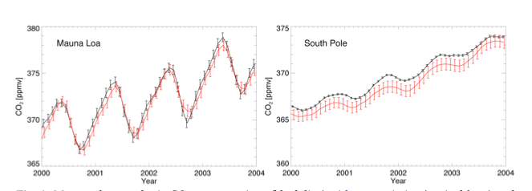

[Source: `Scholze et al., 2009 <http://www.fastopt.com/papers/scholzeal09.pdf>`_]

fAPAR is linked to leaf C (therefore LAI) state within Bethy. The assimilation process is used to optimise the parameters thatr control phenology and soil moisture.

In earlier work, CCDAS operated in a two-stage mode, first assimilating fAPAR data, then running this forward to constrain the atmospheric data interpretation.

A variational scheme is used in which prior (Gaussian) distributions are characterised for the variables controlling Bethy and initial estimates of atmospheric CO2 concentrations. An observation constraint is also used, as described above, with observation operators mapping from the state (Bethy parameters and atmospheroc CO2) space to that of the observations. An adjoint of the code is used for efficient cost function minimisation.

In the new scheme (Scholze et al., 2007) fAPAR is more fully integrated into the CCDAS:

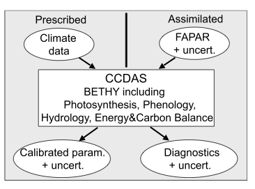

[Source: Scholze et al., 2007]

Once fAPAR data have been assimilated, diagnostic variables, such as CO2 fluxes can be directly calculated by the system (along with their associated uncertainties).

It is worth noting that this is the first DA system of this sort, aimed at constraining CO2 fluxes and concentrations. The various studies using CCDAS have demonstrated the advantages of such an approach, perhaps one of the most important being the uncertainty framework that is applied. In most other *runs* of biogeochemical models, fluxes are predicted, and these may in some way have been constrained by observations (typically, 'calibrations' at flux tower sites), but only a DA system can really deal with the propagation of uncertainties from the assumed prior knowledge and observational constraints through to the diagnostics (fluxes etc.).

Various criticisms can be made of the approach used (e.g. assumptions of Gaussian distributions, the lack of real uncertainty information ob the fAPAR product data used in the assimilation or the difficulty of making sure that fAPAR as represented in the model has the same meaning as that used to derive the satellite products), but the work has been truely ground-breaking in pointing the way forward in the use of data and models in terrestrial carbon modelling and monitoring.

Some typical results from Scholze et al., 2007 are shown here:

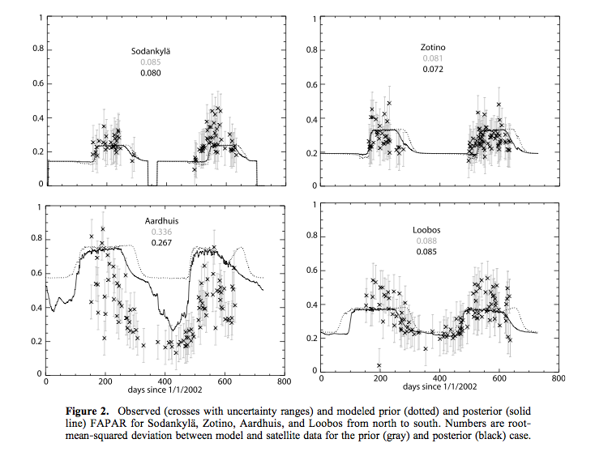

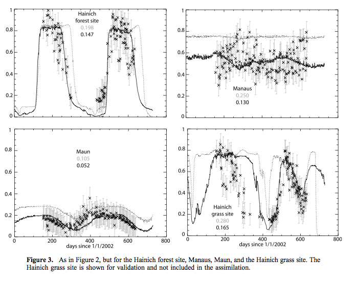

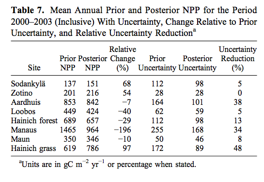

[Source: Scholze et al., 2007]

Even though the fAPAR data are rather partial in their coverage (clouds, snow), sometime have rather large high frequency variations,  and the final match between observations and the model are not always within the (large) uncertainty bounds of the data, the assimilation is seen to have an often quite large impact on NPP estimates. The reduction in uncertainty can be as large as nearly 50%, but is tyoically smaller. This is due in part at least to the large observational uncertainties assumed, but also an expression of the ability of such data to constrain NPP estimates (i.e. it depends on some factors that fAPAR cannot readily constrain).

EnKF of surface reflectance data into an ecosystem model
~~~~~~~~~~~~~~~~~~~~~~~~~~~~~~~~~~~~~~~~~~~~~~~~~~~~~~~~~

One of the criticisms of the CCDAS is the rather simplistic observation operator used for fAPAR. Part of the reason for this is that it is computationally cheap to make use of satellite data prioducts of this sort. At the same time, these data do not make full use of the information content of the satellite data used, and uncertainty information is very difficult to ascribe to data products that have no tracking of uncertainty.

An alternative approach is to try to use low level satellite data *more directly* in the DA scheme. This approach was adopted by Quaife et al. (2008) using the 'simple' ecosystem model DALEC:

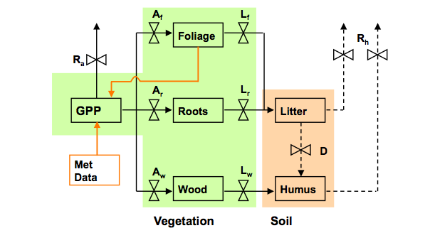

The idea here is that rather than interpreting the satellite datai and using that in tha DA, we use a non-linear observation operator based on radiative transfer considerations of tree crown shadowing/hiding and volumetric scattering within the crowns as the operator :math:`H(x)`.

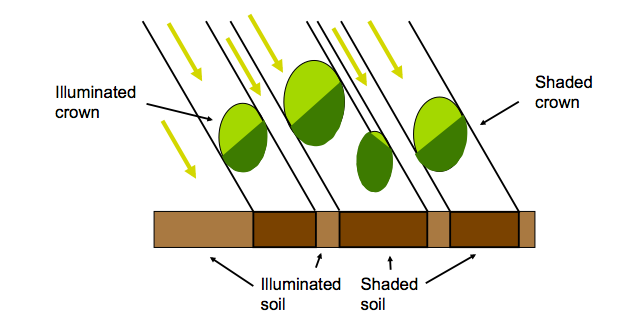

The model had been previously calibrated against measurements at a flux tower site, although uncertainty information on this was only directly available in a simplified form. A forward run of the model produced the following NEP data. Observations (from the flux tower) are shown as black dots (again no uncertainty information was available).

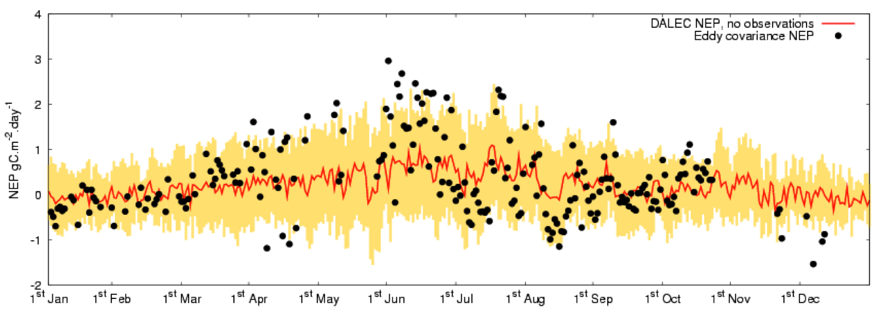

The DA method used here is an Ensemble Kalman filter, which is able to cope with the non-linear observation operator and doesn't require an estimate of the derivatives (i.e. doesn't need adjoint code).  

The observation data used in the DA were MODIS surface reflectance data at red and near infrared wavelengths. Estimates of uncertainty were available for these, although there was no correlation information available.

Of course the remote sensing observations depend on terms that are not directly considered in the (process) model, sich as soil terms, canopy cover (& other clumping), leaf chlorophyll etc. In this case, Quaife et al. performed a first pass estimate of these 'ancillary' variables and assumed they were fixed in the DA at these values. 

The DA proceded by affecting the foliar carbon pool, through a mapping from LAI/leaf area density used in the observation operator. The EnKF was used to provided improved estimates of foliar carbon, which in turn affected the NEP estimates.

The result of the DA is given here (actually, this is slightly different to that used in the paper, as this result also treats snow cover in the reflectance data in winter):

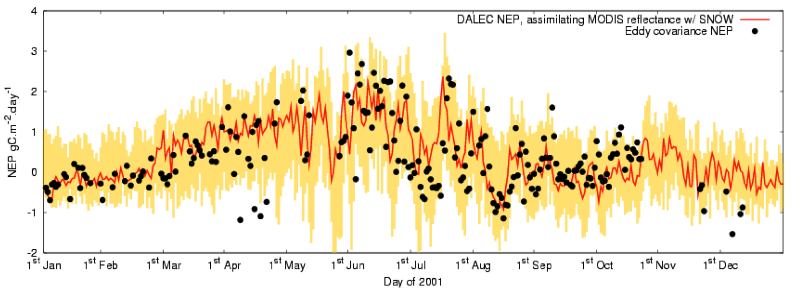

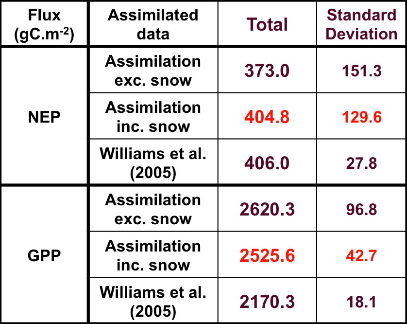

or as an animation:

We see that allowing the DA of surface reflectance to affect the leaf carbon improved the NEP estimate considerably (particularly when winter observations were better constrained by incorporating a snow term in the observation operator). The ability of such data to constrain NEP is much less than detailed flux and stock measurements at the site (see the Williams et al. reference) but this is hardly surprising as we were only affecting leaf carbon and had no real impact on slow soil turnover factors affecting soil respiration.

Also, we can see that although the DA produced a very good estimate of NEP, its modelling of GPP (which one might assume to be better as this does not include soil components directly) was quite poor if the figure of Williams et al. is true.

As with the previous application, there are many criticisms that can be made of this DA exercise. What is important about this work is its attempt to provide a direct linkage from the process model through to the satellite observations. This might be made more fully consistent if top of atmosphere (ToA) data were used instead of surface reflectance, as it would then be more straightforward to track and more fully quantify the observation uncertainties. Whilst this is certainly feasible, it adds another layer of complexity to the DA. Further, it is clearly not a good idea to assume that all of the 'ancillary' parameters are fixed (or to set them to estimates in the rather simplistic manner taken here) and also not to account for uncertainty in these terms.

ORCHIDEE
~~~~~~~~
Ochidee is the French DGVM model and has been used in a wide range of cases for understanding carbon dynamics. Whilst a solid and useful model, it of course needs continuing validation and improvements in constraints to improve its reliability. A significant paper in this regard is that of `MacBean, N. et al., (2018) <https://www.nature.com/articles/s41598-018-20024-w.pdf?origin=ppub>`_ which uses Solar-induced fluorescence (SIF) as a proxy for GPP to optimise the model GPP parameters in a **strong constraint** DA scheme. Recall that a strong constraint system is one where we trust the model, but believe there may be error/uncertainty associated with the model parameters. The paper is significant for this course in two respects: first, it provides a direct link to the course material on GPP and DGVMs, and second, it makes use of novel satellite-based estimates of GPP for the data assimilation. Previously, constraint of process (GPP) has only been possible at limited sites where fluxes are measured or by attempting to constrain the vegetation state (NDVI, LAI etc.). Whilst the use of state variables is useful in helping constrain DGVMs (as in the CCDAS example above), the state in the models is a result of process (GPP, NPP) and it is thought that constraining with flux measurements provides a much more direct and robust route to model testing, calibration and improvement. 

In the approach, the GOME SIF dataset is related to GPP via (empirical) linear models per biome. Orchidee default parameter distributions provide the prior GPP in the figure below. The data assimilation with the SIF observations then results in an update on the model parameter distributions and a **reduction in global GPP uncertainty by 83%**.

.. figure:: https://media.springernature.com/full/springer-static/image/art%3A10.1038%2Fs41598-018-20024-w/MediaObjects/41598_2018_20024_Fig1_HTML.jpg?as=webp
    :align: center
    :width: 75%

**Global mean annual sum (2007–2011) and spatial distribution of: (a) GOME-2 SIF; (b) JUNG up-scaled FLUXNET data-driven GPP product18; (c) ORCHIDEE prior GPP; (d) ORCHIDEE posterior GPP; (e) difference in ORCHIDEE simulated GPP (posterior – prior); (f) reduction in GPP uncertainty (1σ). The maps were created from the ORCHIDEE model simulations performed in this study, GOME-2 SIF data, and the JUNG product, using the Python programming language v2.7.13 (Python So ware Foundation – available at http://www.python.org) Matplotlib (v2.0.2) plotting library54 with the Basemap Toolkit (http://matplotlib.org/basemap/). See Section on Data Availability for GOME-2 SIF and JUNG product availability, the ORCHIDEE model licence information and ORCHIDEE code availability.**

EO-LDAS
~~~~~~~

The Earth Observation Land Data Assimilation (EO-LDAS) project (Lewis et al., 2012) (see also `EOLDAS website <http://www2.geog.ucl.ac.uk/~plewis/eoldas/>`_) aimed to develop a generic scheme for performing DA using EO data.

In the prototype tool developed, linear difference operators (regularisers) were used as the model constraint, along with a prior constraint and observational constraints. Whilst various configurations were implemented and demonstrated, perhaps the most interesting and useful is the non linear radiative transfer model implemented as the main observation operator, along with associated adjoint code. The availability of adjoint code means that variational methods can be efficiently used, so the system was mainly designed as a weak constraint variational DA system.

The observation oeprator models canopy reflectance as a function of leaf biochemistry (leaf chlorophyll, dry matter, water etc.), soil spectral proprties (through some spectral basis functions), and canopy structural characteristics (LAI, leaf angle distribution, leaf size and canopy height (NB reflectance is only sensitive to the ratio of these latter two)).

Such a system can be used to simply estimate the (full) set of biophsyical parameters controlling the EO signal at one particular time. An example, using MERIS reflectance data is:

.. figure:: http://www2.geog.ucl.ac.uk/~plewis/eoldas/_images/MERIS_WW_1_A_1_fwd_plot_y11.png
    :align: center
    :width: 90%

Here, observations in 15 wavebands in the visible and near infrared were used to solve for an estimate of the (7) biophysical parameters  that the signal is sensitive to, assuming weak prior knowledge on these terms.

EO-LDAS is able to achieve this from a single MERIS observation, but not surprisingly, even thouse the uncertainty in the forward modelled reflectance is reduced compared to the observation uncertainties (red are original, green here is modelled from the observation operator), the uncertainties in the biophytsical parameter estimates are typically  high (and cover e.g. the full range of possible values for LAI), although the uncertainty in the estimate for `chlorophyll concentration here is relatively low <http://www2.geog.ucl.ac.uk/~plewis/eoldas/example2.html>`_.

If we then try to use the biophysical parameters estimated from the MERIS data to predict what another sensor (at the same place, on the same day) would see, the results are rather disappointing:

.. figure:: http://www2.geog.ucl.ac.uk/~plewis/eoldas/_images/MODIS_WW_1_A_1_fwd_plot_y11.png
    :align: center
    :width: 90%

The green triangles show MODIS observations and the blue line the prediction from parameters constrained by the MERIS observation.

At first sight, this might seem odd: we were able to describe the MERIS data very well with the model, but it turns out that its predictive power (to other wavebands and angles) is poor. This is because of the high uncertainty in the state vector arrived at from MERIS and also because of correlations between the state vector elements.

Lewis et al. (2012) performed an experiment using EO-LDAS with synthetic observations for the forthcoming Sentinel-2 MSI sensor. A feature of Sentinel-2 MSI (when fully operational with 2 satellites) will be the capability for quite high repeat coverage at quite high spatial resolution: 5 days typically (less with cloud cover) and a resolution of 10s of ms.

To explore the sort of information we might be able to derive from such data, Lewis et al. used a regularisation constraint (or rather two separately first and second difference constraints) to compare with what might be obtained using sets of single observations.

The bottom line result was that, even when just considering the biophsyical properties at the time of observations, a reduction in uncertainty of around a factor of 2 could be achieved just by using such a weak constaint model (i.e. assuming nothing about the form of the parameter trajectories other than smnoothness).

Of course, in any such exercise, the degree of smoothness is not something that is known before hand, so must itself be estimated. This can be achieved in a number of ways, one of which is to perform a *generalised cross validation*. This involves leaving out an observation and performing the DA for different degrees of smoothness and seeing how well each of these is able to predict the 'left out' measurement. 

The figure below shows the average of this metric as a function of :math:`\gamma` (which is effectively the smoothness parameter) over all samples (i.e. the average behaviour when leaving out each sample in turn):

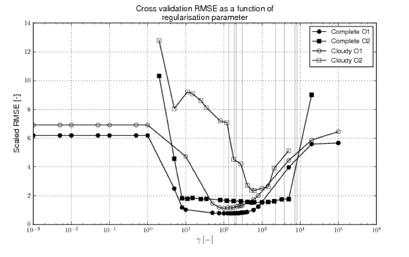

Results for four scenarios are shown. Those labelled 'O1' and 'O2' refer to using first and second order constraints respectively. Those labelled 'complete' refer to assumed refular observations every 5 days, whereas 'cloud' has 50% of samples removed.

One thing to notice from this is that these functions have quite broad minima, which means that the result of the DA is not *very* strongly dependent on the degree of smoothness assumed. This is more true when the sampling rate is higher ('Complete') for obvious reasons.

The results for the 'complete case' are:

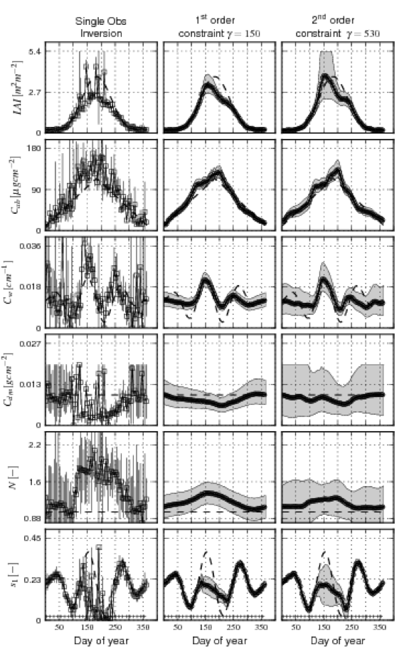

and for the 'cloudy' case:

.. figure:: https://www.nature.com/articles/s41598-018-20024-w/figures/1
    :width: 60%
    :align: center

**Global mean annual sum (2007–2011) and spatial distribution of: (a) GOME-2 SIF; (b) JUNG up-scaled FLUXNET data-driven GPP product18; (c) ORCHIDEE prior GPP; (d) ORCHIDEE posterior GPP; (e) difference in ORCHIDEE simulated GPP (posterior – prior); (f) reduction in GPP uncertainty (1σ). The maps were created from the ORCHIDEE model simulations performed in this study, GOME-2 SIF data, and the JUNG product, using the Python programming language v2.7.13 (Python So ware Foundation – available at http://www.python.org) Matplotlib (v2.0.2) plotting library54 with the Basemap Toolkit (http://matplotlib.org/basemap/). See Section on Data Availability for GOME-2 SIF and JUNG product availability, the ORCHIDEE model licence information and ORCHIDEE code availability.**

The left hand column of these figures ('single obs. inversion') shows results obtained by considering each (day's) observation independently. The dashed line on all graphs shows the *true* temporal trajectory for that parameter. A total of 73 observations are available for the 'complete' case, over a year.

The rows show the different model parameters: LAI, leaf chlorophyll, leaf water, leaf dry matter, leaf complexity (N), and soil brightness.

When the LAI is low (at the start and end of the time period), both LAI and soil properties are quite accurately estimated and have low uncertainties. As LAI reaches around 2, the ability to estimate soil properties is drastically reduced. The uncertainties (for 'single obs.') for all of the leaf terms are quite high, although, within the noise, the basic 'shape' of the parameter trajectory can be determined.

When regularisation constraints are applied, the uncertainty is dramatically reduced. Further, an estimate of the model state is available for all days. The regularisation results for teh cloudy scenario are not very much poorer than for the full sampling.

This experiment is effective in showing the *power* of DA methods to help constrain estimates of surface biophsyical variables. Even if nothing is known of the likely form of the parameter dynamcis, first or second order regularisation constraints can prove effective. The processing cost for this, using a variational approach (solving for all :math:`365 \times 6 = 2190` states simultaneously) is, at present quite high, though that could be greatly reduced with more efficient operators and less intensive methods to solve the cross validation.

Discussion
-----------

We have reviewed some applications using DA in land surface monitoring and linking to ecosystem models. The first of these, CCDAS is in many ways very advanced, and there are similar efforts underway to develop systems of this sort for other land surface schemes. Probably the most important aspect of these systems is the incorporation of an uncertainty framework into the modelling. Before CCDAS (and still all too often) this is something missing in land surface models, whilst at the same time there are many many papers and hours spent 'calibrating' the models and proposing new mechanisms to overcome apparent shortcomings. CCDAS points the way in doing better science with terrestrial carbon models, and also in allowing a multitude of observations (well, fAPAR and CO2 concentrations at the moment) to test and update the model. There are still however many flaws in the land surface models, and this work is scientifically and societally important.

The Orchidee case is a clear example of the value of satellite observations in constraining DGVM behaviour. The model is set up in much the same way as CCDAS, but rather than state variables, the DA is effected by what are essentially global flux measurements (GPP). The impact on the model performance and un certainty is dramatic and shows the great promise of such data.

At present CCDAS and Orchidee use only a very simple interface to observations. In the next example, the work of Quaife et al., we showed how (within an EnKF scheme) an interface could be built to map directly from the state variables of the process model through to EO observations (well, close to these, surface reflectance rather than ToA radiance measurements, but this should be seen as a stage on the way). There were several flaws in some of the details of the approach, but as a demonstrator of the potential of using such complex observation operators for linking to the optical EO  data, this is significant.

In the final example, we showed how a weak constraint variational system can be used to estimate surface state properties. Although this EO-LDAS is not in this case coupled to a process model (other than empirical difference constraints) the utility of the DA was demonstrated, and the idea is readily applied to such coupled modelling. Further, it is unlikely that the process models will, for the foreseeable futre at least, provide models of the expected dynamics of most of the terms that control the EO signal, so some method of dealing with the fact that they are not fixed (such as regularisation constraints) is important in its own right.

The state of the art in 'practical' merging of satellite data and terrestrial carbon models is not, at the present moment very advanced. Until recently, it mainly consisted of using NDVI data to constrain some phenology parameters of the models. This has now been extended by SIF-based estimates of GPP, which provide an extremely powerful source of information in this regard. 

Also, when we do attempt to derive satellite products of surface biophysical  properties, we do not, on the whole, provide reliable uncertainty information with the data. Even if we did, we find that there are really rather different interpretations of what such properties refer to both between different terrestrial models and between these and the information coming from satellite products. All of this is compounded by the rather large volumes of (raw) satellite data that we have access to, and many users feel they would like this to be simplified in some form.

That said, there is emerging, in the DA field, a set of techniques that will allow us to merge and test and calibrate the land surface schemes using a variety of EO (and other) data *in a consistent* manner, and it is likely that this is how EO data will be used 'in the future'. 

Reading
-------
* `MacBean, N. et al., (2018) Strong constraint on modelled global carbon uptake using solar- induced chlorophyll fluorescence data, Nature Scientific Repirts  8:1973 | DOI:10.1038/s41598-018-20024-w <https://www.nature.com/articles/s41598-018-20024-w.pdf?origin=ppub>`_
* Lewis, P., Gomez--Dans, J., Kaminski, T., Settle, J., Quaife, T., Gobron, N., Styles, J., Berger, M. (2012) An Earth Observation Land Data Assimilation System (EO-LDAS). `Remote Sensing of Environment <http://www.sciencedirect.com/science/article/pii/S0034425712000788>`_
* T. Quaife, P. Lewis, M. DE Kauwe, M. Williams, B. Law, M. Disney, P. Bowyer (2008), Assimilating Canopy Reflectance data into an Ecosystem Model with an Ensemble Kalman Filter, Remote Sensing of Environment, 112(4),1347-1364. 
* Scholze, M., T. Kaminski, P. Rayner, W. Knorr, and R. Giering (2007), Propagating uncertainty through prognostic CCDAS simulations, J. Geophys. Res., 112, D17305, doi:10.1029/2007JD008642.
* Knorr, W. (2000), Annual and interannual CO2 exchanges of the terrestrial biosphere: Process0based simulations and uncertainties, Global Ecol. Biogeogr., 9(3), 225-252.
* W. Knorr, T. Kaminski, M. Scholze, N. Gobron, B. Pinty, R. Giering, and P.-P. Mathieu. Carbon cycle data assimilation with a generic phenology model. J. Geo- phys. Res., `doi:10.1029/2009JG001119, 2010. <http://www.fastopt.com/papers/knorral09.pdf>`_

