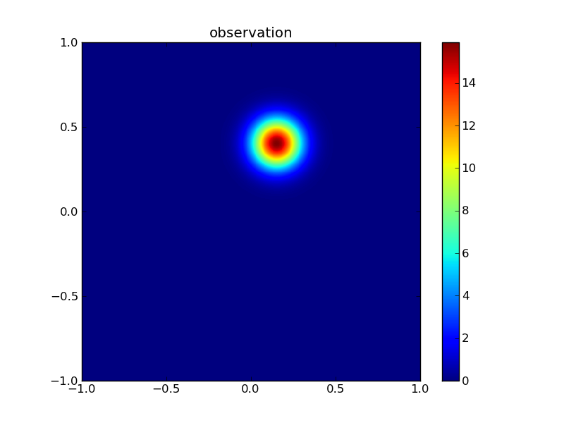
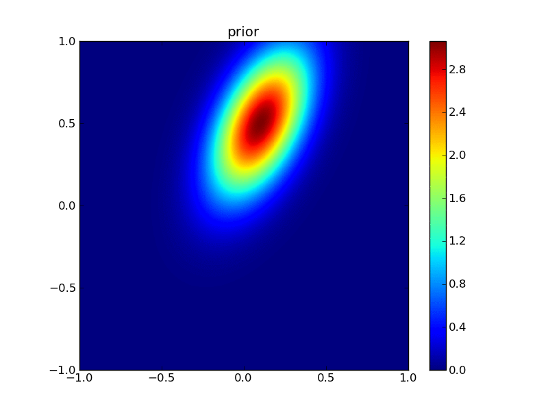
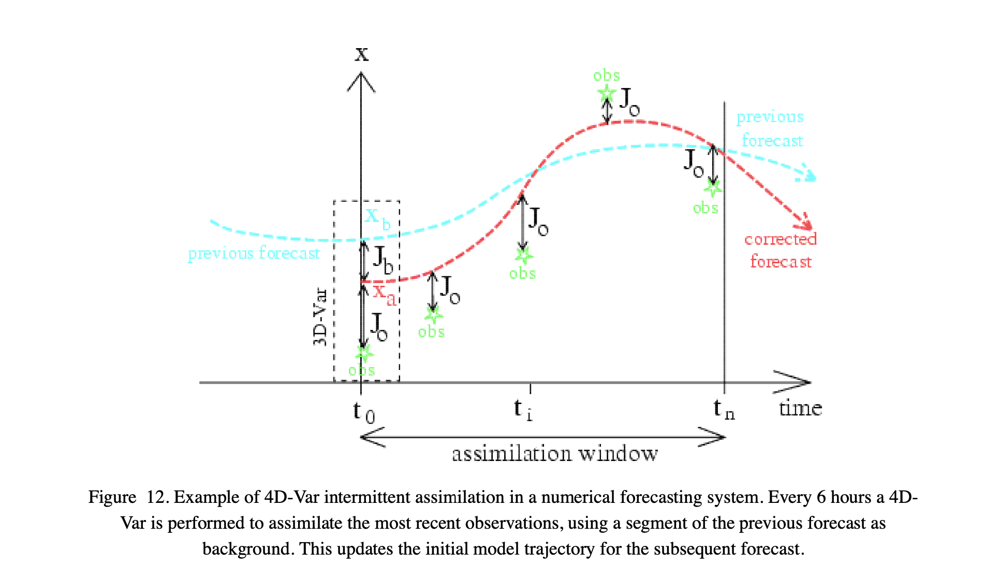
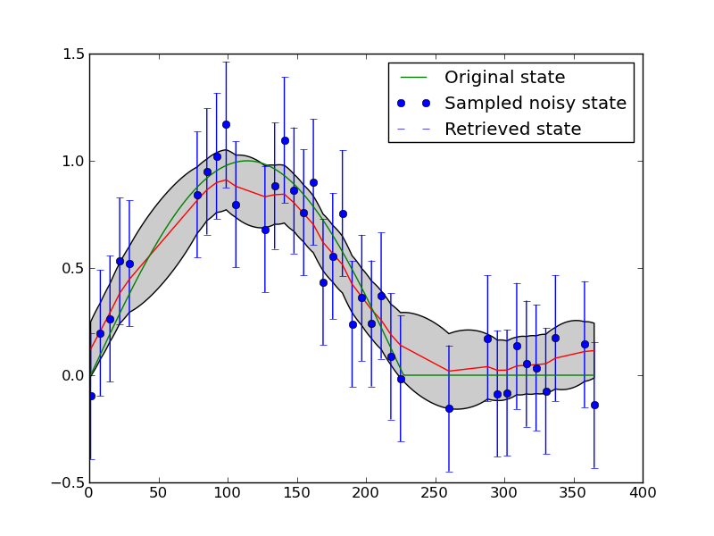

Data Assimilation
==================

Introduction to concepts
------------------------
.. rst-class:: html-toggle

Data Assimilation (DA) is a set of statistical techniques to obtain estimates of some state vector :math:`x`  by merging information from *observations* :math:`y` and any prior (*background*) information on the state, :math:`x_b`. The translation between the state vector and the observations is achieved through an *observation operator* :math:`H(x)` which proposes an estimate of the observations :math:`\hat{y} = H(x)`. 

In this lecture, you will be introduced to some of the underlying statistical concepts, some of the methods you can use for DA, and some applications.

Some basic Gaussian statistics
~~~~~~~~~~~~~~~~~~~~~~~~~~~~~~~~

Importantly, the uncertainties in all of these elements must be taken into account.  If we assume Gaussian (Normal) distribution of  uncertainty, then the *prior* distribution (what we believed the state to be before we included information from any observations) is:

.. math:: P_b(x) = \frac{1}{(2 \pi)^\frac{n}{2} \sqrt{\det(B)}} \exp \left( - \frac{1}{2} (x_b - x)^T B^{-1} (x_b - x) \right)
    :label: pb

:math:`^T` here denotes the transpose operation.

It is important that you understand the notation and concepts here, so we will pause to consider what  equation :eq:`pb` means for a moment. 

The term :math:`P_b(x)` expresses the probability of the state :math:`x` being any particular value, where :math:`x` in the general case is a vector. This is the *probability distribution function* (PDF). You would normally use this to describe what the probability is of :math:`x` lying between some limits (i.e. you integrate the PDF over some limits). 

As a probability, the PDF is normalised so that its integral (over the entire bounds of possibility) is unity. The term :math:`[1/((2 \pi)^{n/2} \sqrt{\det(B)})]` expresses the scaling required to make that so. 

The matrix :math:`B` expresses the variances and covariances between elements of :math:`x`. So, for example, if :math:`x` had only two elements, :math:`x_0` and :math:`x_1`, it would look something like:

.. math:: B = \left[ 
              \begin{matrix}
              \sigma^2_{0} & \rho_{0,1} \sigma_{0} \sigma_{1}\\
               \rho_{0,1} \sigma_{0} \sigma_{1} & \sigma^2_{1}
              \end{matrix}
              \right]

or alternatively:

.. math:: B = \left[ 
              \begin{matrix}
              b_{0,0} & b_{0,1} \\
              b_{0,1} & b_{1,1} 
              \end{matrix}
              \right]

where :math:`b_{i,j}` is the *covariance* between state element :math:`i` and :math:`j` (remember that the *covariance* between element :math:`i` and itself, is of course the *variance*). Note that the matrix is symmetric about the leading diagonal (:math:`b_{i,j} \equiv b_{j,i}`).
 
We assume that students are at least familiar with the univariate concepts of the mean and standard deviation of a Gaussian distribution. For this multivariate case then, we have a standard deviation in the *parameter* (state vector element) :math:`x_0`, being :math:`\sigma_{0}` and one in the parameter  :math:`x_1`, being :math:`\sigma_{1}`. These of course define the spread of the distributions of each of these terms. These control the **leading diagonal** elements of the matrix :math:`B` (they are squared in the matrix, so are stated as *variance* terms).

The term :math:`\rho_{0,1}` is the *correlation coefficient*, which ranges from :math:`-1.0` to :math:`1.0` and expresses the degree of linear correlation between :math:`x_0` and :math:`x_1`. This is just a *normalised* expression of the covariance. As an example, we consider a distribution with :math:`x = [ 0.2, 0.5 ]^T` and :math:`B = [[0.3^2 , -0.5 \times  0.3 \times 0.2][-0.5 \times 0.2 \times 0.3,0.2^2 ]]`:

.. plot::
   :include-source: 
  
   from plotGauss import *
 
   mean_0 = 0.2
   mean_1 = 0.5
   sd_0 = 0.3
   sd_1 = 0.2
   rho = -0.5
   plotGauss(mean_0,mean_1,sd_0,sd_1,rho)

[`plotGauss.py <https://raw.githubusercontent.com/UCL-EO/geog0133/main/docs/python/plotGauss.py>`_]

This might seem rather trivial to some students, but it is best to make sure that you have these concepts clear in your head when considering the statistics here.

The *determinant* of :math:`B`, used in equation :eq:`pb`, is a measure of the total variance expressed by the matrix. In the trivial example for which :math:`\sigma_{0} = \sigma_{1}` and :math:`\rho_{0,1} = 0`, :math:`\det(B) = \sigma_{0}^2`, so :math:`\sqrt{\det(B)} = \sigma_{0}` is a measure of the total 'equivalent' standard deviation (the width of the distribution, if you like, in the same units as :math:`x_0` and :math:`x_1`). You should be able to see more clearly now how the scaling factor arises.

In the univariate Gaussian case, you may be used to considering a term such as a *Z-score*, that is the normalised distance of some location :math:`x` from the mean, so :math:`Z^2 = [(x - x_b)/\sigma_x]^2` should be a familiar concept. The multivariate equivalent is just: :math:`Z^2 = (x - x_b)^T B^{-1} (x - x_b)`, where :math:`B^{-1}` is the *inverse* of the matrix :math:`B`, the equivalent of :math:`1/\sigma_x^2` in the univariate case.

Whilst you will generally use computer codes to calculate a matrix inverse, it is instructive to recall that, for the symmetric :math:`2 \times 2` matrix :math:`B` above, the inverse, :math:`B^{-1}` is given through:

.. math:: \det(B) = (b_{0,0} \times b_{1,1}) - b_{0,1}^2

.. math:: B^{-1} = \frac{1}{\det(B)} \left[
              \begin{matrix}
              b_{1,1} & -b_{0,1} \\
              -b_{0,1} & b_{0,0}
              \end{matrix}
              \right]

We can verify this:

.. math:: B^{-1} B = I = \frac{1}{\det(B)} \left[
              \begin{matrix}
              b_{1,1} & -b_{0,1} \\
              -b_{0,1} & b_{0,0}
              \end{matrix}
              \right] \left[
              \begin{matrix}
              b_{0,0} & b_{0,1} \\
              b_{0,1} & b_{1,1}
              \end{matrix}
              \right] = \left[
              \begin{matrix}
              1 & 0 \\
              0 & 1
              \end{matrix}
              \right]

where :math:`I` is the *Identity matrix*. In Python:

::

    import numpy as np
    
    sd_0 = 0.3
    sd_1 = 0.2
    rho = -0.5
    # Form B
    B = np.matrix([[sd_0**2,rho*sd_0*sd_1],[rho*sd_0*sd_1,sd_1**2]])
    # inverse
    BI = B.I
    # check:
    print 'B x B-1 = I'
    print B,'x'
    print BI,'='
    print BI * B
    

::

    B x B-1 = I
    [[ 0.09 -0.03]
     [-0.03  0.04]] x
    [[ 14.81481481  11.11111111]
     [ 11.11111111  33.33333333]] =
    [[  1.00000000e+00  -5.55111512e-17]
     [  0.00000000e+00   1.00000000e+00]]
    

We will see that in many DA exercises (and quite often when statistics are used) the *off diagonal* elements of a matrix (the covariance terms) are ignored (i.e. set to zero). Sometimes this is simply because nothing is really known of the covariance structure. In this case of course, we obtain a distribution of the form:

.. plot::
   :include-source: 
  
   from plotGauss import *
 
   mean_0 = 0.2
   mean_1 = 0.5
   sd_0 = 0.3
   sd_1 = 0.2
   rho = 0.0
   plotGauss(mean_0,mean_1,sd_0,sd_1,rho)

which is aligned to the axes.  We can see immediately that this is quite different to that with a correlation coefficient of -0.5, so we must recognise that we cannot lightly ignore such correlation information, however pragmatic or convenient it might seem to be.

If, in the above examples, we consider the probability of the coordinate :math:`[0,0]` in these distributions, we can note that it is:

::

    import numpy as np
    
    mean_0 = 0.2
    mean_1 = 0.5
    sd_0 = 0.3
    sd_1 = 0.2
    # case 1: with correlation
    rho = -0.5
    
    test = [0.,0.]
    dx0 = test[0] - mean_0
    dx1 = test[1] - mean_1
    B00 = sd_0**2
    B11 = sd_1**2
    B01 = sd_0 * sd_1 * rho
    Z2 = (dx0*B00+dx1*B01)*dx0 + (dx0*B01+dx1*B11)*dx1
    detB = B00*B11 - B01**2
    scale = (2.*np.pi) * np.sqrt(detB)
    p0 = (1./scale) * np.exp(-0.5 * Z2)
    print 'p0: rho = -0.5: p(0,0) =',p0
    
    # case 1: without correlation
    rho = -0.0
    
    test = [0.,0.]
    dx0 = test[0] - mean_0
    dx1 = test[1] - mean_1
    B00 = sd_0**2
    B11 = sd_1**2
    B01 = sd_0 * sd_1 * rho
    Z2 = (dx0*B00+dx1*B01)*dx0 + (dx0*B01+dx1*B11)*dx1
    detB = B00*B11 - B01**2
    scale = (2.*np.pi) * np.sqrt(detB)
    p1 = (1./scale) * np.exp(-0.5 * Z2)
    print 'p1: rho =  0.0: p(0,0) =',p1
    print 'p1/p0 =',p1/p0
    
    

::

    p0: rho = -0.5: p(0,0) = 3.05132122876
    p1: rho =  0.0: p(0,0) = 2.63460601358
    p1/p0 = 0.863431220793
    

So, If we assume no correlation we would underestimate the probability of :math:`x` being :math:`[0,0]` by a factor of 0.863 in this case.

Combining probabilities
~~~~~~~~~~~~~~~~~~~~~~~~

Now we have got some appreciation of multivariate  Gaussian statistics we can think about how this all works when we combine distributions. This is at the heart of any DA approach. The most fundamental idea in this can be expressed by `Bayes theorum <http://mathworld.wolfram.com/BayesTheorem.html>`_:

.. math:: P(b | a) = \frac{P(b) P(a|b)}{P(a)}

where we understand :math:`P(a | b)` as a *conditional probability*, the probability of :math:`a` *given* :math:`b`.

Suppose we have some observations :math:`y`, and we have a model (observation operator) that provides an estimate of :math:`y`, :math:`\hat{y}` for some values of :math:`x`:

.. math:: \hat{y} = H(x)

so

.. math:: y = \hat{y} + \epsilon = H(x) + \epsilon

where :math:`\epsilon` are the errors arising from the modelling of :math:`y` and any errors in :math:`y` itself (noise in the observations).

The PDF of the observations is the PDF of the observations *given* :math:`x`:

The observation PDF is now:

.. math:: P(y|x) = \frac{1}{(2 \pi)^\frac{n}{2} \sqrt{\det(R)}} \exp \left( - \frac{1}{2} (y - H(x))^T R^{-1} (y - H(x)) \right)
    :label: pbh

where :math:`R` is the variance-covariance matrix expressing the uncertainty in the model and the observations (i.e. the summary statistics of :math:`\epsilon`).

Using Bayes theorem:

.. math:: P(x | y) = \frac{P(x) P( y | x)}{P(y)} 

Here, :math:`P(y)` is simply a normalising term that we could express as :math:`P(y) = \int p(y | x) p(x) dx`, so we can write more simply:

.. math:: P(x | y) \propto  P(x) P( y | x)

The importance of this then is that we can combine probabilities by multiplication of the PDFs. If we have a previous estimate of :math:`x`, :math:`x_b`, and the observations :math:`y`, then we can get a new (improved) estimate of :math:`x`, :math:`x'` through:

.. math:: P(x') = P(x|y) \propto \exp \left( - \frac{1}{2} (x_b - x)^T B^{-1} (x_b - x) \right) \exp \left( - \frac{1}{2} (y - H(x))^T R^{-1} (y - H(x)) \right)

or more  clearly:

.. math:: J_b(x) = \frac{1}{2} (x_b - x)^T B^{-1} (x_b - x) 
    :label: cost1

.. math:: J_o(x) = \frac{1}{2} (y - H(x))^T R^{-1} (y - H(x))
    :label: cost2

.. math:: J(x) = J_b(x) + J_o(x)
    :label: cost3

.. math:: P(x') \propto \exp \left( -J(x) \right)
    :label: cost4

provided :math:`H(x)` is *linear* (otherwise we don't get a Gaussian distribution when we apply :math:`H(x)`), we can write: :math:`H(x) = Hx` where :math:`H` is the linear observation operator.

The optimal estimate of :math:`x'` can be found by finding the value of :math:`x` which gives the *maximum* of the likelihood (probability) function (the maximum of equation :eq:`cost4`). Because of the negative exponential, this is the same as finding the value of :math:`x` that gives the minimum of equation :eq:`cost3`. This is found by solving for the value of :math:`x` for which the partial differentials of :math:`J(x)` with respect to :math:`x` are zero. 

The differential of :math:`J(x)`, :math:`J'(x)` is known as the `Jacobian <http://mathworld.wolfram.com/Jacobian.html>`_. 

We can recognise that :math:`J(x)` as a form of *cost function* which is itself the addition of other cost functions. Each of these cost functions provide a *constraint* on our (optimal) estimate of :math:`x`: :math:`J_b(x)` constrains the solution by our former belief in its state (the background); :math:`J_o(x)` provides a constraint based on observations.

We can estimate the *posterior* uncertainty (matrix, here) from the curvature of the cost function. This is found by the *inverse* of the second differential of :math:`J(x)`, :math:`J''(x)`, which is known as the `Hessian <http://mathworld.wolfram.com/Hessian.html>`_.

For a diversion, we can calculate the Jacobian and Hessian terms from equations :eq:`cost1` and :eq:`cost2`. For the Jacobian:

.. math:: J'_b = -B^{-1}(x_b-x)
    :label: part1

.. math:: J'_o = -H'(x)^T R^{-1}(y-H(x))
    :label: part2

.. math:: J' = J'_b + J'_o
    :label: part3

or in the linear case:

.. math:: J'_o = -H^T R^{-1}(y-Hx)
    :label: part2a

And for the Hessian:

.. math:: J''_b = B^{-1}
    :label: party1

.. math:: J''_o = H'(x)^T R^{-1} H'(x) - H''(x)^T R^{-1} (y-H(x))
    :label: party2

.. math:: J'' = J''_b + J''_o
    :label: part4

or in the linear case:

.. math:: J''_o = H^T R^{-1} H
    :label: party2a

It is worth considering the Hessian in the linear case in a little more detail. The *prior* uncertainty (i.e. what we knew before we added any observations) was simply :math:`B`.

After we add information (observations) the *posterior* uncertainty, :math:`C_{post}` is:

.. math:: C_{post} = \left( B^{-1} + H^T R^{-1} H \right)^{-1}
    :label: party2b

In the simplest case, we might suppose that we have a *direct* observation of the state vector :math:`x`, so :math:`H(x) = Ix = x`, where :math:`I` is the identity operator, or more simply, :math:`H=I`. Then:

.. math:: C_{post} = \left( B^{-1} + R^{-1} \right)^{-1}
    :label: party2c

In the univariate case, consider when we have two observations of :math:`x`, say :math:`x_a` and :math:`x_b`, with uncertainties (standard deviations) :math:`\sigma_a` and :math:`\sigma_b` respectively. The uncertainty after combining these two observations, :math:`\sigma_{post}` is expressed by:

.. math:: \frac{1}{\sigma_{post}^2} = \frac{1}{\sigma_a^2} + \frac{1}{\sigma_b^2} 

and the resultant uncertainty will always be less that either of the two uncertainties. In the most trivial case where :math:`\sigma_b = \sigma_a`, 

.. math:: \sigma_{post} = \frac{\sigma_a}{\sqrt{2}}

Provided the evidence (data) that we combine is independent, we reduce the uncertainty by combining samples. 

The 'optimal' estimate of :math:`x` in the univariate example above is found by setting :math:`J'(x)` to zero:

.. math:: J' = 0 = \frac{-(x_a-x)}{\sigma_a^2} + \frac{-(x_b-x)}{\sigma_b^2}

which is rearranged as:

.. math:: x \left( \frac{1}{\sigma_a^2} + \frac{1}{\sigma_b^2} \right) =  \frac{x_a}{\sigma_a^2} + \frac{x_b}{\sigma_b^2}

or

.. math:: x = \frac{x_a \sigma_b^2 + x_b \sigma_a^2}{\sigma_a^2 + \sigma_b^2}

which is just a variance-weighted mean of the two observations: in the trivial case where the uncertainty in the observations is the same for both samples, we have simply the mean as the optimal estimate, which is what you would expect. 

Clearly, this is a very simple example, but thinking through and understanding such cases can help you develop a deeper appreciation of the more complex (general) cases and also help you to develop some 'mathematical intuition' into such problems.

To illustrate this for a two-dimensional example:

::

    import numpy as np
    import scipy.optimize
    
    # prior 
    xb = np.array([0.1,0.5])
    B  = np.matrix([[0.2**2,0.5*0.2*0.3],[0.5*0.2*0.3,0.3**2]])
    
    # a direct observation: sd = 0.1
    xr = np.array([0.15,0.4])
    R  = np.matrix([[0.1**2,0.0],[0.0,0.1**2]])
    
    BI = B.I
    RI = R.I
    
    # starting guess
    x = np.array([0.,0.])
    
    def cost(x,xb,BI,xr,RI):
        '''
        Return J and J' at x
        '''
        Jb = np.dot(np.array(0.5*(xb-x) * BI),(xb-x))[0]
        Jr = np.dot(np.array(0.5*(xr-x) * RI),(xr-x))[0]
        JbPrime = -(xb-x)*BI 
        JrPrime = -(xr-x)*RI
        return Jr+Jb,np.array(JrPrime+JbPrime)[0]
    
    def uncertainty(x,xb,BI,xr,RI):
        # inverse of Hessian
        return (BI + RI).I
    
    retval = scipy.optimize.fmin_l_bfgs_b(cost,x,args=(xb,BI,xr,RI))
    
    # x new
    x = retval[0]
    # uncertainty
    Cpost = uncertainty(x,xb,BI,xr,RI)
    
    # print prior
    psigma0 = np.sqrt(B[0,0])
    psigma1 = np.sqrt(B[1,1])
    prho12  = B[0,1]/(psigma0*psigma1)
    print 'prior:     x0,x1      :',xb[0],xb[1]
    print 'prior:     sd0,sd1,rho:',psigma0,psigma1,prho12
    
    # print observation
    rsigma0 = np.sqrt(R[0,0])
    rsigma1 = np.sqrt(R[1,1])
    rrho12  = R[0,1]/(rsigma0*rsigma1)
    print 'observation: x0,x1      :',xr[0],xr[1]
    print 'observation: sd0,sd1,rho:',rsigma0,rsigma1,rrho12
    
    sigma0 = np.sqrt(Cpost[0,0])
    sigma1 = np.sqrt(Cpost[1,1])
    rho12  = Cpost[0,1]/(sigma0*sigma1)
    print 'posterior: x0,x1      :',x[0],x[1]
    print 'posterior: sd0,sd1,rho:',sigma0,sigma1,rho12
    
    

::

    prior:     x0,x1      : 0.1 0.5
    prior:     sd0,sd1,rho: 0.2 0.3 0.5
    observation: x0,x1      : 0.15 0.4
    observation: sd0,sd1,rho: 0.1 0.1 0.0
    posterior: x0,x1      : 0.130487804878 0.415853658537
    posterior: sd0,sd1,rho: 0.0869538705852 0.0937042571332 0.0898026510134
    

Here, we have used the theory laid out above, with an Identity observation operator. Rather than trying anything fancy with finding the minimum of the cost function, we simply call an optimisation routine (`scipy.optimize.fmin_l_bfgs_b` in this case) to which we provide a cost function that returns :math:`J` and :math:`J'` for a given :math:`x`. We then calculate the uncertainty from the inverse of the Hessian as described above. Actually, we will see that this is sometime quite a practical approach.

We can illustrate the results graphically:

First, plot the priors:

::

    from plotGauss import *
    plotGauss(xb[0],xb[1],psigma0,psigma1,prho12,\
              title='prior',file='figures/Tprior.png')
    

::

    integral of Gaussian: 0.952539606871
    

Then the observations:

::

    plotGauss(xr[0],xr[1],rsigma0,rsigma1,rrho12,\
              title='observation',file='figures/Tobs.png')
    

::

    integral of Gaussian: 0.999999999073
    

Then the posterior:

::

    plotGauss(x[0],x[1],sigma0,sigma1,rho12,\
              title='posterior',file='figures/Tpost.png')
    

::

    integral of Gaussian: 0.999999999788
    

Aside: to make a movie from this, which is quite interesting, its probably easiest to use the unix tool `convert` which is part of the `ImageMagick <http://www.imagemagick.org/script/index.php>`_ package. To interface to this from python:

::

    import os
    files = 'figures/Tprior.png figures/Tobs.png figures/Tpost.png'
    os.system('convert -delay 50 -loop 0 %s figures/Tanim.gif'%files)
    

Measuring improvement
~~~~~~~~~~~~~~~~~~~~~~

A measure of reduction in uncertainty is found from the ratio of the *posterior* uncertainty to the *prior* uncertainty in some form. One common measure that involves such  ideas is the relative entropy.

The concept of relative entropy comes from information theory (Cover & Cover, 1991). Entropy (in information theory) is a measure of the amount of information needed (on average) to describe a random variable (i.e. one with uncertainty). The relative entropy (or `Kullback Leibler distance <http://en.wikipedia.org/wiki/Kullback%E2%80%93Leibler_divergence>`_) then is a measure of the 'distance' between two distributions, in this case, the *prior* and the *posterior* distributions.

One part of the relative entropy can be expressed as *dispersion* (Kleeman, 2002) of the *posterior* :math:`C_{post}` relative to the *prior* :math:`C_{prior}`:

.. math:: D = \frac{1}{2} \left[ \ln{(\frac{\det{C_{prior}}}{\det{C_{post}}})} + tr(C_{post} C_{prior}^{-1}) - n \right]

where :math:`tr(C)` denotes the `*trace* operator <http://mathworld.wolfram.com/MatrixTrace.html>`_ (the sum of the diagonal elements) and :math:`n` is the *rank* of the matrix (the number of elements in :math:`x`).

Another metric is a form of 'distance' moved by the mean state relative to the prior uncertainty in going from the prior mean to the posterior (the 'signal'):

.. math:: S = \frac{1}{2} (x_{post} - x_{prior})^T C_{prior}^{-1} (x_{post} - x_{prior})

These can be combined into a measure known as the *relative entropy* of the two distributions:

.. math:: E = \frac{D + S}{\ln{2}}

where the :math:`\ln{2}` normalisation `converts the measure <http://en.wikipedia.org/wiki/Kullback%E2%80%93Leibler_divergence#KL_divergence_for_Normal_Distributions>`_ to units of `bits <http://en.wikipedia.org/wiki/Bit>`_.

Taking our univariate example with equal variances above, we obtain: :math:`D = (1/2)(\ln{2} + (1/2) - 1) = 0.097`. Here, :math:`\det{C_{prior}}/\det{C_{post}} = 2` (the reduction in uncertainty as expressed by the matrix determinants) whereas :math:`tr(C_{post} C_{prior}^{-1}) = 1/2` gives a summary of relative variance terms. If there was *no* information added, then the *posterior* would be the same as the *prior* and we would get a value of :math:`D = \ln{(1)} + n - n = 0`. In 'bits', the relative entropy then (ignoring the signal part) is :math:`0.097/\ln{2} = 0.14` in this case. It is not *very* straightforward to interpret such units or such information measures, but they do at least proivide even the novice DA person with a relative measure of information content after data have been added ralative to what was known before.

Looking at the solution that we provided illustrative examples for (two samples, but different variances) we can calculate:

::

    # just remind ourselves of the values above
    Cprior = np.matrix(B)
    Cpost = np.matrix(Cpost)
    xpre = xb
    xpost = x
    
    D = 0.5*(np.log(np.linalg.det(Cprior)/np.linalg.det(Cpost)) + \
                                (Cpost * Cprior.I).trace()[0,0] - Cpost.shape[0])
    print 'Dispersion =',D
    
    S = 0.5*np.dot((xpost-xpre).T * Cprior.I,xpost-xpre)[0,0]
    print 'Signal =',S
    
    print 'relative entropy =',(D+S)/np.log(2.), 'bits'
    

::

    Dispersion = 1.03971286262
    Signal = 0.0964455681142
    relative entropy = 1.63913013369 bits
    

Finding solutions
-----------------

We have laid out the theoretical framework for data assimilation above (assuming Gaussian statistics at the moment), and illustrated it with some simple linear examples. 

Data assimilation is particularly powerful *because* it can be made to work with complex models and complex (large) datasets, provided appropriate methods are chosen.

In this section, we will consider some typical methods of solution.

Variational data assimilation: strong constraint
~~~~~~~~~~~~~~~~~~~~~~~~~~~~~~~~~~~~~~~~~~~~~~~~

In many ways, the most simple way of setting up a DA system is to use variational methods directly. Variational methods (the `calculus of variations <http://mathworld.wolfram.com/CalculusofVariations.html>`_) essentially tells us how to apply constraints to our estimation. In DA language, you will come across methods such as `4DVar <http://www.ecmwf.int/newsevents/training/rcourse_notes/DATA_ASSIMILATION/ASSIM_CONCEPTS/Assim_concepts11.html>`_ that is an example of such a system. 

The heart of this is simply the statement of a set of cost functions as we developed above:

.. math:: J(x) = J_b(x) + \sum_{i=0}^{i=n} J_{oi}(x)

where :math:`J_b(x)` is the *background* or *prior* term as before, and :math:`J_{oi}(x)` are a set of observational cost functions, associated with some set of observations.

Most typically, a dynamic model is used as a **strong constraint** to the problem. What this means is that, for instance in Numerical Weather Prediction (NWP), the state vector :math:`x` represents a set of parameters of an NWP model. This would normally include some set of initial conditions (the current state of the weather system) and some parameters controlling the NWP model. The state vector :math:`x` may be very large in such a case, as it will include a representation of the state of the atmosphere (and land/ocean surface) in some gridded form. The background (prior) might contain a climatology (average conditions that we wish to improve on) or perhaps the results of a previous analysis.

The strong constraint means that the state estimate *must* belong to something that can be predicted by the model. In effect, we assume that the model is correct and only the initial conditions and parameters controlling its behaviour are in error.

Using a strong constraint, we can run the NWP model forward in time (over space) to predict what the conditions will be for any particular representation of :math:`x`. When we have an *observation* available, we transform from the state space (:math:`x`) to the observational space (:math:`y`) with an observation operator :math:`H(x)` and a representation of model and observational uncertainties :math:`R`.

*All* we then need to do, is to solve for which values of :math:`x` give the minimum of the cost function over the time and space windows that we consider.

To make the problem tractable, the model :math:`x_i = M_{0 \rightarrow i}(x)` is often linearised. This means that we replace :math:`M(x)` by a (first order) tangent linear approximation (the derivative) so that:

..  math:: M_{0 \rightarrow i}(x) \approx M_{0 \rightarrow i}(x_b) + M'_{0 \rightarrow i}(x-x_b)

where we use :math:`M'` here to represent the tangent linear approximation of :math:`M`. Note that this is a matrix.

So long as we use this linear approximation to :math:`M`, we can calculate the state :math:`x` at any time step by applying multiple operators:

.. math:: x_i = M'_i M'_{i-1} \cdots M'_0 x

Clearly this sort of approximation gets poorer the longer the time period over which it is applied because errors from the linearisation will stack up (even if the model and starting state were perfect).

The figure above, from `Bouttier and Courtier (1999) <pdf/02EC-BouttierCourter-DAconcepts.pdf>` illustrates how such a strong constraint 4DVar works. 

We define some assimilation window in time, which we can sample over :math:`n` steps from :math:`t_0`. The full 4D scheme involves one of the 'temporal' :math:`x` vectors over a 3D space. 

In this example, the state :math:`x` represented the paramater trajectory over time. Our background (prior) might come from a previous forecast (or in some cases average conditions) which gives us :math:`x_b` and :math:`B`. 

We have some set of (5 here) observations  that we wish to use to correct the forecast. We derive a cost function that is the sum of :math:`J_b` and the observational cost terms, and solve for the trajectory :math:`x` that minimises the combined cost function.

This is exactly the same, in principle, to the simple 'two sample' solution we solved for above, and in fact the algorithm we used to find the cost function minimum (`L_BFGS_B <http://docs.scipy.org/doc/scipy/reference/generated/scipy.optimize.fmin_l_bfgs_b.html>`_) is quite appropriate for this task, even for large state vectors.

Variational data assimilation: weak constraint
~~~~~~~~~~~~~~~~~~~~~~~~~~~~~~~~~~~~~~~~~~~~~~~

The strong constraint is a useful and appropriate approach so long as the *model* is to be trusted, at least for short-term forecasts. This is why is has been of great value in the NWP community.

Sometimes though, we make a model that we interpret only to be a *guide*, and not something we want to strictly enforce.

An example of this is found in the concept of smoothing  (Twomey, 2002; Hansen et al., 2006). 

There are many geographical and physical phenomena that are correlated in space and/or time: any two samples close by are likely to be more similar than samples far apart.

One way of expressing this as a *model* is through the expectation that the change in the property is zero, with some uncertainty. This is a first difference model, and when applied as a weak constraint, provides a way of optimally smoothing and interpolating between observations.

Another way of phrasing this 'first difference' model is to say that it is a zero-order process model (i.e. we expect tomorrow to be the same as today, with some uncertainty).

If we phrase the model as:

.. math:: D x = 0

with uncertainty :math:`C`, then we can phrase a constraint through a cost function as above:

.. math:: J_D(x) = \frac{1}{2} (D x)^T C^{-1} (D x)

which is linear and has the derivatives:

.. math:: J'_D(x) = (D^T C^{-1} D) x

.. math:: J''_D(x) = (D^T C^{-1} D) 

The matrix :math:`D` then, expresses the differential, so if :math:`x` were simply time samples, this would look something like:

.. math:: D = \left[
              \begin{matrix}
               1 & -1 & 0 & ... & 0 & 0 \\
               0 & 1 & -1 & ... & 0 & 0 \\
               \vdots & \ddots & \ddots & ... &  -1 &0 \\
               0 & 0  & 0 & ... & 1 & -1
               \end{matrix}
               \right]

Interestingly, there is an equivalent *convolution filter* for this, which is a Laplace function, the width of which is controlled by the uncertainty :math:`C`:

.. plot::
    :include-source:

    import numpy as np
    import matplotlib.pyplot as plt

    N = 1000
    I = np.matrix(np.identity(N))
    # generate the D matrix
    D = (I - np.roll(I,1))
    # squared for the constraint
    D2 = D.T * D
    for sd in [1e-2,2e-2,4e-2]:
        # inverse
        F = (D2 + sd*sd*I).I
        # plot the central line
        y = np.array(F)[int(N/2)]
        plt.plot(y/y.max(),label=f'SD: {sd:.2f}')
    plt.legend(loc='best',fancybox=True, shadow=True )
    plt.show()

The relative uncertainty between the observations and the model (the first difference operator), expressed as `sd` in the code above, controls the degree of smoothing: the lower the uncertainty in the model, the more narrow the (effective) filter and the less smoothing is applied.

Applying this difference would be a poor model as a stong constraint, but can be very effective as a weak constraint. 

Smoothing of this sort is also known as *regularisation* and has very wide application in science.

We can of course apply higher order derivative constraints and these are sometime appropriate (see Twomey, 2002). A second-order difference constraint is equivalent to (weakly) constraining the slope of the state trajectory to be constant (a first-order process model).

The figure above shows an application of this to filter a noisy time series.
Synthetic observations (of NDVI) are generated and noise added to produce the blue dots (with given error bars). The result of applying a first difference constraint to the solution fives the red line as the mean estimate, with the grey shading as the posterior uncertainty. The green line is the original signal (from which the samples were taken). Regularisation (a first order difference model as a weak constraint) is able to reconstruct the original signal better than the original samples.

Whilst regularisation then is quite a good simple example of a weak constraint, it can of course be much more widely applied. The main advantage is that the state does not have to be something that the model predicts, which means that e.g. if some set of observations showed some phenomenon not dealt with by a model, in a weak constraint, the state would be affected by the observations. In a strong constraint, this would likely be picked up as some bias, but in a weak constraint system we can (at least partially) overcome weaknesses in model structure.

Sequential methods
~~~~~~~~~~~~~~~~~~

Although variations schemes have many attractions, they only really work efficiently if some code of the tangent linear model (or more efficiently, the *adjoint*) exist, or all components of the constraints are linear. This is required to make the minimisation of the cost function as efficient (and fast) as possible.

Additionally, we are normally limited to making the assumption that the statistics are Gaussian.

For many appliocations, particularly real-time applications, sequential methods should be considered.

Perhaps one of the best known of these is the *Kalman Filter* (KF), which arose from the need to correct trajectory estimates for spacecraft. The core idea is the same as the DA methods above: we have some model of state (e.g. if we know the velocity, we know have some expectation of where an object is going), but we wish to update this with observations to improve our estimate.

.. figure:: http://upload.wikimedia.org/wikipedia/commons/a/a5/Basic_concept_of_Kalman_filtering.svg
    :width: 90%

[Source: `Wikipedia <http://upload.wikimedia.org/wikipedia/commons/a/a5/Basic_concept_of_Kalman_filtering.svg>`_]

In this approach, we start from some prior knowledge of the state :math:`x_{k-1|k-1}` and its uncertainty :math:`P_{k-1|k-1}`. 

Based on our (process) *model*, we predict what the state will be at the next time step and update the uncertainty, giving :math:`x_{k|k-1}` and :math:`P_{k|k-1}`.

We then perform an *update* step, where we compare the prediction with an observation :math:`y_k` (if available) and update the estimate giving :math:`x_{k|k}` and :math:`P_{k|k}`. 

We then repeat this process for further timesteps.

We can write the prediction step as:

.. math:: x_{k|k-1} = M_k^T x_{k-1|k-1}

.. math:: P_{k|k-1} = M_k^T P_{k-1|k-1} M_k + Q_k

where :math:`M_k` is the *model* that transitions :math:`x_{k-1|k-1}` to :math:`x_{k|k-1}` (as a linear operator) and :math:`Q_k` is the uncertainty in this prediction.

Thinking about the regularisation approach described above, we could suppose :math:`M_k` to be an identity matrix, representing a zero-order process model (so :math:`x_{k|k-1} = x_{k-1|k-1}`. The uncertainty matrix :math:`Q_k` then plays the same role as :math:`C^{-1}` above.

This part is just straightforward propagation of uncertainty.

The 'clever' part of the KF is the update step:

We suppose a linear observation operator :math:`H_k` and an observation :math:`y_k`. Using the predicted state, we model an approximation to the observation :math:`\hat{y}`:

.. math:: \hat{y}_k = H_k x_{k|k-1}

which gives a measurement residual :math:`r_k`:

.. math:: r_k = y_k - \hat{y}_k = y_k - H_k x_{k|k-1}

The innovation (residual) uncertainty is:

.. math:: S_k = H_k^T P_{k|k-1} H_k + R_k

where :math:`R_k` is the measurement (and observation operator) uncertainty.

The (optimal) *Kalman gain*, :math:`K_k` is:

.. math:: K_k = P_{k|k-1} H_k S_k^{-1}

which is essentially the ratio of the current state uncertainty and the residual uncertainty (mapped through the observation operator). Note that the Kalman gain is *only* a function of uncertainties.

The Kalman gain is applied to the residual to allow an update of the state:

.. math:: x_{k|k} = x_{k|k-1} + K_k r_k

The updated *posterior* uncertainty then is:

.. math:: P_{k|k} = (I - K_k H_k^T) P_{k|k-1}

which expresses a reduction in uncertainty.

It is an interesting exercise to go through the derivation of the Kalman gain (see e.g. `Wikipedia <http://en.wikipedia.org/wiki/Kalman_filter#Kalman_gain_derivation>`_) though we will not do that here.

Clearly then, this is a sequential method: we update the state estimate whenever we have an observation, and trust to the model otherwise.

If the model is linear and the noise known and Gaussian, the KF can be a very effective DA method. If this is not the case, it can become rather unstable.

There are many variants of the Kalman filter that attempt to overcome some of its shortcomings. 

Briefly, this includes:

**Extended Kalman filter** `(EKF) <http://en.wikipedia.org/wiki/Extended_Kalman_filter>`_

In which an attempt is made to deal with non-linearity by linearsing the operators.

**Particle filter** `(PF) <http://www.google.co.uk/url?sa=t&rct=j&q=&esrc=s&source=web&cd=6&ved=0CLEBEBYwBQ&url=http%3A%2F%2Fwww.dis.uniroma1.it%2F~visiope%2FArticoli%2FParticleFilterTutorial.pdf&ei=iwViT4fWL4rD0QXhsPSTCA&usg=AFQjCNGbzaNIuMropAb8AoOyWQSkNz1vuQ&sig2=pWlZiwEPVX9fonj69BluEA>`_

Instead of linearising the operators, sample the distributions using Monte Carlo methods. (see `Wikipedia for an excellent introduction <http://en.wikipedia.org/wiki/Particle_filter>`_)

**Ensemble Kalman filter** `(EnKF) <http://enkf.nersc.no/Presentations/evensen1.pdf>`_

Deal with non-linearities by running an ensemble (a set, if you like) of sample trajectories through the model.

Smoothers and filters
~~~~~~~~~~~~~~~~~~~~~

You will find the terms 'smoothers' and 'filters' in the DA literature. In essence, what this is is a distinction between whether the effective DA filter is applied only on time (or space) samples up to the current sample (a *filter*) or to samples both forward and backward in time (a *smoother*).

One way of thinking about this is to consider DA as a form of convolution filtering, with the *filter* being effectively a one-sided function, and the *smoother* being two-sided:

.. plot::
    :include-source:
    
    import numpy as np
    import matplotlib.pyplot as plt

    N = 1000
    I = np.matrix(np.identity(N))
    # generate the D matrix
    D = (I - np.roll(I,1))
    # squared for the constraint
    D2 = D.T * D
    D4 = D2.T * D2
    sd  = 1e-2
    # inverse
    F = (D2 + sd*sd*I).I
    # plot the central line
    y = np.array(F)[int(N/2)]
    plt.subplot(2,1,1)
    plt.plot(y/y.max(),label='Smoother')
    plt.legend(loc='best',fancybox=True, shadow=True )
    plt.subplot(2,1,2)
    y[int(N/2):] = 0.
    plt.plot(y/y.max(),label='Filter')
    plt.legend(loc='best',fancybox=True, shadow=True )
    plt.show()

The variational methods we have shown above are generally *smoothers* as they apply the constraint to the whole time series, though of course when this is limited to an assimilation window, it is a smoother within the window, but a filter on the timestep of the window.

The estimate from a smoother will (in the absence of sudden changes) always provide a better estimate than the equivalent filter. But sometimes, implementing a smoother is more complex (in sequential cases, we need to make the model run backwards). Additionally, filters can be used for *real time* applications, whereas smoother cannot (we do not have observations into the future).

Markov Chain Monte Carlo
~~~~~~~~~~~~~~~~~~~~~~~~~

An  extremely elegant, but often computationally expensive alternative to the DA methods given above is the Monte Carlo Markov Chain (MCMC) approach.

A common approach is the Metropolis-Hastings (MH) algorithm (see e.g. Chib and Greenberg, 1995 or the `Wikipedia page <http://en.wikipedia.org/wiki/Metropolis%E2%80%93Hastings_algorithm>`_).

There are clear step-by-step instructions for MH on `Wikipedia <http://en.wikipedia.org/wiki/Metropolis%E2%80%93Hastings_algorithm>`_.

At heart, an update of the state :math:`x` is proposed, :math:`x'`, then a metric is calculated which weighs the likeihood of the new state relative to the old state. If the new state is an improvement, then it is selected as an update. If it is not (the metric :math:`a` is less than 1), then a probability of :math:`a` is assigned to taking this new step.

This is a Markov chain as it only concerns transitions from one state estimate to the next. A set of these Markov chains are sampled, each chain starting from arbitrary values. 

Two major advantages of the approach are: (i) it can deal with arbitrary distributions (i.e. not just Gaussian); (ii) it will generally solve for the global optimum distribution (whereas many other approaches may get trapped in local minima).

Discussion
-----------

We have presented in this session some of the core ideas underlying data assimilation methods, starting from  nothing beyong an appreciation of what a univariate mean and standard deviation are. An important part of any DA method is combining uncertainties, so we have been through that in some detail, both mathematically and graphically.

We have then reviewed some of the main methods used in DA, concentrating on variational methods and the Kalman filter, but mentioning other approaches. This should give you some awareness of the core methods out these to perform DA and some of the pros and cons of each approach.

Reading
-------

* Twomey, S., 2002. Introduction to the Mathematics of Inversion in Remote Sensing. Courier Dover Publications.
* Wickle, C.K. and Berliner, L.M., (2012 in press) `A Bayesian tutorial for data assimilation <http://www.deas.harvard.edu/climate/pdf/2007/Wikle_Berliner_InPress.pdf>`_ Physica D
* Arulampalam, M.S., Maskell, S., Gordon, N. and Clapp, T. (2002) `A Tutorial on Particle Filters for Online Nonlinear/Non-Gaussian Bayesian Tracking <http://www.google.co.uk/url?sa=t&rct=j&q=&esrc=s&source=web&cd=6&ved=0CLEBEBYwBQ&url=http%3A%2F%2Fwww.dis.uniroma1.it%2F~visiope%2FArticoli%2FParticleFilterTutorial.pdf&ei=iwViT4fWL4rD0QXhsPSTCA&usg=AFQjCNGbzaNIuMropAb8AoOyWQSkNz1vuQ&sig2=pWlZiwEPVX9fonj69BluEA>`_, IEEE TGRS 50,2, 174-188.
* Greg Welch and Gary Bishop, 2007, `An Introduction to the Kalman Filter <http://www.cs.unc.edu/~welch/media/pdf/kalman_intro.pdf>`_

Suggested Reading
~~~~~~~~~~~~~~~~~~
* `Greg Welch's site <http://www.cs.unc.edu/~welch/kalman/>`_
* Hansen, P.C., Nagy, J.G., O'Leary, D.P. (2006) Deblurring Images: matrices, spectra and filtering, SIAM press.
* `Geir Evensen's website <http://enkf.nersc.no/>`_
* `Peter Jan van Leeuwen's web site <http://www.met.reading.ac.uk/~xv901096/research/>`_
* Bouttier, F. and Courtier, P. (1999) `Data assimilation concepts and methods <http://www.ecmwf.int/newsevents/training/rcourse_notes/DATA_ASSIMILATION/ASSIM_CONCEPTS/index.html>`_
* Chib, S. and Greenberg, E., 1995, `Understanding the Metropolis-Hastings algorithm <http://www.google.co.uk/url?sa=t&rct=j&q=&esrc=s&source=web&cd=2&ved=0CDYQFjAB&url=http%3A%2F%2Felsa.berkeley.edu%2Freprints%2Fmisc%2Funderstanding.pdf&ei=_gZiT6y3NIKE8gPEsdm2CA&usg=AFQjCNEQzEdWw_OXsodFvzlbuv7Zen9mKA&sig2=BLHJNYPzAHlOU0xYkhUXJg>`_ , The american statistician, 49, 4, 327-355.
* Enting, I. G. (2002), Inverse Problems in Atmospheric Constituent Transport, 392 pp., Cambridge Univ. Press, New York.
* Wikle C.K. and Berliner L.M. (2006) `A Bayesian tutorial for data assimilation <https://courses.seas.harvard.edu/climate/pdf/2007/Wikle_Berliner_InPress.pdf>`_ Physica D, doi:10.1016/j.physd.2006.09.017.

Advanced Reading
~~~~~~~~~~~~~~~~~~
* `Kleeman, R. (2002) <http://www.pims.math.ca/files/kleeman_1.pdf>`_ "Measuring Dynamical Prediction Utility Using Relative Entropy", Journal of the atmospheric sciences, Vol. 59, 2057-2072.
* Cover, T.M. and Cover, J.A, (1991) `Elements of Information Theory <http://scholar.google.co.uk/scholar_url?hl=en&q=http://jpkc2010.nudt.edu.cn/xxlybmjc/jishuwenxian/wenxian/Elements%2520%2520of%2520%2520Information.PDF&sa=X&scisig=AAGBfm05hautSnOie6k4MEReBvJe1eGbIg&oi=scholarr&ei=YUZfT8uxAYqq0QWqvPGqBw&ved=0CB8QgAMoADAA>`_, John Wiley & Sons, Print ISBN 0-471-06259-6 Online ISBN 0-471-20061-1
