Dynamic Global Vegetation Models
=================================

Purpose of this section
------------------------

We have looked at strategies for building mathematical models. 
In this section, we review types of model and their building blocks.

Global vegetation modelling
----------------------------

In this course, our focus is on linking measurements from Earth Observation and other sources with models of terrestrial carbon at regional and global scales. The motivation for models here then is to express current understanding of the controls on carbon dynamics as embedded in Earth System  / Terrestrial Ecosystem models. The role of observations is to test and constrain these models to enable: (i) monitoring of terrestrial carbon dynamics; (ii) improved prognostic models. The main focus of the modelling and monitoring is on Net Primary Productivity (NPP).

We can distinguish several types of models : terrestrial biogeochemical models (TBMs) which simulate fluxes of carbon, water and nitrogen coupled within terrestrial ecosystems; and dynamic global vegetation models (DGVMs) which further couple these processes interactively with changes in ecosystem structure and composition (competition among different plant functional types) (Prentice et al.  2001). 

A particular class of models, known as Production efficiency models (PEMs) will be examined here, particularly because they are / can be closely aligned with global observations from satellites. Other than these, we will concentrate on DGVMs as these are the models most commonly used in large LSS modelling efforts.

Dynamic Global Vegetation Models
---------------------------------

Dynamic global vegetation models (DGVMs) seek to model  global biogeochemical fluxes and vegetation dynamics to improve understanding of the dynamics of the terrestrial bioshphere and its interacrions with other components of the Earth system. They are generally *process-based* models, in that they attempt to develop a view of the system by modelling the underlying processes.

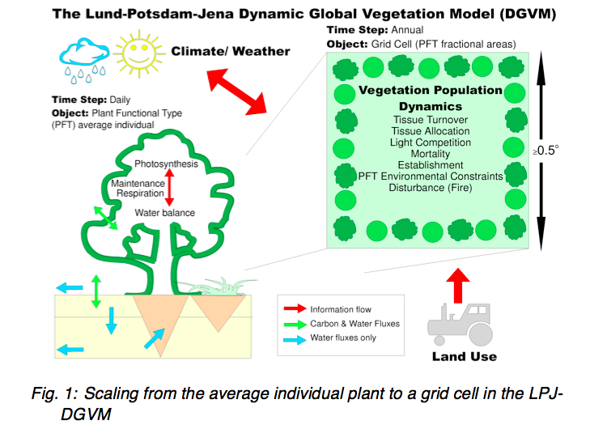

**Source: PIK**  

The main components of a DGVM are: establishment, productivity and competition for resources, resource allocation, growth, disturbance and mortality. DGVMs can be *forced* i.e. run with trends of CO2, climate and land use from observations or *scenarios* or run interactively within climate models to analyse feedbacks.

Clearly many simplifications have to be made to do this sort of modelling at a global scale. This is partly from having to have suitable sets of parameters to describe the processes globally (model parameters) and partly for computational reasons. The trend is to include more complexity as time goes by in these models, as computational resources increase and our understanding of processes and our ability to parameterise the models improves.

The ability to model vegetation dynamics is an important aspect of DGVMs in that it allows for prognostic and paleo use, this also means that the design of DGVMs is geared towards modelling *potential* vegetation. Anthrogenic influences then, such as changes in land use are incorporated by forcing these effects (e.g. prescribing land cover/PFT) on top of the dynamic ('natural' / 'potential') modelling.

DGVMs have been developed from the 1990s in response to the need for models to investigate the responses of vegetation to environmental change at time scales from seconds to centuries and from the local to global scale (Woodward and Lomas, 2004). A non-exclusive list of DGVMs developed in the 1990s and early 2000s is:

*    LPJ - Germany, Sweden
*    IBIS - Integrated Biosphere Simulator - U.S.
*    MC1 - U.S.
*    HYBRID - U.K.
*    SDGVM - U.K.
*    SEIB-DGVM - Japan
*    TRIFFID - U.K.
*    VECODE - Germany
*    CLM-DVGM - U.S.

Peng (2000) provides a useful review of such models as they stood in the year 2000 that students should follow up for background information. 

An overview of the main characteristics of some of the available DGVMs is provided in the table below:

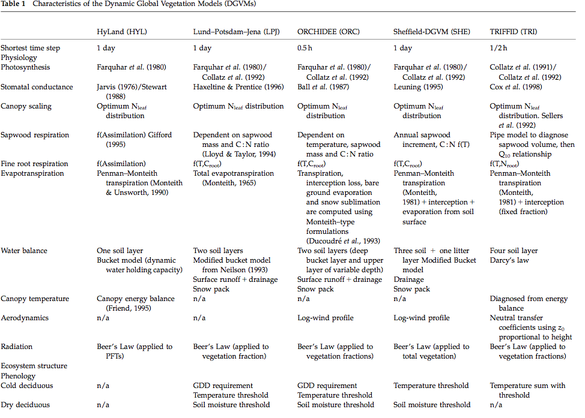

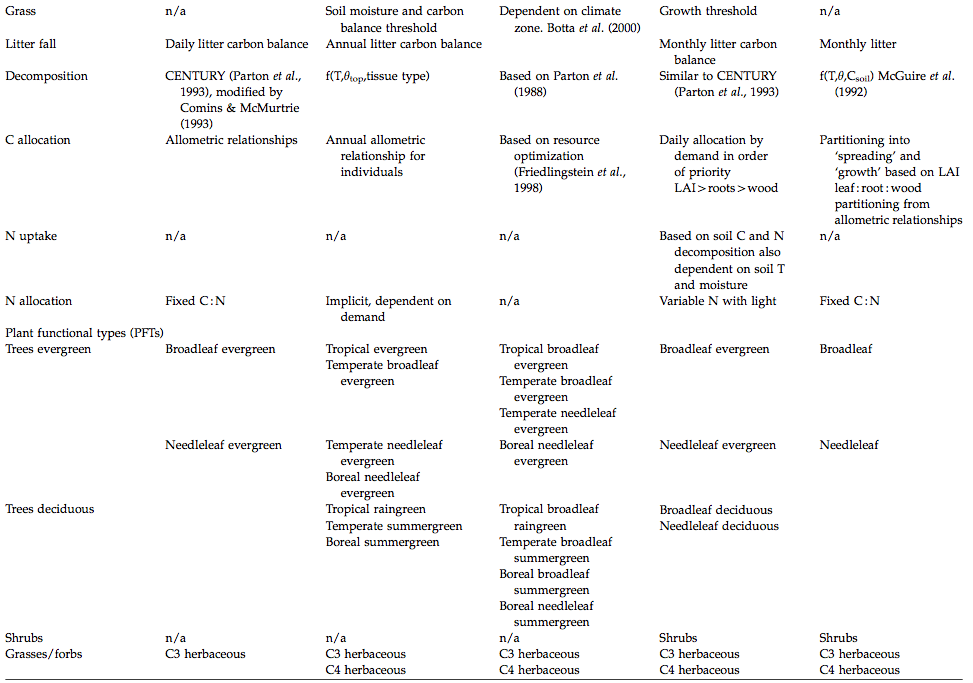

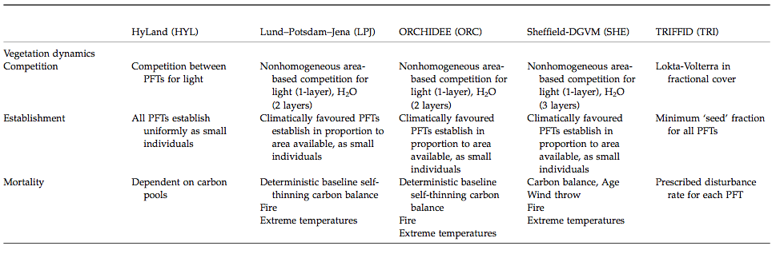

**Source**: Sitch et al. (2008)

Plant Functional Types
~~~~~~~~~~~~~~~~~~~~~~~

One important abstraction made in DGVMs is the idea of *plant functional types* (PFTs). This is a way in which global parameterisations can be simplified, by assuming that the responses to resources annd climate of groups of plant types will be similar and so they can be lumped together. It recognises that we cannot model  all plant species at a global scale and is a pragmatic response to this in defining a more limited set of *functional types* that can be grouped together. 

One might try to do this based on a simple *biome* description, but one soon finds that many difficulties arise when considering biomes with complex structures and mixtures, such as savanna or mixed forest where different plants in the biome have very different responses to light, different phenologies etc.

.. figure:: http://www.cgd.ucar.edu/tss/clm/pfts/igbp.gif
    :align: center
    :width: 50%

**Source:** `NCAR <http://www.cgd.ucar.edu/tss/clm/pfts/index.html>`_

.. figure:: http://www.cgd.ucar.edu/tss/clm/pfts/biome-vs-pft.gif
    :align: center
    :width: 50%

**Source:** `NCAR <http://www.cgd.ucar.edu/tss/clm/pfts/index.html>`_

Box (1996) suggests the following requirements for PFTs. They should:

* represent the world's most important plant types;
* characterize them through their functional behavior;
* and provide complete, geographically representative coverage of the world's land areas

and discusses the various schools of thought on how these groupings should be arrived at. 

One set of PFTs arrived at by Box is:

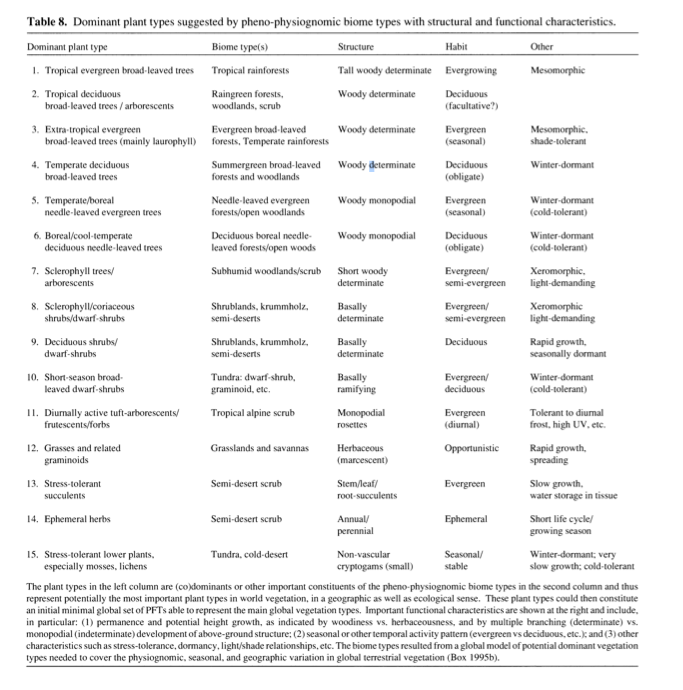

**Source:** Box (1996)

Other groupings of PFTs have been used, for instance that suggested by Bonan et al. (2002), one motivation here being linking to land cover classes defined in global land cover datasets supplemented by climatic zoning based on precipitation, and temperature/Growing degree days (GDD, see below):

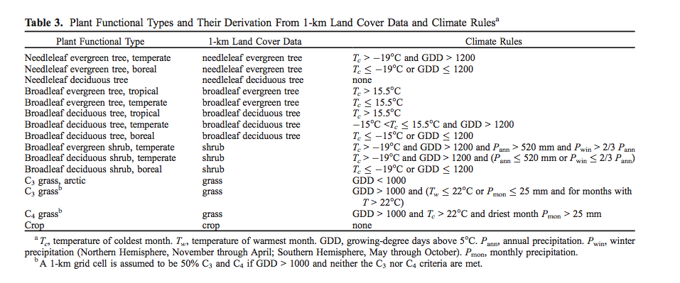

**Source:** Bonan et al. (2002)

Quaife et al. (2008) examined the impact of different land cover schemes for applying the mapping from land cover to PFT:

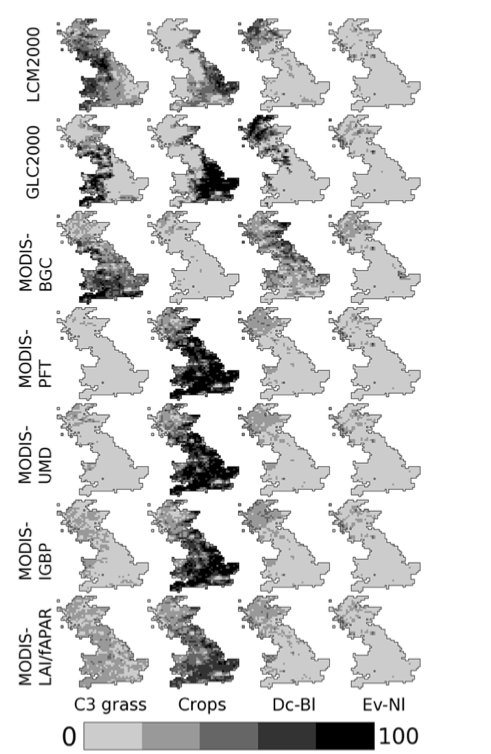

*Proportions (from left to right) of the C3 grass, crop, deciduous broadleaf and evergreen needleleaf Plant Functional Types (PFTs) across Great Britain according to (a) LCM2000 (b) GLC2000 (c) MODIS-BGC (d) MODIS- PFT (e) MODIS-UMD (f) MODIS-IGBP (g) MODIS-LAI/ fAPAR.* **Source:** Quaife et al. (2008)

For context, the values of GPP, NEP and NPP are given for teh UK, assuming the land surface is covered with a single PFT.

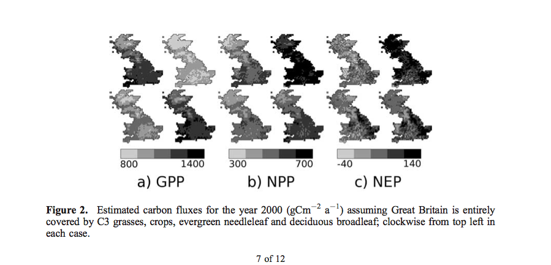

Differences in NPP (:math:`gC m^{-2}`) are shown:

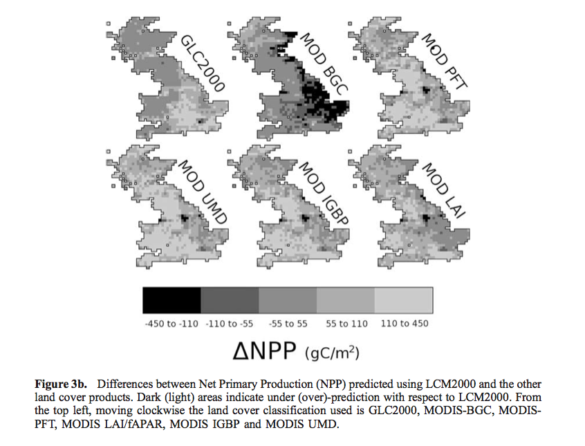

so at any location, the impact of land cover uncertainties and the mapping used from land cover to PFT can have a significant impact on model calculations of carbon fluxes (the range of differences in NPP is 133 :math:`gC m^{-2}`).

The current status of these models then includes a set of *parameters* describing vegetation functioning and other characteristics for each of these broad PFT classes, e.g. (`NCAR <http://www.cgd.ucar.edu/tss/clm/pfts/pft-physiology.htm>`_).

There are many criticisms that can be applied to this approach and there are clearly complexities (those to do with the assignment of a particular PFT to a location, and those concerning the parameterisation of a PFT across broad areas for example), but it should be seen as a pragmatic response to the need to run the DGVMs globally. 

One direction that this area of DGVM research is going in is in developing and using `a global plant trait  database: TRY <http://www.try-db.org/pmwiki/index.php>`_  which can allow the sorts of data that field ecologists measure on plant traits to be linked to what could be used in DGVMs (Kattge et al., 2011).  

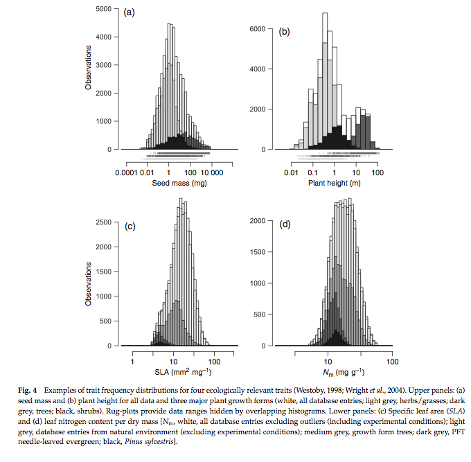

**Source**: Kattge et al., 2011

Because of the large number of samples involved, distributions of these traits can now be more fully explored. Early interesting findings include analysis of the fraction of variance explained by PFT or species for key traits:

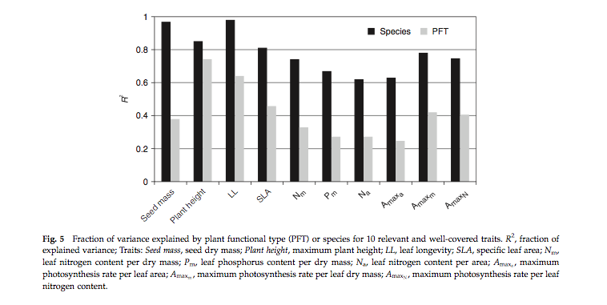

**Source**: Kattge et al., 2011

here, we can see that for example for specific leaf area (SLA, one-sided leaf area per leaf dry mass) about 40% of the variation in SLA that exists in the database occurs between PFTs, also the variation in the mean between PFTs is similar to the within PFT variation for this trait. 

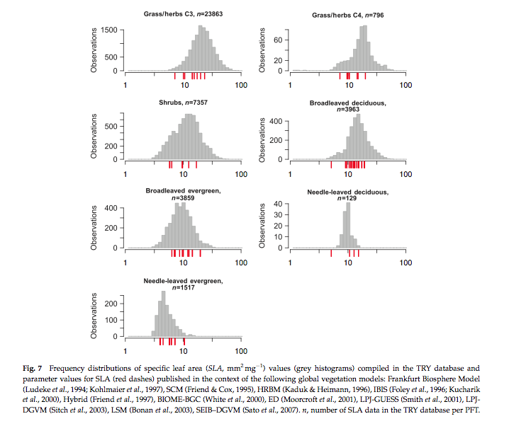

**Source**: Kattge et al., 2011

The figure above shows frequency distributions of SLA for different PFTs. For some (e.g. needle leaf deciduous) the distribution is quite narrow (but a relative small sample number here) but for most, it is wide. Interestingly, the figure also shows the values of SLA used in different global vegetation models (in red) showing the very wide range of values assumed across different models.  

How 'good' are these models?
~~~~~~~~~~~~~~~~~~~~~~~~~~~~~

`Prentice (2011)  <http://www.pik-potsdam.de/news/events/greencyclesii/programme/20.5.2011/prentice/index_html>`_ provides a critique of current efforts in DGVMs, where he argues particularly for more/better model benchmarking. This can be done by comparing model outputs (not just carbon stocks and fluxes, but other measures such as vegetation greennesss or runoff) with *measurements*. A significant internation effort to coordinate such benchmarking is the International Land Model Benchmarking - `iLAMB <http://www.ilamb.org/>`_.

Our current understanding of how good these models are comes from sources such as the Carbon-Land Model Intercomparison Project - `C-LAMP <http://www.climatemodeling.org/c-lamp/>`_ which included an analysis of the biogeochemical models CASA', CN (Randerson et al., 2009). Among these models, global carbon sinks for the 1990s differed by a factor of 2, and the magnitude of net carbon uptake during the growing season in temperate and boreal forest ecosystems was under-estimated, probably due to delays in the timing of maximum LAI. In the tropics, the models overestimated carbon storage in woody biomass based on comparison with datasets from the Amazon.

Another source of information is straight model intercomparisons such as  that of Sitch et al. (2008) which performed an intercomparison of five DGVMs. Whilst such work does not include much comparison with measurements, they are useful for understanding the agreement and divergence of current DGVMs under future climate scenarios.

One comparison in this study was with the best current estimates of global land carbon budgets for the 1980s and 1990s:

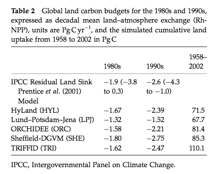

**Source**: Sitch et al. (2008)

Major findings are:

* All models estimates are within the range of current knowledge of these budgets and relatively close to the mean IPCC values. The models were also in general agreement about the cumulative land uptake over the last 50 years.
* They also simulated the correct sign of response to ENSO events but differed markedly in magnitude.
* All five DGVMs have similar response of productivity to elevated atmospheric CO2 in agreement with field observations
* The DGVMs are in less agreement in the way they respond to changing climate.
* All models suggest a release of land carbon in response to climate, implying a significant positive climate-carbon cycle feedback in each case. This response is mainly due to a reduction in NPP and a decrease in soil residence time in the tropics and extra-tropics, respectively.

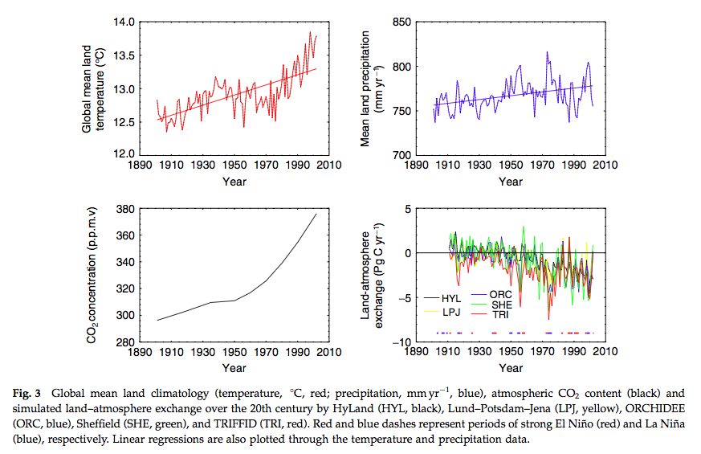

**Source**: Sitch et al. (2008)

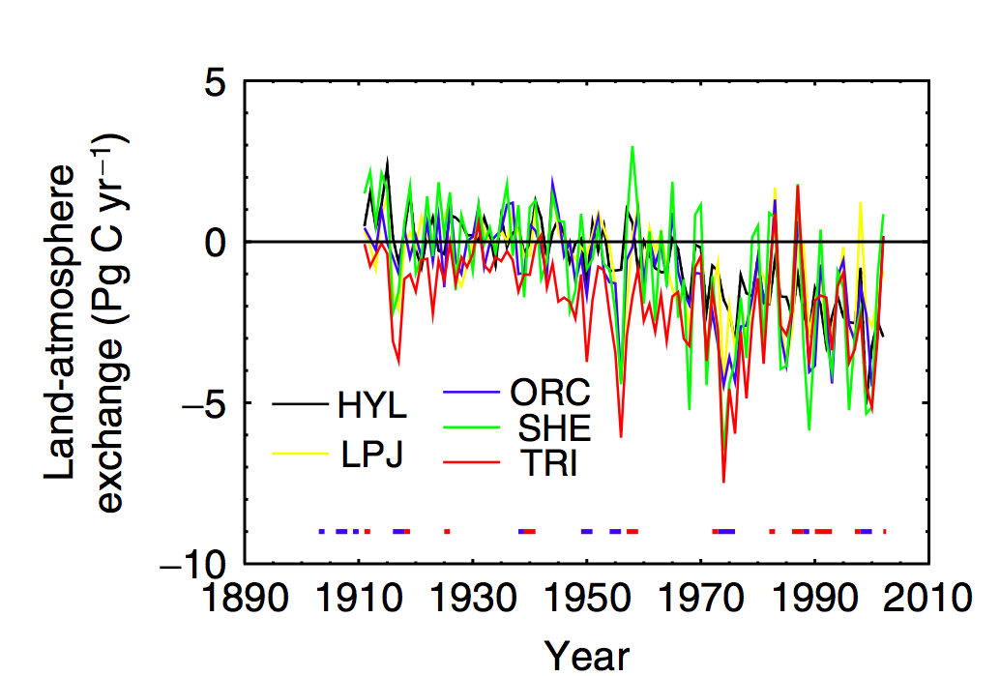

Zoom in of lower right panel of above. **Source**: Sitch et al. (2008)

We see, for example significant scatter on the year to year responses of the models when considering the land-atmospherie carbon exchange, particularly for ENSO years, although the general trends are similar (hence the level of agreement noted above for decadal or longer integrals).

.. figure:: figures/sitch9.png
    :align: center
    :width: 90%

**Source**: Sitch et al. (2008)

Significant disagreement exists between the models on NPP response to climate in the tropics and soil respiration response to climate in the extra-tropics. In the above figure we see the NPP response to elevated CO2 and the sensitivity of some other terms to temperature.

Uncertainty in future cumulative land uptake associated with land processes is large and equivalent to over 50 years of anthropogenic emissions at current levels.

We can see from these various analyses that whilst there are certain (important) areas of agreement among the current DGVMs, significant uncertainty remains in estimating current carbon budgets and predicting future ones. Improvements in these models is of great importance to understanding possible climate changes and impacts.

Summary
--------
In this section, were have reviewed DGVMs and their underlying concepts. We have seen that they represent a compromise between understanding and representation of process at the scales considered and compute power and data requirements. Fundamental to their development have been simplifications that allow them to be used globally, over a large range of timescales. This includes the idea of Plant Functional Types (PFTs) to represent the responses of different 'types' of vegetation to their environment. DGVMs were originally developed to represent 'potential vegetation', so management constraints have to be included on top of the models to be able to compare them with measurements.

References
-----------
* **Scheiter, S.**, Langan, L. and Higgins, S.I. (2013), Next‐generation dynamic global vegetation models: learning from community ecology. New Phytol, 198: 957-969. https://doi.org/10.1111/nph.12210
* **Box., E.O.** 1996, Plant Functional Types and Climate at the Global Scale, Journal of Vegetation Science, Vol. 7, No. 3 (Jun., 1996), pp. 309-320 
* **Woodward, F.I.**  Lomas, M.R. (2004) `Vegetation dynamics - simulating responses to climatic change, Biol. Rev. 79, 643-670 <http://citeseerx.ist.psu.edu/viewdoc/download?doi=10.1.1.170.1584&rep=rep1&type=pdf>`_
* Bonan, G.B, S. Levis, L. Kergoat, and K.W. Oleson, 2002: `Landscapes as patches of plant functional types: an integrating concept for climate and ecosystem models. Global Biogeochem. Cycles, VOL. 16, NO. 2, 10.1029/2000GB001360, 2002 <http://www.cgd.ucar.edu/tss/clm/pfts/pfts.pdf>`_
* **Sitch S,** Huntingford C, Gedney N, Levy PE, Lomas M, Piao S, Betts R, Ciais P, Cox P, Friedlingstein P, Jones CD, Prentice IC, Woodward FI (2008) Evaluation of the terrestrial carbon cycle, future plant geography and climate-carbon cycle feedbacks using 5 Dynamic Global Vegetation Models (DGVMs). Global Change Biology 14:2015-2039, doi:10.1111/j.1365-2486.2008.01626.x
* **Sellers PJ,** Berry JA, Collatz GJ, Field CB, Hall FG. 1992b. `Canopy reflectance, photosynthesis and transpiration. III. A reanalysis using improved leaf models and a new canopy integration scheme. Remote Sensing of the Environment 42: 187-216. <http://www.google.com.mx/url?sa=t&rct=j&q=canopy%20reflectance%2C%20photosynthesis%20and%20transpiration.%20iii.%20a%20reanalysis&source=web&cd=1&ved=0CCYQFjAA&url=http%3A%2F%2Famazonpire.org%2FPDF%2Ffc2009%2Freadings%2FSellers_1992_RSE.pdf&ei=IFsgT8uoBu3CsQKkpLmhDg&usg=AFQjCNGNYjTPYFSPZ0KCNjnApXXOvW9S8Q&sig2=H83PVd5Bqo0AAf8b__FKtg&cad=rja>`_
* **Randerson, James T.**, Forrest M. Hoffman, Peter E. Thornton, Natalie M. Mahowald, Keith Lindsay, Yen-Huei Lee, Cynthia D. Nevison, Scott C. Doney, Gordon Bonan, Reto Stockli, Curtis Covey, Steven W. Running, and Inez Y. Fung. September 2009. `Systematic Assessment of Terrestrial Biogeochemistry in Coupled Climate-Carbon Models. <http://www.climatemodeling.org/c-lamp/pubs/Randerson_GCB_2009.pdf>`_  Global Change Biology, 15(9):2462-2484. doi:10.1111/j.1365-2486.2009.01912.x. See also `Supporting Information. <http://www.climatemodeling.org/c-lamp/pubs/Randerson_GCB_2009_SupportingInfo.pdf>`_
* **D. B. Clark**, L. M. Mercado, S. Sitch, C. D. Jones, N. Gedney, M. J. Best, M. Pryor, G. G. Rooney, R. L. H. Essery, E. Blyth, O. Boucher, R. J. Harding, C. Huntingford, and P. M. Cox (2011) The Joint UK Land Environment Simulator (JULES), model description: Part 2: Carbon fluxes and vegetation dynamics, Geosci. Model Dev., 4, 701-722, 2011, doi:10.5194/gmd-4-701-2011
* **Prentice et al.**  The Carbon Cycle and Atmospheric Carbon Dioxide, 2001, `IPCC AR3 WG1 <http://archive.ipcc.ch/ipccreports/tar/wg1/pdf/TAR-03.PDF>`_
* **Peng, C.**  (2000)  From static biogeographical model to dynamic global vegetation model: a global perspective on modelling vegetation dynamics, Ecological Modelling, Volume 135, Issue 1, 25 November 2000, Pages 33–54
* **Kattge, J.**, et al. (2011), TRY: a global database of plant traits. Global Change Biology, 17: 2905-2935. doi: 10.1111/j.1365-2486.2011.02451.x
* Bonan, G.B, S. Levis, L. Kergoat, and K.W. Oleson, 2002: `Landscapes as patches of plant functional types: an integrating concept for climate and ecosystem models. Global Biogeochem. Cycles, VOL. 16, NO. 2, 10.1029/2000GB001360, 2002 <http://www.cgd.ucar.edu/tss/clm/pfts/pfts.pdf>`_
* Cramer W, Kicklighter DW, Bondeau A, Moore Iii B, Churkina G, Nemry B, Ruimy A, Schloss AL: Comparing global models of terrestrial net primary productivity (NPP): Overview and key results. Global Change Biology 1999, 5:1-15.
* Sellers PJ, Tucker CJ, Collatz GJ, Los SO, Justice CO, Dazlich DA, Randall DA. 1994. A global 1 degree by 1 degree  NDVI data set for climate studies. Part 2: the generation of global fields of terrestrial biophysical parameters from the NDVI. International Journal of Remote Sensing 15: 3519-3545.
* Sellers PJ. 1992.  Biophysical models of land surface processes. In Climate System Modelling, Trenberth KE (ed.). Cambridge University Press.

