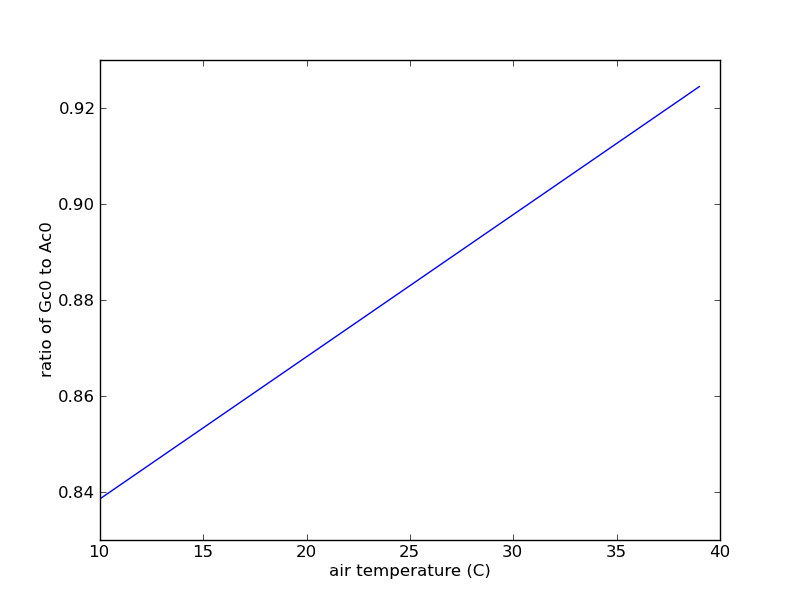
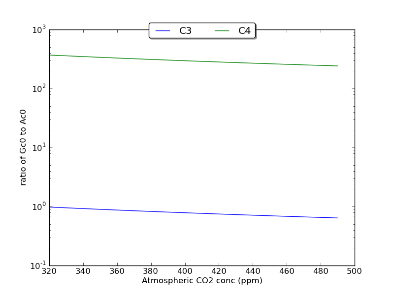
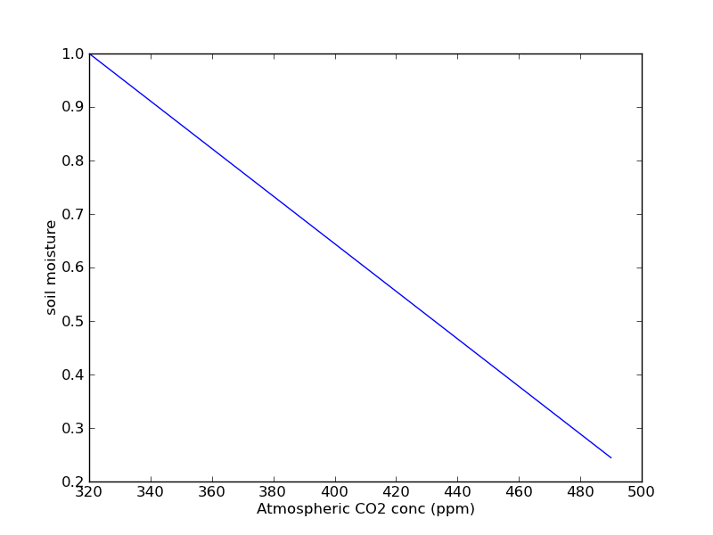
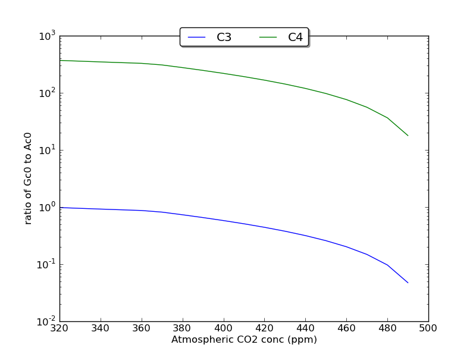

Modelling canopy conductance
------------------------------

We will implement here the canopy conductance-maximum photosynthesis rate  model
used in Bethy, Triffid etc. 

The calculation of internal CO2 concentration will follow the method of Knorr (1987):

::

    import numpy as np
    import pylab as plt
    
    def CO2InternalLeaf(atmosphericCO2,\
    	airTemperatureK_0 = 25.+273.15,\
    	airPressure_0 = 1.01325e5,\
    	atmosphericCO2_0 = 355.,\
    	C3Type=True):
        '''
        Calculate internal leaf CO2 concentration (ppm) Ci 
        from knowledge of atmosphericCO2 (ppm)
        assuming that Ci/atmosphericCO2 is constant.
    
        This follows  Knorr (1997) (Ch2, p49-50) but
        NB 1.6*8.3145*1000*(25+273.15)/(1.*10^5)/0.883
        = 44.92 ~= 45 which is what Knorr states
        but that is for std pressure, not 1 atm
        which is what we prefer to use
    
        parameters:
    
        atmosphericCO2 : ppm
            Actual atmospheric CO2 conc. 
    
        optional parameters:
    
        airTemperatureK_0 : K
    	fixed air temperature for assumed relationship
    
        airPressure_0 : Pa (STP = 1e5 Pa, but 1 atm = 1.01325e5 Pa)
    	fixed air pressure for assumed relationship
    
        C3Type : True (C3); False (C4)
    
        atmosphericCO2_0 : ppm
            fixed atmospheric CO2 conc. for assumed relationship
        
        '''
        R = 8.3145 # gas constant, J/mol K
        if C3Type == True:
            scaling = 0.883
        else:
            scaling = 333.
    
        deltaCO2 = 1.6 *1e3 *  R * airTemperatureK_0 \
                    / airPressure_0 / scaling
        CO2ratio = 1 - deltaCO2/atmosphericCO2_0
        Ci0 = atmosphericCO2 * CO2ratio
        return Ci0
    
    

This assumes a fixed ratio of internal to external CO2 concentration (under unstressed conditions)
which allows the internal CO2 concentration to be calculated from the external CO2 concentration.

If we assume that this ratio (different for C3 and C4 plants) holds for changing 
temperature, pressure and atmospheric CO2 concentration, then we can use it
to calculate the canopy conductance (mm s-1) from knowledge of the maximum canopy CO2 assimilation 
rate (umol(CO2) m-2 s-1) for different temperature, pressure and atmospheric CO2 concentrations.

::

    def canopyConductance(maxPhotosyntheticRate,\
            airTemperatureC=25.,\
            airPressure=1.01325e5,\
            C3Type=True,\
            atmosphericCO2=355.):
        '''
        maxPhotosyntheticRate : mol(CO2)m-2s-1
        airTemperatureC : C
        airPressure : Pa (STP = 1e5 Pa, but 1 atm = 1.01325e5 Pa)
        C3Type : True (C3); False (C4);
        atmosphericCO2 : ppm
    
        '''
        R = 8.3145 # gas constant, J/mol K
        airTemperatureK = airTemperatureC + 273.15
    
        Ci0 = CO2InternalLeaf(atmosphericCO2,C3Type=C3Type)
    
        Gc0 = maxPhotosyntheticRate * 1.6 *1e3 *  R * airTemperatureK \
                    /((atmosphericCO2 - Ci0)*airPressure)
        return Gc0
    
    

As an example, we can vary the air temperature from 10 to 40 C  and see what the impact is
on the ratio of Gc0 to maxPhotosyntheticRate:

::

    airTemperatureC = np.arange(10,40).astype(float)
    ratio = canopyConductance(1.0,airTemperatureC=airTemperatureC)
    
    plt.plot(airTemperatureC,ratio)
    plt.xlabel('air temperature (C)')
    plt.ylabel('ratio of Gc0 to Ac0')
    plt.savefig('figures/stomatalAssimRat.png')
    
    
    
    

So, over this quite large temperature range, we see the expected linear increase in  stomatal conductance for a given maximum photosynthetic rate.

As another example, lets vary the CO2 concentration from 200 ppm to 600 ppm:

::

    atmosphericCO2 = np.arange(320,500,10)
    ratio = canopyConductance(1.0,atmosphericCO2=atmosphericCO2)
    
    plt.clf()
    plt.semilogy()
    plt.plot(atmosphericCO2,ratio,label='C3')
    plt.plot(atmosphericCO2,\
    	canopyConductance(1.0,atmosphericCO2=atmosphericCO2,C3Type=False),\
    	label='C4')
    plt.xlabel('Atmospheric CO2 conc (ppm)')
    plt.ylabel('ratio of Gc0 to Ac0')
    plt.legend(loc='upper center',bbox_to_anchor=(0.5,1.05),\
            ncol=2,fancybox=True,shadow=True)
    plt.savefig('figures/stomatalAssimRat2.png')
    
    

We see an apparent decrease in the Gc0 to Ac0 ratio (i.e. lower stomatal conductance for a given  Ac0) with increasing CO2 concentration.

**Exercise 3**
Examine the behaviour of this model for varying air pressure over  a reasonable range.

At what point does the ratio Gc0 to Ac0 become: (a) 1.0; (b) 0.0 for pressure, temperature and CO2? Do these limits matter at all?

**Exercise 4**

What does this apparently imply for carbon assimilation and water loss through transpiration? Criticise this model.

We will now add the water limitation model of Cox (2001) (i.e. that of Triffid/JULES):

::

    def canopyConductanceLimiting(maxPhotosyntheticRate,\
            soilMoisture,\
            airTemperatureC=25.,\
            airPressure=1.01325e5,\
    	soilMoistureCritical=0.8,\
    	soilMoistureWilt=0.2,\
            C3Type=True,\
            atmosphericCO2=355.):
        '''
        maxPhotosyntheticRate : mol(CO2)m-2s-1
        soilMoisture : any units (same as soilMoistureCritical etc.)
        airTemperatureC : C
        airPressure : Pa (STP = 1e5 Pa, but 1 atm = 1.01325e5 Pa)
        C3Type : True (C3); False (C4);
        atmosphericCO2 : ppm
        soilMoistureCritical, soilMoistureWilt : any units (same as soilMoisture)
        '''
        soilMoisture = np.array(soilMoisture)
        beta = (soilMoisture-soilMoistureWilt)/(soilMoistureCritical-soilMoistureWilt)
        beta[np.where(beta>1.0)] = 1.0
        beta[np.where(beta<0.0)] = 0.0
    
        Gc0 = canopyConductance(maxPhotosyntheticRate,\
            airTemperatureC=airTemperatureC,\
            airPressure=airPressure,\
            C3Type=C3Type,\
            atmosphericCO2=atmosphericCO2)
    
        Gc = Gc0* beta
        return Gc
    

We can't fully look at feedbacks yet, but we can now suppose
for example that soil moisture decreases with increasing atmospheric CO2
and look at the impact of that:

::

    atmosphericCO2 = np.arange(320,500,10)
    # this is just a made up model
    soilMoisture = 1. -  0.8*(atmosphericCO2-320.)/(500.-320.)
    
    plt.clf()
    plt.plot(atmosphericCO2,soilMoisture)
    plt.xlabel('Atmospheric CO2 conc (ppm)')
    plt.ylabel('soil moisture')
    plt.savefig('figures/stomatalAssimRat3a.png')
    
    ratio = canopyConductanceLimiting(1.0,\
    	soilMoisture,\
    	atmosphericCO2=atmosphericCO2)
    
    plt.clf()
    plt.semilogy()
    plt.plot(atmosphericCO2,ratio,label='C3')
    plt.plot(atmosphericCO2,\
            canopyConductanceLimiting(1.0,\
    	soilMoisture,\
    	atmosphericCO2=atmosphericCO2,\
    	C3Type=False),\
            label='C4')
    plt.xlabel('Atmospheric CO2 conc (ppm)')
    plt.ylabel('ratio of Gc0 to Ac0')
    plt.legend(loc='upper center',bbox_to_anchor=(0.5,1.05),\
            ncol=2,fancybox=True,shadow=True)
    plt.savefig('figures/stomatalAssimRat3.png')
    
    

So, if there is a positive feedback between atmospheric CO2 concentration and soil moisture, then we would expect from this that the ratio of canopy conductance to maximum CO2 assimilation rate would decrease more rapidly with increasing CO2 concentration.

 **Exercise 5**

As above, what does this imply for water losses by transpiration?

Modelling Photosynthesis
------------------------

Here, we will take the approach used in the JULES model (Best et al., 2011; Clark et al., 2011) with some minor modifications.

::

    print CO2InternalLeaf(383)
    

::

    335.17179975
    

References
----------

* M. J. Best, M. Pryor, D. B. Clark, G. G. Rooney, R .L. H. Essery, C. B. Menard, J. M. Edwards, M. A. Hendry, A. Porson, N. Gedney, L. M. Mercado, S. Sitch, E. Blyth, O. Boucher, P. M. Cox, C. S. B. Grimmond, and R. J. Harding (2011) The Joint UK Land Environment Simulator (JULES), model description Part 1: Energy and water fluxes, Geosci. Model Dev., 4, 677-699, 2011
* D. B. Clark, L. M. Mercado, S. Sitch, C. D. Jones, N. Gedney, M. J. Best, M. Pryor, G. G. Rooney, R. L. H. Essery, E. Blyth, O. Boucher, R. J. Harding, C. Huntingford, and P. M. Cox (2011) The Joint UK Land Environment Simulator (JULES), model description Part 2: Carbon fluxes and vegetation dynamics, Geosci. Model Dev., 4, 701-722, 2011
