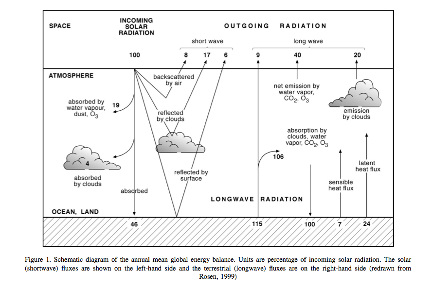
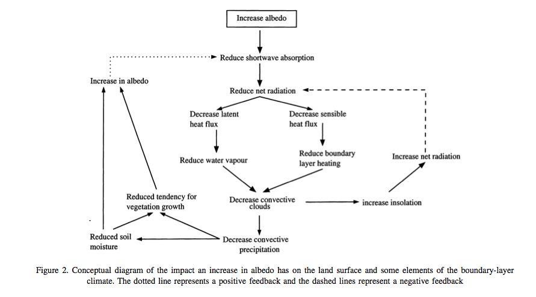
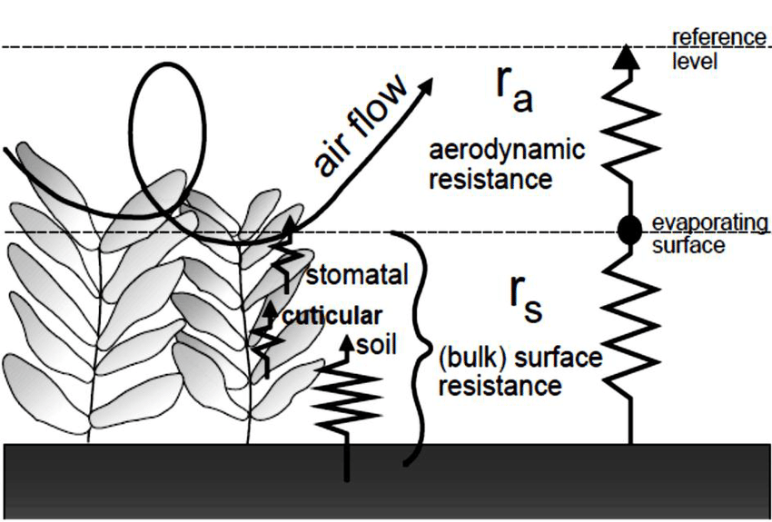
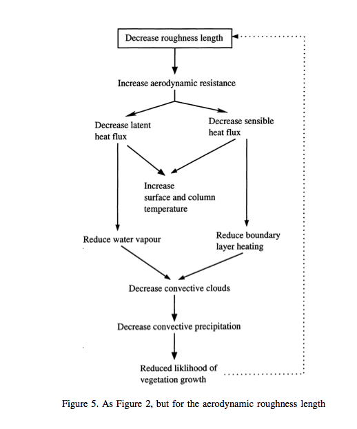
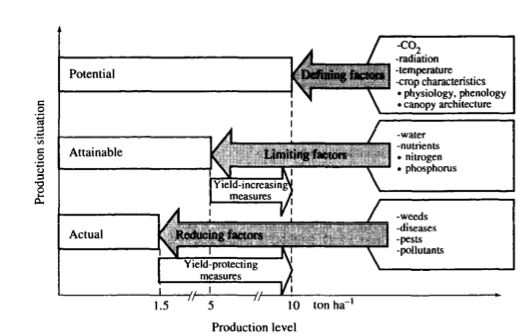
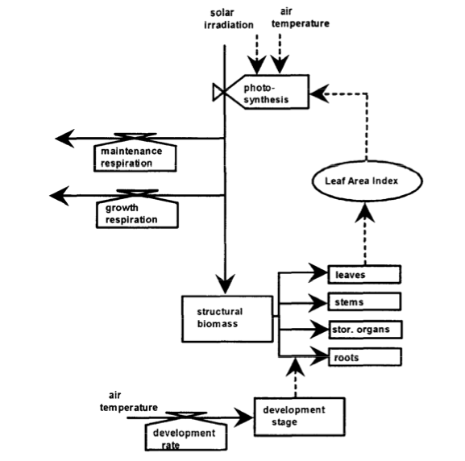
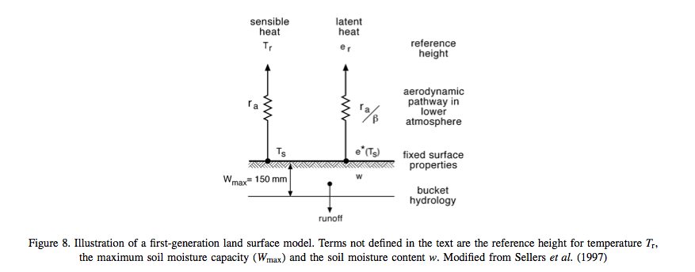
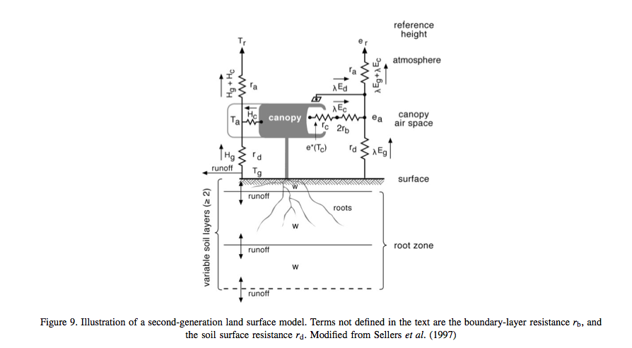
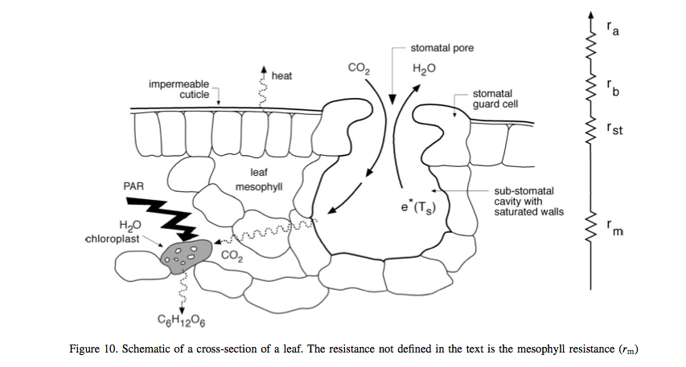
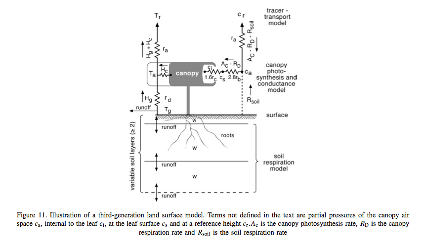

Terrestrial Ecosystem Modelling
===============================

Purpose of this section
------------------------

In the previous section, we reviewed some of the important mechanisms for understanding global terrestrial carbon state and dynamics. 
In this lecture, we consider strategies for building mathematical models to represent these concepts.

Land Surface schemes
--------------------

Basic energy and water processes
~~~~~~~~~~~~~~~~~~~~~~~~~~~~~~~~

The land surface component of a climate or  Earth System model, as well as models used in weather forecast  can be called a 'land surface scheme' (LSS), implemented as a 'land surface model' (LSM). The purpose of such a scheme is to model energy and (e.g. water, carbon) flux interactions at the land surface. The main driver of and LSS is generally consideration of the surface energy balance.

.. math:: R_n = S\downarrow (1 - \alpha) + L \downarrow - L \uparrow

where :math:`\alpha` is the shortwave albedo, :math:`R_n` is the net radiation, :math:`S \downarrow` is the downwelling shortwave radiation and :math:`L \downarrow` and  :math:`L \uparrow` are the downwelling and upwelling longwave radiation respectively. Although these terms balance globally over the long term, they do not do so locally and these energy dynamics drive the Earth climate system.

**Source**: Pitman (2003)

In the above figure, showing global averages  of components of the energy balance, the solar radiation is represented as 100 units. Around 31 units are exchanged  as sensible and latent heat fluxes (:math:`H` and :math:`\lambda E` respectively), but the properties of the land surface significantly affect the way these fluxes are partitioned. The land surface also acts to *store* energy on various timescales (diurnal, seasonal, and longer). 

Here, :math:`E` is evapotranspiration (water loss from soil, leaf surfaces and from plant transpiration) (:math:`kg m^{-2} s^{-1}`), and :math:`\lambda` is the latent heat of vapoursiation (:math:`J kg^{-1}`).

The net radiation :math:`R_n` must be balanced by :math:`H` and :math:`\lambda E` and by the soil flux  :math:`G` and the chemical energy flux  :math:`F`  stored in photosynthesis:

.. math:: R_n = H + \lambda E + G + F

We can already see from these equations that changes in e.g. albedo  :math:`\alpha` are likely to alter :math:`H` and :math:`\lambda E` by altering  :math:`R_n`.

**Source**: Pitman (2003)

Being able to model the partition between :math:`H` and :math:`\lambda E`  is important in climate / Earth system models because lower  :math:`\lambda E`   implies a lower flux of water vapour to the atmosphere which implies lower cloudiness and rainfall. Lower  :math:`H`  on the other hand tends to cool the planetary boundary layer and reduce convection.

:math:`H` and :math:`\lambda E`  are turbulent heat  fluxes  (see Monteith and Unsworth, 1990, pp. 123-137 for more details), influenced by the turbulence of the airflow in the `planetary boundary layer <http://en.wikipedia.org/wiki/Planetary_boundary_layer>`_, the lowest part of the atmosphere, which is influenced by the aerodynamic roughness of the surface. 

:math:`H` can be represented as a quasi-diffusive process:

.. math:: H = \frac{T_s - T_r}{r_a} \rho c_p

where :math:`T_s` is the surface temperature,  :math:`T_r` is a reference temperature above the surface,  :math:`r_a`  is the aerodynamic resistance ,  :math:`\rho`  is the density of air, and :math:`c_p`  is the specific heat of air. 

The latent heat is a more complex process but can be represented (e.g. Sellers, 1992) as:

.. math:: \lambda E = \left( \frac{e^* (T_s) - e_r}{r_s + r_a} \right)  \frac{\rho c_p}{\gamma}

where :math:`e^* (T_s)` is the saturated vapour pressure at :math:`T_s`, :math:`e_r` is the vapour pressure at a reference height, :math:`\gamma` is the `psychrometric constant <http://www.fao.org/3/X0490E/x0490e07.htm#psychrometric%20constant%20%28g%29>`_ and :math:`r_s` is the bulk surface resistance to the transfer of water from the surface to the air. 

*Simplified representation of the (bulk) surface and aerodynamic resistances for water vapour flow* **Source**: FAO

The aerodynamic resistance is inversely dependent upon the wind speed and the logarithm of the surface roughness length, which, in turn, is a function of the drag properties of the land surface (Pitman, 2003). 

The roughness length of the surface over vegetated areas is strongly influenced by vegetation height, so if the vegetation is altered or removed the roughness will decrease: a higher roughness length (e.g. over a forest) permits a greater exchange of turbulent heat fluxes for given meteorological conditions than a lower roughness length  (e.g. grass). 

A roughness (positive -- self-enhancing) feedback can exist  if vegetation conditions are altered (e.g. removing forest and replacing with grass):

**Source**: Pitman (2003)

The factors that affect turbulent energy flows between the land surface and the atmosphere also affect fluxes of materials and gases, a significant one being the flux of CO2 between plants and the atmosphere. This can be given as:

.. math::  F = \frac{c_i - c_a}{r_{st} + r_a}

where :math:`F` is the the CO2 flux density (:math:`kg m^{-2}  s^{-1}`), :math:`c_i` is the internal leaf CO2 concentration, and  :math:`c_a` is the ambient CO2 concentration. Here, :math:`r_{st}` is the stomatal resistance (see below), a measure of the difficulty (or ease) for the vegetation to transpire. The stomatal resistance  is not the same as the bulk surface resistance :math:`r_s` above as :math:`r_{s}` includes the resistance to moisture transfer from  the soil and leaf surface. For a crop or grassland, the bulk surface resistance can be estimated as (`FAO <http://www.fao.org/docrep/X0490E/x0490e06.htm#%28bulk%29%20surface%20resistance%20%28rs%29>`_):

.. math::  r_s = \frac{r_{st}}{LAI_{active}}

where :math:`LAI_{active}` is the active (sunlit) leaf area index, and :math:`r_{st}` is the 'bulk' stomatal resistance  of a well-illuminated leaf.  Note that this approximation does not include evaporative fluxes from the leaf surface or soil however: in land surface schemes this is usually treated more carefully and involves explicit calculation of the individual resistance terms that combine to make the bulk surface resistance.

[`Exercise 3 <aside_PM.html>`_]

Following from the considerations of water fluxes above, the water balance can be represented in a LSS:

.. math:: P = E - R_{drain} - R_{surf} - \Delta S

where :math:`P` is water input to the system (precipitation and snow melt generally, but also translocation of water e.g. in irrigation), :math:`E` is evapotranspiration (water from the surface to the atmosphere through evaporation from the soil and leaf surfaces and transpiration from leaves), :math:`R_{drain}` is a *slow* drainage component of water loss from an area, :math:`R_{surf}` is surface runoff, and :math:`\Delta S` is the change in soil moisture storage.

Note the use of :math:`E` here when considering water fluxes, but :math:`\lambda E` above when considering energy fluxes.

A LSS then, implemented as a LSM, models the energy and water fluxes at the land surface and provides an interface of these to atmospheric modelling.
Usually, this will be done for a set of grid cells, where the inputs and outputs of each cell are considered separately. There is potential for a lateral flow of water
between cells due to the runoff terms in consideration of the water balance and also potentially for snowmelt or other water inputs to the cell.

Basic vegetation growth processes
~~~~~~~~~~~~~~~~~~~~~~~~~~~~~~~~

The pedigree of most  models of  vegetation dynamics used to simulate carbon flows in terrestrial ecosystems models (TEMs) comes from attempts to describe the processes controlling crop growth in computer  codes from the 1960s (Bouman et al., 1996) onwards.  Such models express current knowledge of process using mathematical equations and the coupling of these in (computer) simulation models. We will consider crop models then to outline the basic processes involved.

To understand the basic functioning of such models, we can look at the system diagram of Rabbinge (1993):

    *"The relationship among potential, attainable and actual yield and defining, limiting and growth reducing factors (Rabbinge, 1993)."* Source: Bouman et al., 1996

A set of defining factors (plant type, CO2, radiation, etc.) describe how the vegetation would grow under conditions where it is not limited by water and nutrient constraint. It will of course respond to variations in the environmental conditions (CO2, radiation, temperature). This provides a model of the *potential growth* of the vegetation under these conditions. The *attainable growth* then is the potential growth modulated by some limiting factors such as water or nutrient availabiliy. The *actual* growth then has some further modulation by  pest, disease etc. or when considering carbon stocks perhaps other reducing factors such as grazing.

One might think at first sight that temperature (or even radiation) ought to be a 'limiting' factor, rather than a 'defining' term: if plants have insufficient temperature or light, they will grow 'sub-optimally'. The main conceptual difference is really to do with how the modelling of process takes place. For crops, the 'limiting resources' (water, nitrogen etc.) are things that intervention by the farmer can affect (e.g. irrigation or fertilizers: yield increasing measures in the diagram), so in crop models it makes sense to separate the environmental factors that one has little ability to control once the crop is planted (except by expensive, experimental measures such as CO2 increase in `FACE experiments <http://climatechangescience.ornl.gov/content/free-air-co2-enrichment-face-experiment>`_) and those that are typically employed to improve yield. Further, we can see the *reducing factors* mentioned as things in which the farmer can intervene (yield protecting measures). So, in crop models, we tend to separate the processes in this way and this feeds through into the philiosphy of many of the more general ecosystem/carbon models.

The models we are interested in here are *dynamic*, as the state variables develop as a function of *time*. Many of these models are *hierarchical* because they consider the (eco)system as a hierarchy of organisational units (cell, leaf, canopy etc.) and the model then integrates these lower level processes. We can also call these models *'state variable based'* in that they represent and store the dynamics of some set of weights (state variables, such as leaf area) that are updated at each time step of the system by rate variables (e.g. carbon flux).

One main difference between *crop growth* models and those we will more generally consider in modelling terrestrial carbon are that the focus on the former is on estimating *yield* from the crop, rather than other terms that may be important in carbon modelling such as total CO2 stocks or fluxes. In a general sense though, the structure of most such models is similar.

    *"Diagram of the relations in a typical School of de Wit crop growth model (SUCROS) for potential production. Boxes indicate state variables, valves rate variables. circles auxiliary variables, solid lines (arrows) the flow of matter and dotted lines the flow of information."* Source: Bouman et al., 1996 

The diagram above shows a typical crop model structure, although as we have said this is similar for most ecosystem models.

The main state variable here is the *pool* of structural biomass, which is also represented as a set of pools in different plant organs (leaves, stems, roots and storage organs). The fundamental process within such a model then is the production of this pool of stuctural biomass and its allocation to organ pools. The other state variable here is the *development stage* which strongly affects the  allocation rate from the 'structural biomass' pool to the different organs. It also impacts plant *structure* although this is not generally explicitly considered in such models.

The biogeochemical *processes* represented here are photosynthesis, respiration (maintenance and growth) and the development rate which controls the 'stage of development' of the crop. Note that *only* states and processes directly involving the plant are considered in such a crop growth model (i.e. we do not consider what happens to/in the soil).

Some land surface schemes
-------------------------

First generation models
~~~~~~~~~~~~~~~~~~~~~~~~

There have been several generations of LSMs. The 'first generation' (Pitman, 2003), from the  late 1960s, treated the basic processes described above and were a major step forward in  climate modelling. These models used simple bulk aerodynamic transfer formulations and tended to use uniform and prescribed surface parameters, including water-holding capacity, albedo and roughness length and had a static representation of vegetation, and tended not to include canopy resistance in estimation of surface resistance.

One other weakness of these models was that they did not really provide a framework for some of the other flux transfers that were found to be important in climate models, such as CO2 flux.

There were various attempts to add complexity to these models, although this was not always done in a systematic way that demonstrated improved model performance from this added complexity (Pitman, 2003). 

**Source**: Pitman (2003)

**Second generation models**

From the late 1970s, new concepts were added to these models such as multi-layer (two initially) representations of soil for moisture and temperature calculations, and the representation of vegetation as a single bulk layer.

**Source**: Pitman (2003)

These models represented the vegetation-soil system as something that interacts with the atmosphere, and had more complex representations of albedo (e.g. splitting the downwelling component into that in visible wavelengths (strongly absorbed by vegetation) and longer wavelengths. A significant advance in these models was the incorporation of  satellite observations (e.g. Sellers et al., 1994). Other advances include: the inclusion of momentum transfer concepts; and some form of explicit biophysical control on evaporation (Pitman, 2003), connecting CO2 uptake and water loss through stomatal opening.

Most of these models then has a representation of stomatal conductance :math:`g_{st}`, the reciprocal of stomatal resistance  :math:`r_{st}` which , based on empirical evidence is generally modelled as:

.. math:: g_{st} = F(PAR) [ f(\delta e) f(T) f(\psi_l)] 

where :math:`PAR` is the 'photosynthetically active radiation', i.e. the downwelling shortwave radiation at visible wavelengths where it is absorbed by plants for use in photosynthesis, :math:`\delta e` is humidity, :math:`T` is temperature, and :math:`\psi_l` is the `leaf water potential <http://en.wikipedia.org/wiki/Water_potential>`_.

Another feature of  these LSSs is their more complex soil moisture parameterisations and the incorporation of relatively sophisticated snow sub-models.

Third generation LSMs
~~~~~~~~~~~~~~~~~~~~~~~~~~~~~~~~

One of the major advances of the so-called third generation models, developed in the 1990s and beyond  is their connection of the leaf stomatal conductance and carbon assimilation by leaves. In second generation models, :math:`g_{st}` was only used to model transpiration, but it now became a key concept in estimating canopy photosynthesis, using the approach of Farquhar et al. (1980) and Farquhar and von Caemmerer (1982). Details of this model are dealt with below, but the essentials of the method are some semi-mechanistic model of stomatal conductance from the net leaf  assimilation rate :math:`A_n` and the calculation of math:`A_n` a as the minimum of potential assimilation under different limitations with leaf respiration subtracted.

**Source**: Pitman (2003)

Typical methods for scaling these processes from the leaf to canopy include assuming that leaf nitrogen concentrations (and the photosynthetic enzyme Rubisco) are proportional throughout the canopy  (e.g. Sellers et al., 1992b).

Since carbon assimilation is calculated in these models, it is now possible to consider other canopy processes such as the allocation of carbon to different pools (leaves, wood etc.) and also to consider the turnover of these pools in emitting carbon to the atmosphere  (e.g. accumulation or loss of soil carbon). It also provides the link to *grow* vegetaion dynamically rather than to specify e.g. plant LAI. Thus, these models have the potential to respond to climate change due to e.g. increased CO2 concentrations, as well as variations in water (and to a limited extent, nutrient) availability.

As Pitman (2003) stresses, the most identifiable element of these third generation models is their ability to model carbon.

**Source**: Pitman (2003)

One particular feature one can note is the concentration of national resources into 'national' land surface schemes, perhaps because of the way these models are tied to national meteorological (as well as climate modelling) efforts. Such land surface schemes include `JULES (Joint UK Land Environment Simulator) <>https://jules.jchmr.org`_ in the UK, `Orchidee <https://orchidee.ipsl.fr>`_ in France, and `JSBACH <https://mpimet.mpg.de/en/science/the-land-in-the-earth-system/working-groups/global-vegetation-modelling/jsbach-publications>`_ (Jena Scheme for Biosphere Atmosphere Coupling in Hamburg) in Germany.

Summary
---------

In this section, we have outlined the main processes in land surface schemes and models and highlighted the interplay of radiation and water.

We have introduced some core concepts in vegetation processes, in the context of crop models and see how vegetation growth can be modelled as a potential amount of carbon assimilation that is then limited by factors such as water and nutrient availability as well as being reduced by pests, disease etc.

We have also traced the development of various land surface schemes, highlighting that the current suite of models importantly incorporates carbon assimilation and allocation and allows dynamic vegetation to be modelled.

References
-----------

Where first author is given in **bold** reading the text is strongly recommended for this course.

* **Fatichi** et al., 2018, Modelling carbon sources and sinks in terrestrial vegetation, ` https://doi.org/10.1111/nph.15451 <https://doi.org/10.1111/nph.15451>`_
* **Fisher, J.B.** Deborah N. Huntzinger, Christopher R. Schwalm, Stephen Sitch, `Modeling the Terrestrial Biosphere <https://www.annualreviews.org/doi/10.1146/annurev-environ-012913-093456>`_, Annual Review of Environment and Resources 2014 39:1, 91-123 
* **Bouman, B.A.M.** ; van Keulen, H. ; van Laar, H.H. ; Rabbinge, R. (1996)  The School of de Wit crop growth simulation models: A pedigree and historical overview, Agricultural Systems, 1996, Vol.52(2), p.171-198
* **Sellers PJ. 1992.**  Biophysical models of land surface processes. In Climate System Modelling, Trenberth KE (ed.). Cambridge University Press.
* **D. B. Clark**, L. M. Mercado, S. Sitch, C. D. Jones, N. Gedney, M. J. Best, M. Pryor, G. G. Rooney, R. L. H. Essery, E. Blyth, O. Boucher, R. J. Harding, C. Huntingford, and P. M. Cox (2011) The Joint UK Land Environment Simulator (JULES), model description: Part 2: Carbon fluxes and vegetation dynamics, Geosci. Model Dev., 4, 701-722, 2011, doi:10.5194/gmd-4-701-2011
* **Pitman, A.J,** (2003) The Evolution Of, And Revolution In, Land Surface Schemes Designed For Climate Models,, Int. J. Climatol. 23: 479-510 (2003)
* Quaife, T., S. Quegan, M. Disney, P. Lewis, M. Lomas, and F. I. Woodward (2008), `Impact of land cover uncertainties on estimates of biospheric carbon fluxes, Global Biogeochem. Cycles, 22, GB4016, doi:10.1029/2007GB003097. <http://www2.geog.ucl.ac.uk/~mdisney/papers/quaife_et_al_land_cover.pdf>`_

