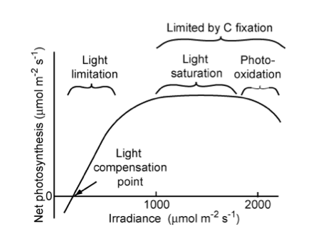
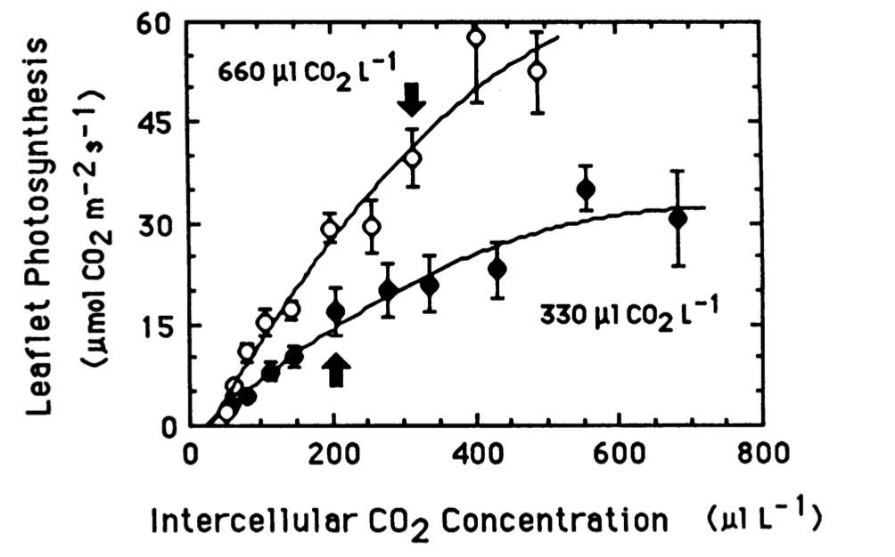
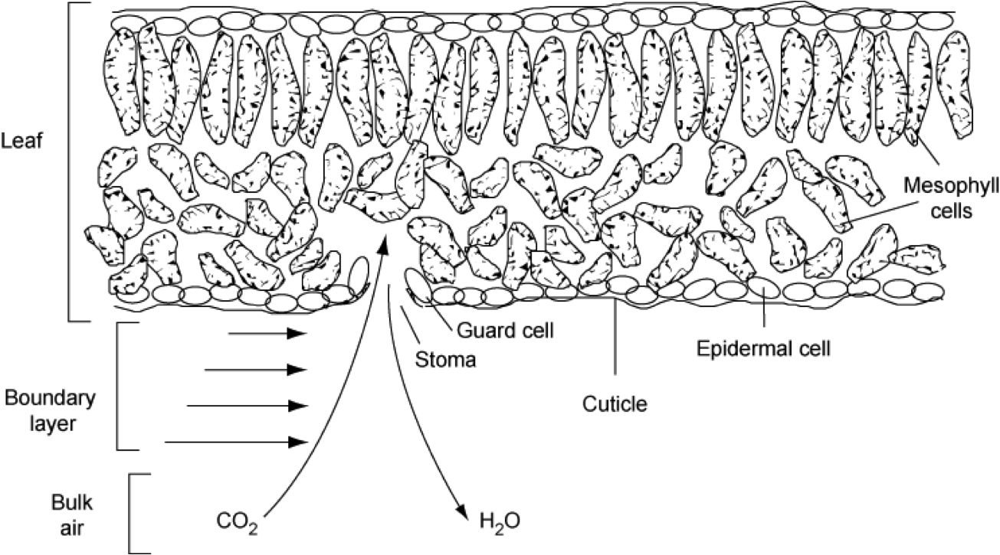
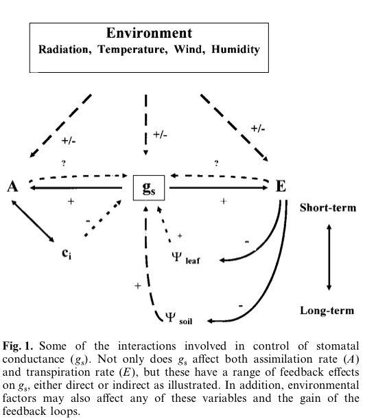
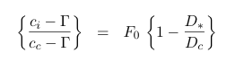
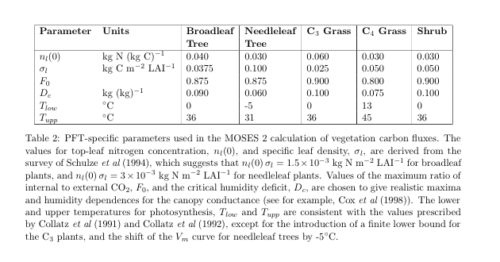
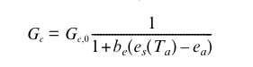
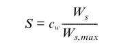
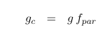

Modelling Phenology
===============================

Purpose of this lecture
------------------------

In the previous sessions, we reviewed some of the important mechanisms for understanding global terrestrial carbon state and dynamics. 
In this lecture, we consider strategies for building mathematical models to represent these concepts.

Overview of the 'Farquhar' approach
-------------------------------------

In the 'Farquhar' approach (Farquhar et al. 1980), the non-limited photosynthetic rate :math:`A_0` is calculated for a fixed value of intercellular CO2 concentration :math:`C_{i,0}` (Knorr, 1998). The actual carbon assimilation rate :math:`A:` at the leaf level depends on the actual  intercellular CO2 concentration :math:`C_{i}`. For the C3 pathway it is calculated as a function of the electron transport limited rate :math:`J_E` and a carboxylating rate :math:`J_C` controlled by the enzyme Rubisco (units :math:`mol(CO_2)m^{-2}s{-1}`) and the leaf 'dark' respiration rate :math:`R_d`:

.. math::

    A = min\{J_C ; J_E \} - R_d

where:

.. math::
    
    J_C = V_m \frac{C_i-\Gamma_{*}}{C_i+K_C(1+\frac{O_x}{K_O})}

    J_E = J \frac{C_i-\Gamma_{*}}{4(C_i-2\Gamma_{*})}

-------------------------------------

*"Relationship of net photosynthetic rate to photosynthetically active radiation and the processes that limit photosynthesis at different irradiances. The linear increase in photosynthesis in response to increased light (in the range of light limitation) indicates relatively constant light use efficiency. The light compensation point is the minimum irradiance at which the leaf shows a net gain of carbon."* **Source: Chapin**

-------------------------------------

*"Leaflet photosynthetic rates (leaflet area basis) versus inter-cellular CO2 concentration for soybean plants grown at 330 and 660 uL CO2 L-1."* **Source** `Campbell et al., 1988 <https://www.ncbi.nlm.nih.gov/pmc/articles/PMC1055758/pdf/plntphys00634-0362.pdf>`_

-------------------------------------

Here, :math:`\Gamma_{*}` (:math:`mol(CO_2) mol(air)^{-1}`) is the CO2 compensation point without leaf respiration, :math:`K_C` is the Michaelis-Menton constant for CO2 (:math:`mol(CO_2) mol(air)^{-1}`), :math:`O_x` is the oxygen concentration (0.21 :math:`mol(O_2) mol(air)^{-1}`), :math:`K_O` is the Michaelis-Menton constant for O2 (:math:`mol(O_2) mol(air)^{-1}`), and :math:`J` is  the electron transport rate:

.. math::

    J = \frac{\alpha I J_{max}}{\sqrt{J_{max}^2 + \alpha^2 I^2}}

with :math:`I = I_{PAR}/E_{PAR}` where :math:`I_{PAR}` (:math:`Wm^{-2}`) is the PAR absorption rate :math:`E_{PAR}` the energy content of PAR quanta (220 :math:`kJ mol^{-1}`), :math:`J_{max}` the maximum electron transport rate, (:math:`mol(CO_2) m^{-2} s^{-1}` and :math:`\alpha` the efficiency of photon captupre (0.28).

The 'Michaelis-Menton' constants depend on vegetation temperature (:math:`T` in :math:`K`):

.. math::

    K_C = K_{C,0} exp(\frac{E_C }{R T} \frac{T_0}{T_1})

    K_O = K_{O,0} exp(\frac{E_O} {R T} \frac{T_0}{T_1})

where :math:`K_{C,0}` and :math:`K_{O,0}` are the maximum Michaelis-Menton values for CO2 and O2 respectively :math:`460 x 10^{-6} mol(CO_2) mol(air)^{-1}` and :math:`330 x 10 ^{-3} mol(O_2) mol(air)^{-1}`), :math:`E_C` is the activation energy for :math:`K_C` (:math:`59396 J mol^{-1}`), :math:`E_O` is the activation energy for :math:`K_O` (:math:`35948 J mol^{-1}`), :math:`T_1` is 25 :math:`C` in `K` (i.e. 25 + 273.15)  and :math:`T_0` is the vegetation temperature relative to 25 :math:`C` (i.e. :math:`T - T_1`). :math:`R` is the gas constant (8.314 :math:`J mol^{-1} K^{-1}`).

The maximum electron transport rate :math:`J_{max}` is modelled as the electron transport rate  :math:`J` at 25  :math:`C` with a temperature dependence. :math:`J` at 25  :math:`C`  is modelled as :math:`J_0 * NSCL`  where :math:`NSCL` is a Nitrogen scaling factor at maximum carboxylation rate and maximum electron transport rate.

.. math::

    J_{max} = E_{transport}  * NSCL * (T - 273.15)/25.

This is the basic model of photosynthesis used in most DGVMs (with some variations).

Stomatal conductance
-----------------------

Plants regulate CO2 uptake and water loss through the regulation of the size of stomatal openings (mainly in leaves). The stomatal conductance, the reciprocal of stomatal resistance, is the flux of water vapour or CO2 per unit driving force. The usual interpretation is that when plants decrease stomatal  conductance (increase resistance) to minimise water loss, photosynthesis declines redcuing the efficiency at which plants convert light to carbohydrates (Chapin et al., 2002).

.. raw:: html

    <centre>
    "Cross-section of a leaf, showing the diffusion pathways of CO2 and H2O into and out of the leaf, respectively. Length of the horizontal arrows outside the leaf is proportional to wind speeds in the boundary layer" </i>Source: Chapin</a>
    </centre>

Jones (1998) reviews and criticises models of stomatal control of photosynthesis and transpiration. A number of possible (not necessarily exclusive) hypotheses for the role of stomata are considered in the various approaches. These include:

* stomata operate in such a way as to minimize water loss relative to the amount of CO2 uptake  (as above)
* the prime role of stomata might be to avoid damaging plant water deficits (e.g. avoidance of `cavitation <https://en.wikipedia.org/wiki/Cavitation>`_)
* stomatal control of transpiration has a role in maintaining leaf temperature within an optimal range

The hypotheses one puts forward about the potential role (or roles) of stomatal dynamics clearly have the potential for influence on conclusions one might draw about future climates, as these hypotheses lead to particular model forms being used in TEMs.

Source: Jones 1998

Understanding the control of stomata is complicated because of the various feedback mechanisms involves (figure above).

There are a number of models available to describe the response of leaf stomatal conductance (G, mm s-1 or sometimes mmol m-2 s-1). This include the empirical model of Jarvis (1976) which requires a large number of parameters  through to semi-empircal approaches such as that of Jones (1983).

Despite such debates, most TEMs seem to use semi-empircal approaches to modelling stomatal conductance as a compromise between complexity and the number of parameters and other mechanisms required.  Typical of these is  the approach used in the Bethy model (Knorr, 1997) and the subsequent `JSBACH model <http://www.mpimet.mpg.de/en/wissenschaft/land-im-erdsystem/globale-vegetationsmodellierung/jsbach-publikationen.html>`_, as well as the Triffid model (`Cox, 2001 <http://www.google.com.mx/url?sa=t&rct=j&q=triffid+cox&source=web&cd=9&ved=0CF0QFjAI&url=http%3A%2F%2Fwww.met.rdg.ac.uk%2Fphdtheses%2FThe%2520Dynamic%2520Response%2520of%2520the%2520Global%2520Atmosphere-Vegetation%2520coupled%2520System.pdf&ei=BxAXT-DLCYqasgL9wa34AQ&usg=AFQjCNGWDnCKZmUmVP6W8AMBI29evjUW2g&sig2=lpAlozDG7byM8_VJ-4VKug&cad=rja>`_) and the subsequent `JULES <https://jules.jchmr.org/>`_ implementation, following Jones, 1983 for *maximum* (i.e. unstressed) *canopy* stomatal conductance, *Gc0* (Knorr, 2000):

.. figure:: figures/knorr1.png
    :align: center

which is considered a function of leaf temperature (Tk, K), non-water-limited net leaf CO2 uptake rate(Ac0, umol m-2 s-1), Ca the atmospheric CO2 concentration (355 umol(CO2)/mol(air)) and standard non-stressed leaf- internal CO2 concentration, (Ci,0). R is the gas constant (8.3145 J/mol K, so units: kg m-2 s-2 mol-1 K-1), and p is the air pressure of the standard atmosphere (Pa, i.e. kg m-1 s-2), so that Gc0 is given in m/s (Knorr, 2000). The factor of 1.6 accounts for the different molecular diffusivities of water and carbon dioxide.

In Triffid, Ci0 is assumed a function of internal partial pressure of CO2 and the leaf surface humidity deficit:

where the symbol ci is now used in place of Ci0 and Gamma is the internal partial pressure of CO2 at which photosynthesis just balances photorespiration ( the photorespiration compensation point), D* is the humidity deficit at the leaf surface, and F0 and Dc are vegetation specific parameters:

In Bethy, the equation above is interpreted as a linear relationship between Gc0 and Ac0, i.e. between the maximum stomatal conductance and the maximum photosynthetic rate and the following equation used (after Schultze et al., 1994):

with Gc0 in mm s-1 and Ac0 in umol(CO2) m-2 s-1. This leads to the assumption (Knorr, 1998) that for C3 plants, Ci0 = 0.87Ca and for C4 plants Ci0 = 0.67 Ca (interpreting data from Schultze et al., 1994).

Water limitations on stomatal conductance
-------------------------------------------

Most models place an additional limitation on Ac0, thence on stomatal conductance if soil water limits photosynthesis (and so stomata close). In Bethy/JSBACH, this is:

where be is assumed to change with soil water status in such a way that during the course of a day, the transpiration rate, Et, does not exceed a root supply rate, S, described by (Knorr, 2000):

:math:`b_e` is thereby set each day either to 0 if Et never exceeds S, or to a value where S = Et at the time of highest atmospheric demand, assumed at 13:00 h. Ws is the soil water content, adjusted to take soil freezing into account and cw an empirical parameter representing root density. (this, verbatim from Knorr, 2000).
Above, es(Ta) is the saturation pressure at the actual temperature (Ta) and ea is the actual vapour pressure exerted by the water in the air, the difference between these two being the `vapour pressure deficit (VPD) or saturation deficit <http://www.fao.org/3/X0490E/x0490e07.htm>`_ which is a measure of the evaporative capacity of the air. These terms are usually expressed in kPa. 

Scaling to canopy stomatal conductance
----------------------------------------

There are several hypotheses about how leaf stomatal  conductance scales to an equivalent canopy stomatal  conductance. In models such as `SDGVM <https://pubmed.ncbi.nlm.nih.gov/15366766/>`_ and triffid/JULES, it is assumed that canopy stomatal  conductance increases with increasing leaf area index (LAI). In triffid/JULES and most other models:

where :math:f_{PAR}` is the fraction of incident 'PAR' radiation (shortwave radiation used in photosynthesis) absorbed by the canopy, L is the LAI and k is a geometric term representing leaf projection (and also clumping) -- an extinction coefficient for the canopy (typically set to 0.5). 

The rationale for this is that incident PAR decreases over the vertical extent of the canopy so stomatal conductance might be considered  to also decrease as it is linked to assimilation rates which will decrease in this way. 

Summary
---------

In this section, we have outlined the 'Farquar' approach to modelling photosynthesis, that is used in this or related forms in most DGVMs.

The model relates the carbon assimilation rate to the the minimum of two potentially limiting factors, the electron transport limiting rate and a carboxylating rate, with leaf 'dark' respiration subtracted. This model has been seen to operate well at the leaf level and is relatively simple to implement and parameterise.

An important facet of this model for climate studies is that it relates carbon assimilation to ambient CO2 concentrations.

We have also outlined some concepts about what controls stomatal conductance. This is an important concept because it can limit carbon assimilation and relates to water use by the leaf (transpiration).

References
-----------
* Farquhar, G.D., S. von Caemmerer, and J.A. Berry (1980). A Biochemical Model of Photosynthetic CO2 Assimilation in Leaves of C3 species. Planta 149:78-90. [`download <http://scholar.google.com.mx/scholar_url?hl=en&q=http://www.geo.utexas.edu/courses/387H/LAID_papers/Farquhar_etal1980.pdf&sa=X&scisig=AAGBfm32YGPZTIiCDrsrnI-XMp3AZJay1w&oi=scholarr>`_]
* Farquhar GD, von Caemmerer S. 1982. Modeling of photosynthetic response to environmental conditions. In Physiological Plant Ecology. II. Water Relations and Carbon Assimilation, Lange OL, Nobel PS, Osmond CB, Ziegler H (eds). Encyclopedia of Plant Physiology, vol. 12B, Springer-Verlag: New York; 549-587.
* Knorr, W. (1997) Satellite remote sensing and modelling of the global CO2 exchange of land vegetation: a synthesis study. Max-Planck-Institut fur Meteorologie Examensarbeit Nr. 49, 185 pp. ISSN 0938-5177 (in German and English), Max-Planck-Institut fur Meteorologie, Hamburg, Germany.
* Knorr, W. (2000) Annual and interannual CO exchanges of the terrestrial biosphere: process-based simulations and uncertainties, Global Ecology & Biogeography (2000) 9, 225-252
* Jarvis, P.G. (1976) `The interpretation of variations in leaf water potential and stomatal conductance found in canopies in the field <http://rstb.royalsocietypublishing.org/content/273/927/593.full.pdf+html>`_ . Philosophical Trans- actions of the Royal Society of London, Series B, 273, 593-610.
* Jones, H.G. (1983) Plants and microclimate. 323 pp. Cambridge University Press, Cambridge, UK. (also `1992 <http://www.amazon.co.uk/Plants-Microclimate-Quantitative-Environmental-Physiology/dp/0521425247/ref=sr_1_fkmr1_1?ie=UTF8&qid=1326907523&sr=8-1-fkmr1>`_)
* Jones, H.G. (1998) `Stomatal control of photosynthesis and transpiration <http://www.google.com.mx/url?sa=t&rct=j&q=stomatal%20control%20of%20photosynthesis%20and%20transpiration&source=web&cd=2&ved=0CCoQFjAB&url=http%3A%2F%2Fwww.ipicyt.edu.mx%2Fstorage-sipicyt%2Fmaterialposgrado%2FStomatalContPsn-clsPS.pdf&ei=e_0WT8j_Mu3KsQKFpqynAg&usg=AFQjCNEvJWZjVLBkWPJb90OOd3T7Mecjhg&sig2=1momBiUiVzDZ2wQE-0TyfA&cad=rja>`_ J. Exp. Bot. (1998) 49(Special Issue): 387-398 doi:10.1093/jxb/49.Special_Issue.387 
* **Chapin, F.S**, Matson, P.A., and Mooney, H.A., (2002) Principles of Terrestrial Ecosystem Ecology, Springer: Chapters 5 and 6 . 

