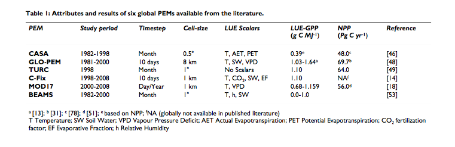
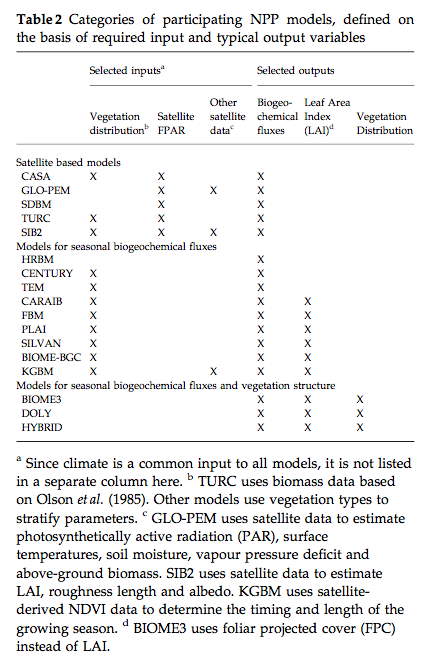
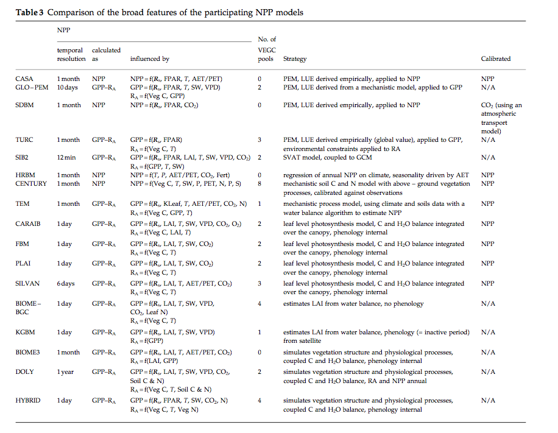
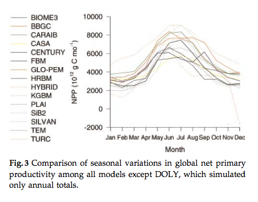
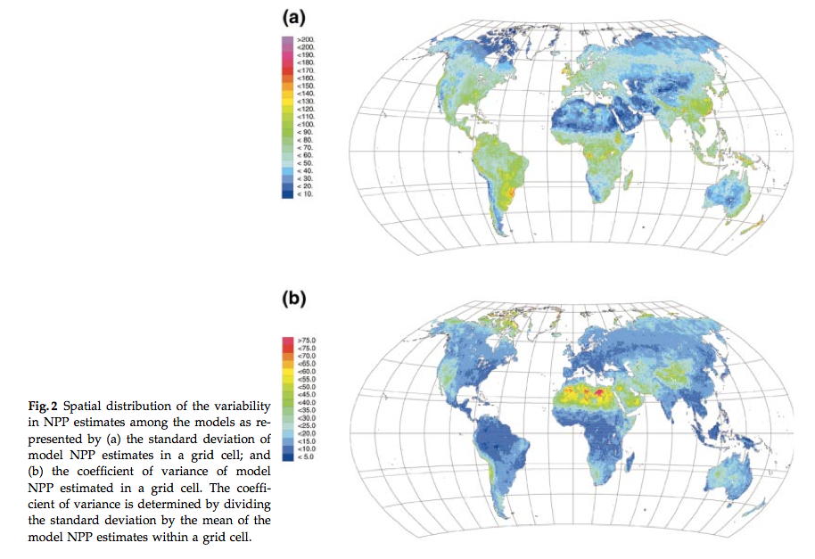
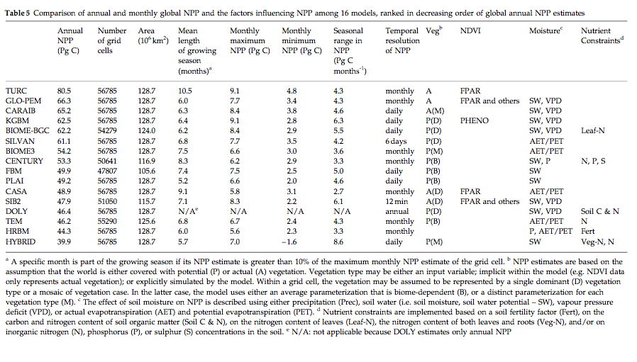

Production efficiency models
===============================

Purpose of this section
------------------------

One class of (data-driven) models used to understand and measure terrestrial Carbon dynamics are Production Efficient Models (PEMS). In this section, we review this class of model and set them in the context of the course objectives.

Overview of the 'Monteith' approach
------------------------------------

In the production efficiency approach to modelling NPP (or GPP) (the 'Monteith' approach, (Monteith, 1972, 1977)), a linear relationship is assumed between (non limited) canopy photosynthesis and absorbed PAR (Photosynthetically Active Radiation, i.e. the amount of shortwave radiation that is absorbed by the canopy).

.. math::

    GPP  = PAR \times   f_{PAR}  \times  (\epsilon \times  C_{drm}) \times  scalars

.. math::

   NPP = GPP - R_a

Here, :math:`GPP` is the Gross Primary Productivity (:math:`g C m^{-2}`), :math:`\epsilon` is the 'light use efficiency' (LUE)  (g dry matter per MJ PAR), :math:`C_{drm}` is the carbon content of dry matter (0.45 :math:`gC g^{-1}`), :math:`f_{PAR}` is  the fraction of PAR absorbed by the canopy (also known as fAPAR), and :math:`PAR` is Photosynthetically Active Radiation (:math:`MJ m^{-2}`) or the downwelling shortwave radiation multipled by the the PAR fraction  of direct and diffuse illumination taken together. 

The :math:`scalars` represent multiplicative  environmental constraints that are typically meteorologically derived (i.e. limiting factors).

:math:`NPP` is the Net Primary Productivity (:math:`g C m^{-2}`) and :math:`R_a` is the autotrophic respiration (:math:`g C m^{-2}`).

The obvious attraction of this approach is that it is simple and that it caputures the 'main effect' that carbon assimilation increases with increasing PAR absorption in the absence of limiting factors (including such limits as scalars). An additonal (strong) attraction that we shall see is that fAPAR is potentially accessible from satellite data, so a major part of the model can be friven by observations globally.

Although such a linear relationship between PAR and photosynthesis does not exist at the leaf level, at the canopy level it is generally observed and can be a reasonable and simple model of GPP.

For crops (with sufficient nutrients and water) the LUE can remain constant over the full range of light intensity. For other vegetation types such as forests, it can be more complex and depend on other factors such as species, stand ageand  soil fertility.

A useful review of some of the major current PEMs and  an analysis of some of their deficiencies is provided by McCallum et al. (2009).

They review six PEMs (see McCallum et al. for brief descriptions of the unique features of each of the models):

    **Source**: McCallum et al. (2009)

LUE is often assumed constant in these models, e.g. constant globally in CASA or per biome via a land cover map as in MOD17. GLO-PEM does not assume a constant LUE.

Although all models make use of satellite data (primarily in the estimation of fAPAR), most also require climate data (for APAR and to drive limiting scalars). Only GLO-PEM runs on only satellite data (with the exception of attribution of C3 and C4 plants). 

As we shall see in a following lecture, satellite-derived fAPAR is essentially an 'measurement' (though it is not actually a direct measurement). It is of necessity an estimate of fAPAR at the time of the satellite overpass and under the atmospheric  conditions  of the 'measurement'. Since the conditions need to be clear of clouds for measurement, it may be thought of as being primarily a clear sky, or direct-radiation dominated measure. It is known that under diffuse conditions, the capacity of a canopy to absorb shortwave radiation (i.e. the  fAPAR) tends to be higher, particularly for forest canopies. Do, even though the PAR may be lower under diffuse/cloudy conditions, the fAPAR may be higher than the 'clear sky' fAPAR.

Key findings of the review by McCallum et al. are:

* LUE should not be assumed constant, but should vary by PFTs
* Results are strongly dependent on the climate drivers used for particular models (which also complicates intercomparison)
* Further use of satellite data iwould alleviate the need for many or all climate drivers.
* PEMs should consider incorporating diffuse radiation, especially at daily resolution 
* PEMs should also consider the need to account for GPP saturation when radiation is high

Cramer et al. (1999) compared seventeen global models of NPP, including PEMs and mechanistic models. 

    **Source**: Cramer et al. (1999)

There was broad general agreement among the models in global seasonal variations in NPP (range of variation around 50% of the lowest value with two outliers excluded), and generally quite low coefficient of variations of NPP spatially, except for a few areas.

    **Source**: Cramer et al. (1999)

    **Source**: Cramer et al. (1999)

These results are claimed to be 'relatively good' considering this is a relatively poorly understood variable,and one thing the study highlights is degree of our current uncertainty of this quantity. Within this range of spread then, the PEMs performed no more poorly than other models and PEMs should be considered a viable semi-independent approach for NPP monitoring.

Summary
-----------------------------

An overview of the PEM approach is presented. The key idea here is that non-limited carbon assimilation can be assumed a linear function of the capacity of a canopy to absorb shortwave (specifically PAR) radiation and the amount of downwelling PAR. 

These models are particularly useful as they can be largely driven by observations (or rather fAPAR, derived from satellite observations).

Several key issues in the use of such models are highlighted, but these models seem to perform 'quite well' in comparison to mechanistic approaches.

Since these models are driven by observations, they cannot directly be used in prognostic mode.

References
-----------
* **McCallum, I.,** et al., 2009, Satellite-based terrestrial production efficiency modeling, `Carbon Balance and managementi, 4:8 doi:10.1186/1750-0680-4-8 <http://www.cbmjournal.com/content/pdf/1750-0680-4-8.pdf>`_
* Monteith JL: Solar radiation and productivity in tropical ecosystems.  J Appl Ecol 1972, 9:747-766.
* Monteith JL: Climate and the efficiency of crop production in Britain.  Philos Trans R Soc London, Ser B 1977, 281:277-294.
