Phenology
============

Purpose of this lecture
------------------------

We have dealt with ideas of plant biomass (Carbon) accumulation. How this biomass is 'used' by a plant is responsive to environmental factors and generally happens in a sequence. This sequence and timing of events is known as phenology. This lecture will introduce some fundamental ideas of phenology, and discuss models.

Crop Phenology
----------------

 For a field crop such as winter wheat, you will no doubt have seen fields being planted in the Autumn and a low crop cover appearing over the Winter as the seeds germinate and develop leaves to allow photosynthesis. As the weather warms, tillering starts, followed by stem elongation, and finally the wheat grains appear, develop and ripen. This process is described as plant `phenology <http://en.wikipedia.org/wiki/Phenology>`_. In crop models, this is usually quite detailed. One example of this is the `Zadok <http://www.fao.org/DOCREP/006/X8234E/x8234e05.htm>`_ scale:

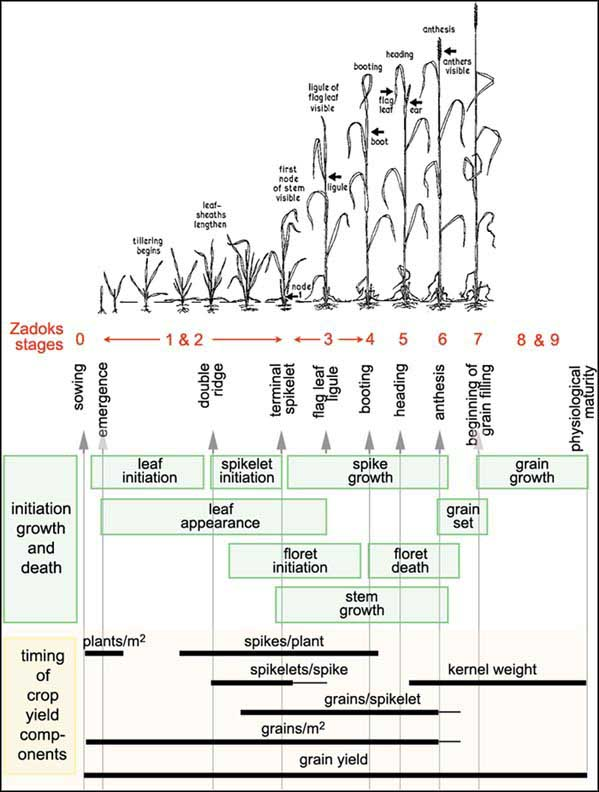

"the external Zadoks stages of the plant (red) and the two internal stages, double ridges and terminal spikelet (check the vertical text). It shows when the shoot components are initiated, grow and die (green boxes) and when the yield components are formed (bars)".* Source: `FAO <http://www.fao.org/DOCREP/006/X8234E/x8234e05.htm>`_

This describes the 'timing' (or rather sequencing) of the different stages of growth of a crop such as wheat. This sort of scale and diagram is useful for farmers in understanding and modellers in expressing the allocation of resources in the crop and when yield is determined.  

A simplified version of a crop phenology model involves the following phases:

**Germination**

Seed germination has a strong temperature dependence in crops. The duration of this phase is usually expressed then as the time over which the sum of `growing degree days (GDD) <http://en.wikipedia.org/wiki/Growing-degree_day>`_ must reach some threshold value. GDD is useful  for understanding some other stages of development. 

.. figure:: http://upload.wikimedia.org/wikipedia/en/math/e/d/b/edb99f9b6612dc70d600b3f74c2f5d58.png
    :align: center

The GDD for a particular day is  usually modelled as the mean of the minimum and maximum temperature minus some base temperature (typically 10 C). This is then summed over time from planting and, in the absence of other 'stress' factors (e.g. lack of water or pests) will be characteristic of the length of the germination period.

**Initial spread**

During this phase, the production of biomass is dependent on the proportion of radiation intercepted by green leaves, in the absence of other stress factors. The amount of biomass production per unit ground area then is a function of leaf area index (LAI, one sided leaf area per unit ground area, dimensionless (:math:`m^2 m^{-2}`)). LAI is the product of the leaf biomass pool per unit area (in kg m-2) and the specific leaf area  (SLA, one-sided area of a fresh leaf divided by its oven-dry mass, expressed in :math:`m^2 kg^{-1}`) assuming SLA constant over the plant.  As LAI growth then, the rate of biomass production increases so biomass production is close to exponential.

**Full coverage** 

When the canopy reaches full coverage, adding more leaf area does not greatly increase the radiation interception so growth is dependent more strongly on incident radiation and respiration rate. Some plants (crops especially)  then switch resource allocation from leaf production to generative growth or storage.

**Allocation to storage organs** 

In this stage, biomass allocation goes into storage organs. Whilst the leaves remain intact the biomass production rate will be similar to the previous phase.

**Ripening** 
Although in many crops leaves continually die as new ones are produced at the top of the canopy, in the ripening phase, biomass production is essentially terminated as all leaves senesce and no new ones are produced.

Phenology
---------

.. figure:: http://www.uwgb.edu/biodiversity/phenology/arbo_seasons2009_04gf_canopy120.jpg
    :align: center

.. figure:: http://www.uwgb.edu/biodiversity/phenology/arbo_seasons2009_02gf120.jpg
    :align: center

Images of forest phenology. **Source**: `UWGB <http://www.uwgb.edu/biodiversity/phenology/>`_

All plants, to some extent experience daily and seasonal variations in environmental conditions. Plants then tend to adjust their behaviour to  these variations. There are diurnal variations in light, temperature and water. Many plants then exhibit `cirdadian rhythms <http://en.wikipedia.org/wiki/Circadian_rhythm#In_plants>`_ (24 hour cycles) for example in stomatal opening (Chapin et al., 2002 Ch. 6).

Plants in temperate climates experience strong seasonal variations in environment and generally exhibit a predictable pattern of phenology: they put more resources into leaf production at certain times, flowers at others etc. Often this is  a response to `photoperiod <http://en.wikipedia.org/wiki/Photoperiodism>`_ where e.g. leaf `senescence <http://en.wikipedia.org/wiki/Plant_senescence>`_ begins and photosynthesis is reduced when day length is reduced or other environmental factors give cues to the onset of winter. To prepare for this, plants will tend to shift resources (nutrients, carbohydrates, water) from leaves  to other organs to prevent their loss from the plant.  These resources can then be used to initiate growth in the next season.

This 'phasing' by plants covers many aspects of plant growth and development, for instance allocation rates. When carbohydrates are produced in primary production, they are allocated to different pools (leaves, roots, wood etc.). Different plants have different patterns of allocation, e.g. deciduous or annual plants must allocate to leaf (for light) and roots (for water and nutrients)  production early on, but evergreen plants already have leaves and so can put more resources into root production in the early season. When the growing season is short (e.g. Arctic tundra) storage of resources form one season to more rapidly start photosynthesis in the next season become more important.

**Tissue turnover**

Although plants gain carbohydrate through photosynthesis, they must also use some of it for respiration to maintain current organs and mechanisms and also for new growth.  In the previous lecture we saw that the balance between these gives what we call the net primary productivity. If this starts to become negative (i.e. it *costs* more to the plant to keep some organs  such as leaves that they contribute to photosynthesis) then it can be advantageous for plants to  lose biomass e.g. by shedding leaves. This is an important mechanism for plants as it gives then *control* over this balance. 

`Senescence  <http://en.wikipedia.org/wiki/Plant_senescence>`_  is the programmed breakdown of tissues in a plant which allows plants to reduce the impact of e.g. unproductive leaves. One upshot of this is that it allows plants to *explore* new space. For example, in grasses a relatively constant rate of leaf senescence allows maintenance costs associated with lower (early) leaves to be reduced as new leaves are produced higher in the canopy. 

There is a danger of the loss of important resources (e.g. nutrients) when shedding leaves or other organs. Plants therefore tend to transfer soluble nutirents out of senescing tissue (`resorption <http://www.sciencedirect.com/science/article/pii/S0378112708000145>`_) and are able to maintain around half of the phosphorus, nitrogen and potassium from leaves at senescence (Chapin, 1992, Ch. 8).

It is interesting to note the relationship between Nitrogen Use Efficiencey (NUE), the ratio of dry mass to nitrogen in litter fall (Chapin et al., Ch. 8) and the nitrogen lost in litterfall:

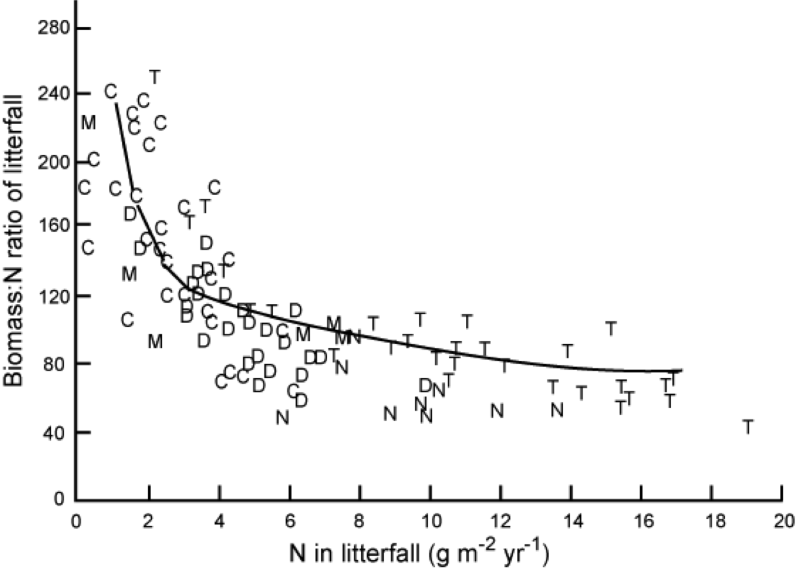

*"Relationship between the amount of nitrogen in litterfall and nitrogen use efficiency (ratio of dry mass to nitrogen in that litterfall). Each symbol is a different stand, including conifer forests (C), temperate deciduous forests (D), tropical evergreen forests (T), mediterranean ecosystems (M), and temperate forests dominated by nitrogen fixers (N). Redrawn from Vitousek (1982)."* Source: Chapin et al. 2002 , Ch. 8

Plants on less fertile soils tend to be more efficient at using nitrogen than those on more fertile soils.  NUE cab be  increased by reducing tissue turnover times (e.g. keeping leaves longer: so plants with lower leaf turnover and higher NUE have a competitive advantage in nutrient poor soils) but this tends to imply a trade-off with the capacity to capture nutrients and carbon (Chapin et al. 2002 , Ch. 8) so is not a universal advantage.

Another part of the value of senescence is that it allows plants to shed parasites, pathogens and herbivores. By shedding leaves and roots then, then plants can respond to such *attacks* if their impact is likely damaging.

Other episodic factors that  lead to loss of biomass  include fire, wind storms etc. Whilst these can lead to severe impacts and nutrient losses to a plant, they also play a wider role in the ecosystem e.g. by providing gaps in a canopy or increasing heterogeneity of nutrient resources (Chapin, 1992, Ch. 6).

Mechanisms of phenology and evidence of changes
------------------------------------------------

We have seen above that temperature and photoperiod (day length relative to night length) are important concepts for plant growth and development and it is hardly surprising that phenology is generally controlled by these environmental cues.

Using photoperiod as well as temperature is particularly important in humid extratropical areas where there are large temperature fluctuations from year to year  as it stops plants picking up on temperature at the 'wrong' time of year (Korner and Basler, 2010).

Because the photoperiod is  the same in winter and autumn, plants need a cue that winter is over. This is often obtained from the dose of low temperatures experienced by the plant, and amounts to a 'chilling' requirement by some plants before spring bud burst (Korner and Basler, 2010. The 'phasing' of the signals seems to be: chilling requirement which enable photoperiod sensitivity, then response to temperature.i For plants that have a chilling requirement then, bud break can be delayed by mild temperatures.

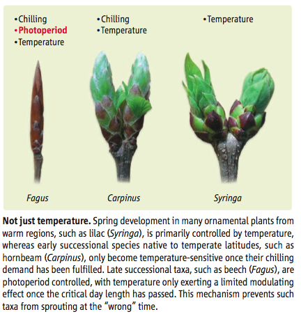

    **Source**: Korner and Basler  2010

Burrows et al. 2011 analysed global temperature trends over the period 1960-2009 and have noted the  following patterns of advance in Spring temperatures and delay in autumn temperatures. 

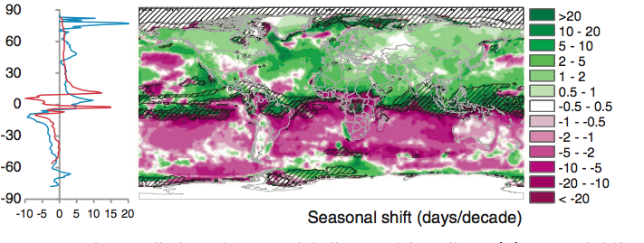

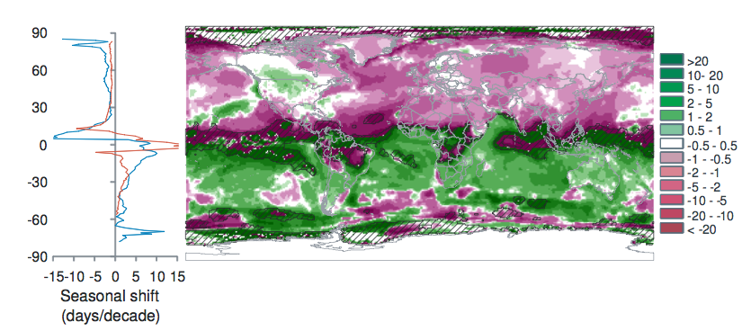

"Seasonal shift (days/decade) is the change in timing of monthly temperatures, shown for April (top), representing Northern Hemisphere spring and Southern Hemisphere fall and October (bottom): positive where timing advances, negative where timing is delayed. Cross-hatching shows areas with small seasonal temperature change (<0.2 C/month), where seasonal shifts may be large." **Source**: Burrows et al. 2011

Plant responses to such climatic variables means that phenology is likely to change under climate change, and there is already much evidence for this.

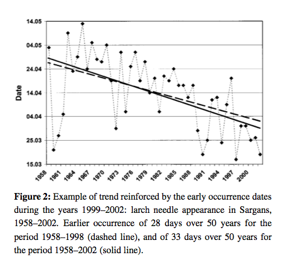

    **Source**: Defilia and Clot, 2005

Our evidence for phenological changes comes from a combination of ground observations of this sort, flux towers,  and satellite observations.

Until relatively recently there has been  little work linking these two sources of information, partly due to a spatial paucity of ground data until recent years and partly because of complexities in matching the scales of the observations (Liang et al., 2011; Studer et al., 2007; White et al., 2009).

A useful `white paper on phenology by Friedl et al. is available here <http://www.google.com.mx/url?sa=t&rct=j&q=phenology_friedl_whitepaper.pdf&source=web&cd=1&ved=0CCEQFjAA&url=http%3A%2F%2Flandportal.gsfc.nasa.gov%2FDocuments%2FESDR%2FPhenology_Friedl_whitepaper.pdf&ei=yZAhT5HBM8WIsQK5lcygCQ&usg=AFQjCNEEl8ElupuBrnXcbM1qeuLGRdIJew&sig2=A3oSgEAXaQc3AwYJKQJY5A&cad=rja>`_.

Models of phenology
-------------------

Logistic function of time
~~~~~~~~~~~~~~~~~~~~~~~~~~

One of the most simple models for tracking phenology that has been extensively applied to satellite data is a logistic function of time:

.. math:: y(t)  = \frac{c}{1 + e^{a + bt}}+d

This is used for instance by Zhang et al., 2003 for tracking the dynamics of MODIS vegetation index data. The model is fitted to the VI data and transition date metrics calculated:

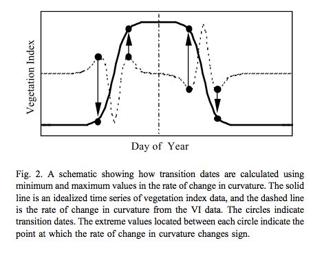

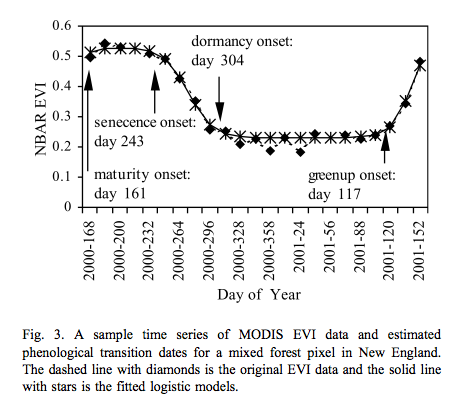

    **Source**: Zhang et al., 2003

Such processing provides valuable spatial datasets of information related to phenology:

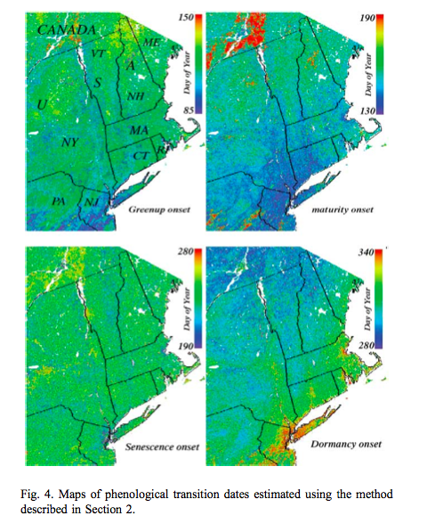

    **Source**: Zhang et al., 2003
 
and allows the tracking of dynamics of the phenology metrics over time. Generally a model of this sort is used to derive *data* that are then used to model phenology.

**(Growing) Degree day model**

The simplest form of model that can be used prognostically then is a simple GDD model. Note that such models are only appropriate where temperature is a limiting factor in plant growth (the extratopics). Note that this does not include any account of chilling days or photoperiod.  In this, approach some phenological metric such as spring greenup is used to calibrate parameters of a GDD model. The model can be phrased as:

.. math:: GDD = \sum_{T>T_{base}} (T - T_{base})

where :math:`T_{base}` is a base or 'critical' temperature and :math:`T` is the air temperature (C) (e.g. at 2 m).

Some options exist after this point for implementation of such a model. They key is to identify  some threshold value of GDD :math:`F^*` that corresponds to the metric of interest. Most typically this is simply a GDD threshold. The sum of GDD generally starts from 1 January for the Northern hemisphere and 1 July for the Southern hemisphere to act as a consistent baseline.

Sobrino et al.. (2011) used a double logistic function of the same form for mapping changes in spring date timing trends for global vegetation:

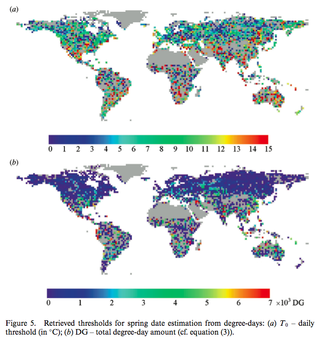

    **Source**: Sobrino et al.. (2011)

Another approach is to use day of year (DOY) as a additional model parameter. Fisher et al. (2007) for example allow the GDD threshold to vary spatially but attempted to calibrate a model where the starting DOY of the summation and the base temperature were constant over a wide area. An interesting feature of that study is its consideration of  some of the complexities in using satellite data for phenology modelling. They compared  a calibration of a spring warming model for predicting the date of half maximum greenness, calibrated with satellite data over deciduous forests in New England. Whilst a calibration of the model was achieved:

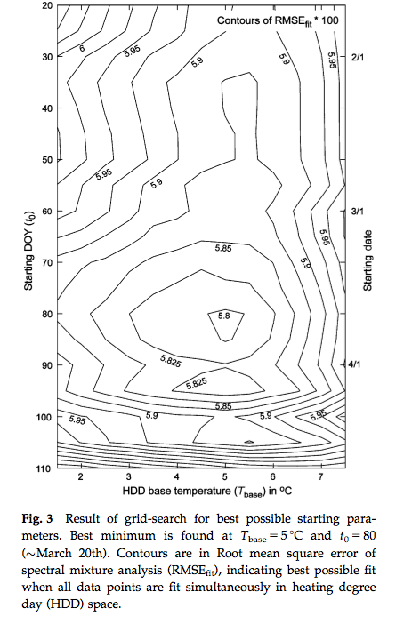

    **Source**: Fisher et al. (2007)

a comparison with a null model (i.e. using mean values) against the model driven with climatological data showed little improvement over the use of the model.  

A more detailed analysis of the data showed that it was not the model *per se* at fault, but the calibration and application of it to a broad PFT.  They found that when the model was applied  at a more specific level (northern (beech- maple-birch) and central (oak-hickory) hardwood forests)  different responses to climate were observed and conclude that conclude that spatial location and species composition are critical factors for predicting the phenological response to climate change.

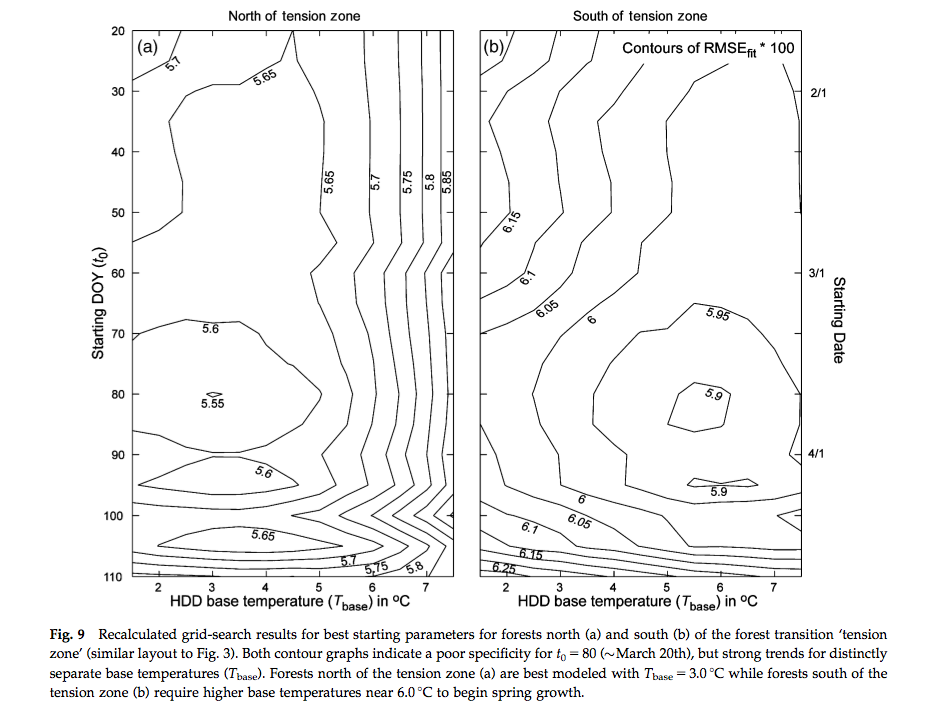

    **Source**: Fisher et al. (2007)

Generally, satellite observations based on visible and near infrared wavelengths are used for monitoring phenology, but Picard et al. (2005) used an uindex based on near infrared and middle infrared which is more sensitive to water content that vegetation greeness. 
This was found to  be particularly useful for the study area (Siberia) as the metric used (NDWI) decreases during snowmelt then increases around the date of bud burst.

models including chilling
~~~~~~~~~~~~~~~~~~~~~~~~~~~

Picard et al. (2005) outline three main approaches for including chilling effects in bud burst models along with other focings (mainly temperature):

* sequential models: forcing only starts when the chilling requirement is met
* parallel models:  chilling and forcing accumulated in parallel and critical values then applied to both
* alternating models: the temperature :math:`F^*` is a decreasing function of chilling.

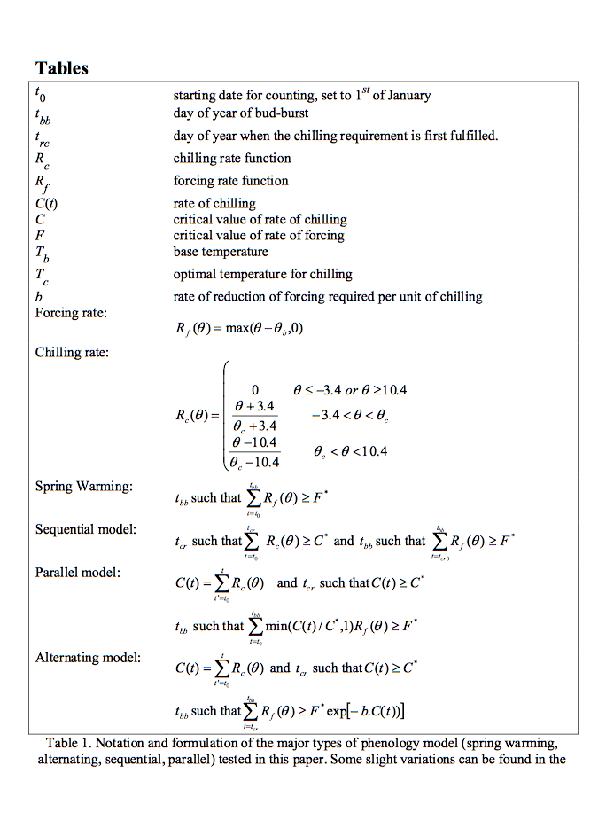

    **Source**: Picard et al. (2005) 

They found that uncertainty from the bud burst date calibration had an impact of only around  8% of mean NPP, and suggest that the calibrated model is accurate enough for carbon budget calculations.

tropics
~~~~~~~~

In tropical areas, simulating and understanding phenology is complicated (Bradley et al., 2011) as in places like the Amazon temperature is generally not thought to be limiting. Rather then, water availability is often more of a control when there is a strong seasonal cycle in precipitation. This is not a simple response however because trees with deep roots may have access to water reserves and show no pronounced annual variation. 

There is evidence of enhanced tree mortality and decrease in growth however when Amazonian rain forests are exposed to a longer and more intense moisture deficit than normal (Phillips et al., 2009).

The state of phenology models in DGVMs for tropical areas  then is at present rather weak and an area of active research.

Phenology in DGVMs
~~~~~~~~~~~~~~~~~~~

Unsurprisingly, phenology in DGVMs is more complex that just the determination of bud burst. In `JULES <https://jules.jchmr.org>`_ for example, it is dealt with in terms of a leaf mortality rate that is assumed to be a function of temperature. Other rules such as a constant rate of dropping leaves are implemented when the daily mean value of leaf turnover reaches twice its minimum value. In JULES budburst occurs  at the same rate when leaf mortality drops back below this threshold. This then is a form of temperature dependence similar to those outlined above with an implict chilling requirement, but the parameters are clearly not the same as those considered above.

Clark et al. 2011  describe this in more detail. It is found that the model described above is not sufficient to produce realistic vegetation phyenology and so a variable :math:`p` is introduced that describes the phenological status of the vegetation as the ratio :math:`LAI/LAI_{max}` where :math:`LAI` is the current LAI and :math:`LAI_{max}` is the seasonal maximum LAI.

Summary
--------

Vegetation phenology is seen to be an important concept in monitoring, modelling and understanding vegetation dynamics and its response to climate variations. There is a growing amount of observational data on phenology at various scales and more recent attempts to reconcile measures at different scales. 

It is likely that for some areas  at least, species specific (or slighly broader groupings of species) parameterisations of phenology need to be considerdd rather than just broad PFT definitions.

Most phenology analysis is done using simple degree day models, although some analyses also consider chilling requirements.

Phenology models in DGVMs may be phrased rather differently to those used in most analyses. Whilst maintaining a required 'mechanistic approach', current DGVM phenology models are not entirely satisfactory.

References
-----------

* Bradley et al. 2011, Relationships between phenology, radiation and precipitation in the Amazon region, Global Change Biology Volume 17, Issue 6, pages 2245-2260, June 2011
* Zhang, X. Y., Friedl, M. A., Schaaf, C. B., Strahler, A. H., Hodges, J. C. F., Gao, F., et al. (2003). Monitoring vegetation phenology using MODIS. Remote Sensing of Environment, 84, 471-475.
* White, M. A., et al. (2009), Intercomparison, interpretation, and assessment of spring phenology in North America estimated from remote sensing for 1982-2006, Glob. Change Biol., 15(10), 2335-2359.
* Studer, S. ; Stockli, R. ; Appenzeller, C. ; Vidale, P. ; Vidale, L. 2007, A comparative study of satellite and ground-based phenology , International Journal of Biometeorology, 2007, Vol.51(5), p.405-414
* Sobrino, JA., Yves Julien, Luis Morales, 2011, Changes in vegetation spring dates in the second half of the twentieth century, International Journal of Remote Sensing , Vol. 32, Iss. 18, 2011
* Schwartz, M.D and Hanes J.M. 2010, Continental-scale phenology: warming and chilling, Int. J. Climatol. 30: 1595-1598 (2010)
* Burrows, Michael T ; Schoeman, David S ; Buckley, Lauren B ; Moore, Pippa ; Poloczanska, Elvira S ; Brander, Keith M ; Brown, Chris ; Bruno, John F ; Duarte, Carlos M ; Halpern, Benjamin S ; Holding, Johnna ; Kappel, Carrie V ; Kiessling, Wolfgang ; O'Connor, Mary I ; Pandolfi, John M ; Parmesan, Camille ; Schwing, Franklin B ; Sydeman, William J ; Richardson, Anthony J, The pace of shifting climate in marine and terrestrial ecosystems, Science (New York, N.Y.), Nov, 2011, Vol.334(6056), p.652-5
* Reed, at el., 2009. Remote Sensing Phenology: Status and the Way Forward, in Noormets, A. Phenology of Ecosystem Processes: Application in Global Change Research. Springer, Dordrecht, pp. 275.
* Picard, G., Quegan, S., Delabert, N., Lomas, M.R., Le Toan, T., Woodward, F.I. (2005) Bud-burst modelling in Siberia and its impact on quantifying the carbon budget, Global Change Biology 11 (2005) 2164-2176
* Jeffrey Morisette, Mark Schwartz (Lead Author);C Michael Hogan (Topic Editor) `"Phenology" <http://www.eoearth.org/article/Phenological_Research>`_ . In: Encyclopedia of Earth. Eds. Cutler J. Cleveland (Washington, D.C.: Environmental Information Coalition, National Council for Science and the Environment).
* Liang, LA ; Schwartz, MD ; Fei, SL, 2011, Validating satellite phenology through intensive ground observation and landscape scaling in a mixed seasonal forest, Remote sensing of environment, 2011 JAN 17, Vol.115(1), p.143-157
* **Korner and Basler,** 2010, Phenology Under Global Warming, Science 19 March 2010: 1461-1462.DOI:10.1126/science.1186473 
* Defilia and Clot, 2005, Phytophenological trends in the Swiss Alps, 1951-2002, Meteorologische Zeitschrift, Vol. 14, No. 2, 191-196 (April 2005)
* Fisher, JI ; Richardson, AD ; Mustard, JF, 2007, Phenology model from surface meteorology does not capture satellite-based greenup estimations, lobal change biology, 2007 MAR, Vol.13(3), p.707-721

