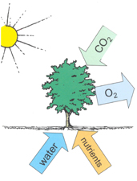
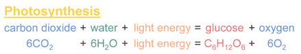
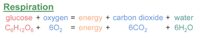
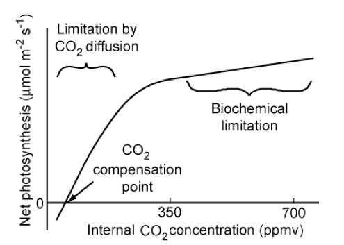
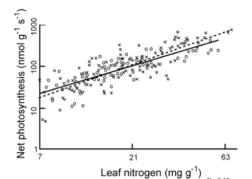
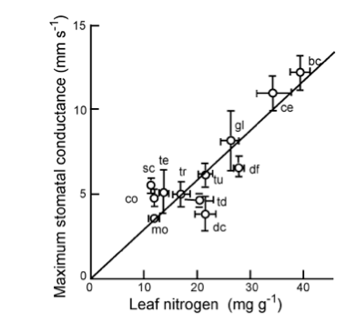
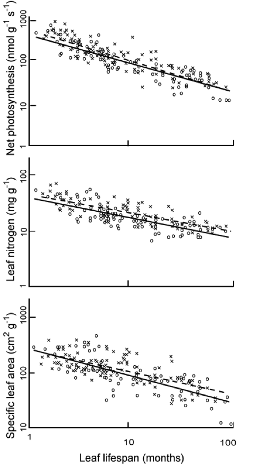
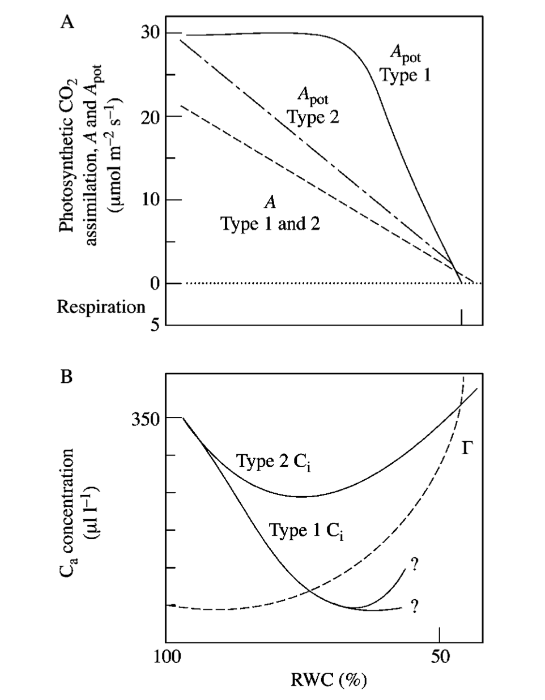
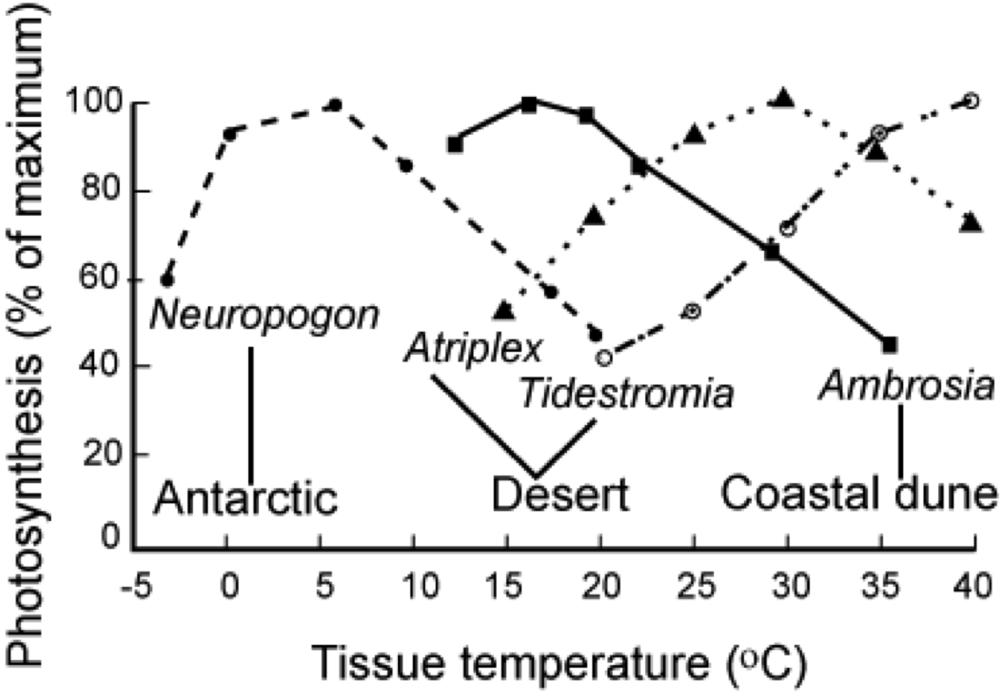

Photosynthesis
===============

Introduction
----------------

In this section, we will:

* look in some detail at photosynthesis and factors that limit this

Photosynthesis
-----------------

What photosynthesis achieves is to fix solar energy. This is then used to support plant growth and produce organic matter that in turn supports animals and soil microbes. It is the primary mechanism for carbon (and chemical energy) input to ecosystems.

------------

.. raw:: html

    
<i>
    In photosynthesis, the plant uses water and nutrients from the soil, and carbon dioxide from the air with the sun's energy to create photosynthates using the primary photosynthetic enzyme Rubisco.  Oxygen is released as a byproduct.
    </i>

    <a href="http://www.cmg.colostate.edu/gardennotes/141.html">Source: Colorado State University</a>

------------

In essence, what it does is to split (proportionately) 12 water molecules (H20) and produce 6 molecules of oxygen gas (O2) and 6 of H20. Carbon dioxide is reduced to glucose (C6H12O6) which is the basic material from which other biochemical constituents of biomass are synthesised (Grace, 2001). Note that the additional 6H2O are omitted in the figure above which does not include transpiration. 

Transpiration in plants is part of the water cycle and provides around `10% of the moisture found in the atmosphere <https://earthobservatory.nasa.gov/features/Water/page2.php>`_.  Transpiration `uses around 90% of the water that enters the plant <https://earthobservatory.nasa.gov/features/Water/page2.php>`_ (the rest being used in cell growth and photosynthesis). Most transpiration water loss takes place in the stomata of the leaves. The guard cells of the stomata open to allow CO2 diffusion from the air for photosynthesis.
In that sense, it can be thought of as the "cost" associated with the opening of the stomata to allow the diffusion of carbon dioxide gas from the air.

Stomatal conductance, (e.g. in mmol m-2 s-2) is a measure of the rate of passage of carbon dioxide (CO2) exiting, or water vapor entering through the stomata of a leaf. The term `conductance <http://www.allaboutcircuits.com/vol_1/chpt_5/4.html>`_ comes from analogy with electrical circuitry. It is controlled by the guard cells of the leaf stomata and controls transpiration rates and CO2 diffusion rates (along with gradients of water vapour and CO2).

`Transpiration serves three main roles <https://earthobservatory.nasa.gov/features/Water/page2.php>`_:

* movement of minerals (from the roots: xylem) and sugars (from photosynthesis: phloem) throughout the plant.
* cooling (loss of heat energy through transpiration)
* maintenance of turgor pressure in plant cells for plant structure and the functioning of guard cells in the stomata to regulate  water loss and CO2 uptake.

.. figure:: https://d9-wret.s3.us-west-2.amazonaws.com/assets/palladium/production/s3fs-public/thumbnails/image/wss-cycle-evapotranspiration-diagram.jpg
    :align: center
    :target:  https://www.usgs.gov/special-topic/water-science-school/science/evapotranspiration-and-water-cycle?qt-science_center_objects=0#qt-science_center_objects

.. raw:: html

    
This Source: <a href="https://www.usgs.gov/special-topic/water-science-school/science/evapotranspiration-and-water-cycle?qt-science_center_objects=0#qt-science_center_objects"> USGS </a>. Original source unknown.
    

------------

There are three types of photosynthesis mechanisms in plants: C3, C4 and CAM. Plants that use the CAM mechanism include cacti and orchids that are adapted to extremely hot and dry environments. We will concentrate on C3 and C4 plants here because of their greater global significance.

`C3 plants <http://www.biology-online.org/dictionary/C3_plant>`_ use the `Calvin cycle <http://hyperphysics.phy-astr.gsu.edu/hbase/biology/calvin.html#c1>`_ for fixing CO2. 

.. figure:: http://hyperphysics.phy-astr.gsu.edu/hbase/biology/imgbio/calc3.gif
    :align: center
    :target: http://hyperphysics.phy-astr.gsu.edu/hbase/biology/phoc.html

.. raw:: html

    
<i>
    "In the first step of the cycle CO2 reacts with RuBP to produce two 3-carbon molecules of 3-phosphoglyceric acid (3-PGA). This is the origin of the designation C3 or C3 in the literature for the cycle and for the plants that use this cycle. The entire process, from light energy capture to sugar production occurs within the chloroplast. The light energy is captured by the non-cyclic electron transport process which uses the thylakoid membranes for the required electron transport."</i>
    Source: <a href="http://hyperphysics.phy-astr.gsu.edu/hbase/biology/phoc.html">GSU</a>
   
</i>

------------

Around 85% of plants use this mechanism, including wheat, barley, potatoes and sugar beet and `most trees <http://hyperphysics.phy-astr.gsu.edu/hbase/biology/phoc.html>`_. C3 plants cannot grow in hot climates because the enzyme RuBisCO involved in catalyzing carboxylation of RuBP incorporates more oxygen into RuBP as temperatures increase ('C2 photosynthesis'), leading to a process called `photorespiration <http://en.wikipedia.org/wiki/Photorespiration>`_ and a net loss of carbon (and nitrogen) that can act as a limit to growth. C3 plants are also sensitive to water availability.

`C4 plants <http://en.wikipedia.org/wiki/C4_carbon_fixation>`_ (and `CAM plants <http://en.wikipedia.org/wiki/Crassulacean_acid_metabolism>`_) operate more efficiently than C3 plants under conditions of drought, high temperatures, and nitrogen or CO2 limitation. They do this by bypassing the photorespiration pathway and efficiently delivering CO2 to the RuBisCO enzyme. 

.. figure:: http://hyperphysics.phy-astr.gsu.edu/hbase/biology/imgbio/kranzm.gif
    :align: center
    :target: http://hyperphysics.phy-astr.gsu.edu/hbase/biology/phoc.html

.. raw:: html

    
<i>
    "C4 plants almost never saturate with light and under hot, dry conditions much outperform C3 plants. They use a two-stage process were CO2 is fixed in thin-walled mesophyll cells to form a 4-carbon intermediate, typically malate (malic acid). The reaction involves phosphoenol pyruvate (PEP) which fixes CO2 in a reaction catalyzed by PEP-carboxylate. It forms oxaloacetic acid (OAA) which is quickly converted to malic acid. The 4-carbon acid is actively pumped across the cell membrane into a thick-walled bundle sheath cell where it is split to CO2 and a 3-carbon compound. This CO2 then enters the Calvin cycle in a chloroplast of the bundle sheath cell and produces G3P and subsequently sucrose, starch and other carbohydrates that enter the cells energy transport system. " </i> Source: <a href="http://hyperphysics.phy-astr.gsu.edu/hbase/biology/phoc.html">GSU</a>
    </i>

------------

C4 plants include maize and sugarcane. They are rarely found outside of `latitudes 60N to 46S <https://www.google.com/url?sa=t&rct=j&q=&esrc=s&source=web&cd=&ved=2ahUKEwjFosO-04TuAhWVs3EKHT62DPEQFjANegQIJhAC&url=https%3A%2F%2Flink.springer.com%2Fcontent%2Fpdf%2F10.1007%2Fs11434-012-5233-9.pdf&usg=AOvVaw07gHvX966CEJSPxol9rMo0>`_. Although  only a small proportion of flowering plants use this mechanism for carbon fixation, they are responsible for around 25%  of photosynthesis on land.

Respiration
-----------
In (autotrophic) respiration, plants convert the sugars made during photosynthesis back into CO2 and water, and release energy in the process.

------------

Oxygen is taken up in this process. The energy released from respiration is used by the plant for growth and maintenance of existing material. It consumes between 25% and 75% of all of the carbohydrates generated in photosynthesis. 

Limitations to photosynthesis at the leaf level
------------------------------------------------

The main factors affecting net photosynthesis at the leaf level are: (i) light limitation; (ii) CO2 limitation; (iii) nitrogen limitation and photosynthetic capacity; (iv) water limitation; (v) temperature effects; and (vi) pollutants. (see pp.105-115 of Chapin et al. 2002)

**light limitation**

Light response curves measures plants response to light intensity. 

.. figure:: figures/chapin1.png
    :align: center
    :target: figures/chapin1.png

.. raw:: html

    <centre>
    "Relationship of net photosynthetic rate to photosynthetically active radiation and the processes that limit photosynthesis at different irradiances. The linear increase in photosynthesis in response to increased light (in the range of light limitation) indicates relatively constant light use efficiency. The light compensation point is the minimum irradiance at which the leaf shows a net gain of carbon.  "
    </i>Source: <a href="https://www.researchgate.net/publication/236981791_Principles_of_Terrestrial_Ecosystem_Eology">Chapin, 2011, fig. 5.5</a>
    

    

    </centre>

At low to moderate light levels, leaves have a near linear response to light intensity. The rate of change of net photosynthesis in this region to irradiance is the `quantum yield of photosynthesis <http://www.annualreviews.org/doi/pdf/10.1146/annurev.pp.09.060158.000245>`_. This is similar for all C3 plants (in the absence of environmental stresses) at around 6% (Chapin et al., 2002). At higher light levels, saturation occurs as the efficiency of the photosynthetic mechanism is reduced. At higher levels still, net photosynthesis can decline as a result of photorespiration as described above.

Plants have some capacity to respond to changes in light conditions over time scales of days to months, such as by having leaves in more direct sunlight with more cell layers and higher photosynthetic capacity than shade leavesi by `acclimation <http://en.wikipedia.org/wiki/Acclimatization>`_ or `adaptation <http://www.sciencedaily.com/releases/2011/01/110131161344.htm>`_ over longer time periods. Respiration rate depends on tissue protein content (Chapin et al., 2002, ch. 6) so shade leaves with low photosynthetic capacity generally have a lower protein content to minimise respiration losses. 

When upscaling light limitations to the canopy or ecosystem scale, the leaf area index (LAI) is a major constraint. In effect, the lower the LAI, the lower the radiation intercepted by the vegetation. Radiation interception is often approximated through Beer's law:

::

    I = I0 exp(-k L)

where I is the radiation intensity intercepted, I0 is that at the top of the canopy, k is an extinction coefficient (a function of leaf angle distribution and clumping) and L is the LAI.

Assuming only first order interactions then gives the proprtion of radiation intercepted over the canopy, I/I0 as:

::

    I/I0 = 1 -  exp(-k L)

so that for L = 0, no radiation is intercepted, and as L increases, so the proportion intercepted does as well. We shall return to consideration of this in later lectures, but for the moment we can suppose this simple relationship showing general principles.

**CO2 limitation**

Although we have noted spatial and temporal variations in CO2 concentrations, the variation is in fact only quite small, being of the order of 4% (Chapin et al., 2002) and insufficient to cause significant regional variations in photosynthesis.  Further, although photosynthesis locally depletes the CO2 pool, it is not to a sufficient extent that it significantly affects  the amount available. 

.. raw:: html

    <centre>
    "Relationship of the net photosynthetic rate to the CO2 concentration inside the leaf. Photosynthetic rate is limited by the rate of CO2 diffusion into the chloroplast in the initial (left-hand side) linear portion of the CO2 response curve and by biochemical processes at higher CO2 concentrations. The CO2 compensation point is the minimum CO2 concentration at which the leaf shows a net gain of carbon.  "</i>
    </i>Source: <a href="https://www.researchgate.net/publication/236981791_Principles_of_Terrestrial_Ecosystem_Eology">Chapin, 2002</a>
    

    

    </centre>

The response curve of net photosynthesis to CO2 concentration inside the leaf of a C3 plant is shown above. At low levels, CO2 diffusion limits photosynthesis. With current atmospheric CO2 levels of around 390 ppmv most C3 plants would show an increase in photosynthetic rate with further increases. The magnitude of this is however uncertain due to plant acclimation and other factors. 

Over the long term, it is likely that *indirect* effects of elevated CO2 concentrations may be more important than increased net photosynthesis rates (Chapin et al., 2002), such as thoise arising from changes to the water cycle. 

C4 plants are relatively unresponsive to changing CO2 concentrations, which could possibly affect their competitaveness with C3 plants with rising CO2, but again, indirect effects are likely to be important and are hard to predict.

**Nitrogen limitation and photosynthetic capacity**

Photosynthetic capacity is the photosynthetic rate per unit leaf mass (in unstressed conditions). It isan important cocept as it can be thought of as the 'carbon gaining potential per unit of biomass invested in leaves' ((Chapin et al., 2002; p. 110). This measure is found to be highly positively correlated with leaf nitrogen *concentration*, because a large proportion of the nitrogen in leaves is used in photosynthetic enzymes:

.. raw:: html

    <centre>
    <i>
    "Relationship between leaf nitrogen concentration and maximum photosynthetic capacity (photosynthetic rate measured under favorable conditions) for plants from Earth's major biomes. Circles and the solid regression line are for 11 species from six biomes using a common methodology. Crosses and the dashed regression line are data from the literature. Redrawn from Reich et al. (1997)."
    </i>
    </i>Source: <a href="https://www.researchgate.net/publication/236981791_Principles_of_Terrestrial_Ecosystem_Eology">Chapin, 2002</a>
    

    

    </centre>

The leaf nitrogen concentration can be affected by such factors as high nitrogen concentrations in soils which is why nitrogen fertilizers can be so effective) or whether the plants are `nitrogen-fixing <http://www.biology.ed.ac.uk/research/groups/jdeacon/microbes/nitrogen.htm>`_ through symbiosis with nitrogen-fixing bacteria in the soils.

We can also note that high photosynthetic capacities  (asociated with high leaf N concentrations) have higher *maximum* stomatal conductance. This allows such plants to gain carbon rapidly (n the absence of environmental stresses), at the cost of higher water loss.

.. raw:: html

    <centre>
    <i>
    "Relationship between leaf nitrogen concentration and maximum stomatal conductance of plants from Earth's major biomes. Each point and its standard error represent a different biome: bc, broad-leafed crops; ce, cereal crops; co, evergreen conifer forest; dc, deciduous conifer forest; df, tropical dry forest; gl, grassland; mo, monsoonal forest; sc, sclerophyllous shrub; sd, dry savanna; sw, wet savanna; tc, tropical tree crop; td, temperate deciduous broadleaved forest; te, temperate evergreen broadleaved forest; tr, tropical wet forest; tu, herbaceous tundra. Redrawn from Schulze et al. (1994)."
    </i>
    Source: <a href="https://www.researchgate.net/publication/236981791_Principles_of_Terrestrial_Ecosystem_Eology">Chapin, 2002</a>
    

    </centre>

A further observation relating to leaf N is that the higher the leaf N concentration, the shorter the leaf lifespan. Leaves with shorter lifspans tend to have lower specific leaf area (SLA, the leaf surface area per unit of biomass) (i.e. long-lived leaves are more dense), so higher leaf N concentration correlates with higher SLA.

.. raw:: html

    <centre>
    <i>
    "The effect of leaf lifespan on photosynthetic capacity, leaf nitrogen concentration, and specific leaf area. Symbols as in Fig. 5.13. Redrawn from Reich et al. (1997)"
    </i>
    </i>Source: <a href="https://www.researchgate.net/publication/236981791_Principles_of_Terrestrial_Ecosystem_Eology">Chapin, 2002</a>
    

    

    </centre>

According to Chapin et al. (2002, p. 112) then, "there is only modest variation in photosynthetic capacity *per unit leaf area* because leaves with a high photosynthetic capacity per unit leaf biomass aalso have a high SLA". The Photosynthetic capacity per unit area (Parea) then (g cm-2 s-1) is a useful ecosystem-scale measure.

**Water limitation**

Water limitation reduces the capacity of leaves to match CO2 supply with light availability (Chapin et al., 2002, p. 113). Water stress is manifested as a decrease in leaf relative water content (`RWC <http://www.plantstress.com/Methods/RWC.htm>`_). Decreasing RWC progressively decreases stomatal conductance which slows CO2 assimilation (lower photosynthetic capacity) (Lawlor, 2002), although different studies show different responses for RWC between 100% and 70% (type 1 and 2 responses below).

.. raw:: html

    <centre>
    <i>
    "A, Schematic of the basic responses of actual photosynthetic rate (A) in air (360 umol CO2 m-2s-1) and potential photosynthetic rate (Apot) measured at elevated CO2 concentration, to relative water content (RWC). Type 1 and 2 responses of Apot are shown. In the Type 1 response, Apot is unaffected until a 20-30 % decrease in RWC occurs, when it becomes metabolically limited. In Type 2, the change is linear, showing progressive metabolic limitation. In both types in well-watered leaves, photosynthetic rate (A) is stimulated by elevated CO2. Elevated CO2 maintains A at the potential rate (Apot) in the Type 1 response as RWC decreases; but at RWC below approx. 80 % Apot decreases in Type 1. Elevated CO2 simulates A progressively less as RWC decreases in Type 2, showing that Apot is inhibited. B, Scheme of the changes in CO2 inside the leaf (Ci) during steady-state A, as stomatal conductance (gs) decreases with falling RWC, associated with Type 1 or Type 2 photosynthetic response (1 with Ci decreasing to compensation point; 2 with Ci decreasing but not to compensation point). The equilibrium compensation point, Gamma, associated with Type 1 response is indicated. There are differences between experiments, with Ci not decreasing, or decreasing somewhat, or substantially. This may reflect different methods of assessing Ci."
    </i>Source: <a href="http://www.google.com.mx/url?sa=t&rct=j&q=water%20stress%20impacts%20on%20photosynthesis%20leaf&source=web&cd=4&ved=0CEYQFjAD&url=http%3A%2F%2Faob.oxfordjournals.org%2Fcontent%2F89%2F7%2F871.full&ei=mFwPT-byN4-BsgK_56T5Aw&usg=AFQjCNHxbp6Juudxaf5T4_kQzyn-0LzbCg&sig2=nk2IrpjmG_YeldiBzksCLA&cad=rja">Lawlor, 2002</a>
    

In plants that are acclimated and adapted to dry conditions, plants reduce photosynthetic capacity and leaf N concentrations to give a low stomatal conductance that conserves water (Chapin et al., 2002, p. 113). Such plants also minimse leaf area (shedding or lower leaf production rates) to minimise water loss. Some such plants also minimise shortwave radiation absorption by higher reflectance at the leaf surface and or by having more vertically-inclined (erectophile) leaves.

**Temperature effects**

Extreme temperatures limit carbon uptake (Chapin et al., 2002, p. 114-115).

.. raw:: html

    <centre>
    <i>
    "Temperature response of photosynthesis in plants from contrasting temperature regimes. Species include antarctic lichen (Neuropogon acromelanus), a cool coastal dune plant (Ambrosia chamissonis), an evergreen desert shrub (Atriplex hymenelytra), and a summer-active desert perennial (Tidestromia oblongifolia). Redrawn from Mooney (1986)."
    </i>Source: <a href="https://www.researchgate.net/publication/236981791_Principles_of_Terrestrial_Ecosystem_Eology">Chapin, 2002</a>
    

    

    </centre>

The figure above shows some typical response curves for plants adapted to different temperature regimes though, which means that what is considered extreme varies considerably between different plant types.

**Pollutants**

Finally, we mention pollutants (such as sulfur dioxide SO2) and Ozone (O3) in limiting photosynthesis. The main mechanism is by the pollutants entering and damaging the photosynthetic machinery (Chapin et al., 2002, p. 115). Plants can respond to this by reducing stomatal conductance to balance CO2 uptake with this reduced capacity, which also reducesthe entry of further pollutants.

Summary
-------

In this lecture, we have:

* looked in some detail at photosynthesis and factors that limit this

Reading for this lecture
------------------------

This course cannot cover all aspects of climate science and related biological, chemical and physical/meteorological aspects in great detail. The emphasis of the course is on students developing an understanding of monitoring and modelling terrestrial carbon, so we provide only a brief overview of other aspects.

For further reading, some references are provided. Students are encouraged to fill the gaps in their knowledge in other areas using:

* IPCC Fifth Assessment Report: Climate Change 20xxi1407: `Working Group I: The Physical Science Basis <https://www.ipcc.ch/report/ar5/wg1/>`_ and for a brief overview, the `IPCC synthesis <https://archive.ipcc.ch/report/ar5/syr/>`_.
* Monteith, J.L. and Unsworth, M., (2007), `Principles of Environmental Physics <http://www.amazon.co.uk/Principles-Environmental-Physics-John-Monteith/dp/0125051034/ref=sr_1_1?ie=UTF8&qid=1325699791&sr=8-1>`_, Academic Press
* Allen, R.G et al., 1998, `Crop evapotranspiration - Guidelines for computing crop water requirements - FAO Irrigation and drainage paper 56 <http://www.fao.org/docrep/X0490E/X0490E00.htm>`_ for a good practical guide to Agrometeorology, and a wider range of agricultural (and societal) documents in the `FAO Corporate Document Repository <http://www.fao.org/documents/en/docrep.jsp>`_.
* `AIP essay on Simple Models of Climate Change <http://www.aip.org/history/climate/simple.htm>`_
* Grace, J., (2001) Carbon Cycle, in *Encyclopedia of Biodiversity*, Vol. 1, Academic Press
* `Stevens, A. (2011) Introduction to the Basic Drivers of Climate. Nature Education Knowledge 2(2):6 <http://www.nature.com/scitable/knowledge/library/introduction-to-the-basic-drivers-of-climate-13368032>`_
* `Forseth, I. (2010) Terrestrial Biomes. Nature Education Knowledge 1(8):12 <http://www.nature.com/scitable/knowledge/library/terrestrial-biomes-13236757>`_
* `Stevens, A. N. (2011) Factors Affecting Global Climate. Nature Education Knowledge 2(1):5 <http://www.nature.com/scitable/knowledge/library/factors-affecting-global-climate-17079163>`_
* `Gough, C. M. (2011) Terrestrial Primary Production: Fuel for Life. Nature Education Knowledge 2(2):1 <http://www.nature.com/scitable/knowledge/library/terrestrial-primary-production-fuel-for-life-17567411>`_
* Lawlor, D.W. (2002) Limitation to Photosynthesis in Water-stressed Leaves: Stomata vs. Metabolism and the Role of ATP, Ann Bot (2002) 89 (7): 871-885. `doi: 10.1093/aob/mcf110 <http://aob.oxfordjournals.org/content/89/7/871.full>`_
* `The evolution of C4 photosynthesis, Rowan F. Sage (2003) <https://nph.onlinelibrary.wiley.com/doi/10.1111/j.1469-8137.2004.00974.x>`_

Texts of particular importance to this lecture are:

* Ryu et al., 2019, What is global photosynthesis? History, uncertainties and opportunities,Remote  Sensing of Environment, https://doi.org/10.1016/j.rse.2019.01.016.
* Chapin, F.S, Matson, P.A., and Mooney, H.A., (2002) Principles of Terrestrial Ecosystem Ecology, Springer: `Chapters 5 and 6 . <https://github.com/UCL-EO/geog0133/blob/main/docs/pdf/Principles_of_terrestrial_ecosystem_ecol.pdf>`_.
* Rockstrom, Johan; Steffen, Will; Noone, Kevin; Persson, Asa; Chapin, F. Stuart; Lambin, Eric F.; et al., TM; Scheffer, M et al. (2009). `"A safe operating space for humanity". Nature 461 (7263): 472-475. doi:10.1038/461472a <http://www.nature.com/nature/journal/v461/n7263/full/461472a.html>`_
* FAO Global Forest Resource Assessment 2010 [`pdf <http://www.fao.org/docrep/013/i1757e/i1757e.pdf>`_]
* Forests and Climate Change: Forcings, Feedbacks, and the Climate Benefits of Forests, G.B. Bonan, Science 320, 1444 (2008), DOI: 10.1126/science.1155121
* `Contribution of Working Groups I, II and III to the Fourth Assessment Report of the Intergovernmental Panel on Climate Change, Core Writing Team, Pachauri, R.K. and Reisinger, A. (Eds.), IPCC, Geneva, Switzerland. pp 104 <http://archive.ipcc.ch/publications_and_data/publications_ipcc_fourth_assessment_report_synthesis_report.htm>`_
