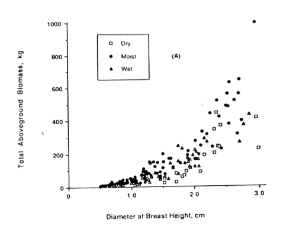

Measurement
==============

Introduction
------------

In the previous lectures, we have dealt with the general context for wanting to monitor and model land surface processes and terrestrial carbon exchanges in particular. We have also deal with how these carbon processes are currently modelled in DGVMs and similar tools. We have emphasises the terrestrial vegetation components throughout, as (as we shall see) this is where remote sensing data have most to directly offer (it is difficult at best to monitor soil carbon stocks and fluxes from Earth Observation (EO)).

In this section, we will introduce ideas of measurement of quantities pertinent to terrestrial carbon. The material presented will be an overview only that students are expected to read through. The 'lecture' session this week will be run as a set of student-led seminars on particular aspects of this material (details below). 

You should all read the key papers:

*  `Balsamo et al. (2018), Satellite and In Situ Observations for Advancing Global Earth Surface Modelling: A Review, Remote Sensing, doi:10.3390/rs10122038 <https://www.mdpi.com/2072-4292/10/12/2038>`_
* `Schimel et al. (2014) Observing terrestrial ecosystems and the carbon cycle from space: a review,  https://doi.org/10.1111/gcb.12822 <https://onlinelibrary.wiley.com/doi/abs/10.1111/gcb.12822>`
*  `Pasetto et al. (2018) Integration of satellite remote sensing data in ecosystem modelling at local scales: Practices and trends <https://besjournals.onlinelibrary.wiley.com/doi/full/10.1111/2041-210X.13018>`_
* ` Exbryat et al (2019) Understanding the Land Carbon Cycle with Space Data: Current Status and Prospects <https://link.springer.com/article/10.1007%2Fs10712-019-09506-2>`_

Broadly, we need to concern ourselves with: 

* disturbance (e.g. fire, disease, logging, but concentrating on fire here)
* measurement of Carbon stocks (i.e. how much carbon is there in different pools (e.g. leaf, wood, roots)) and what are the (longer term) changes in these stocks?);
* measurement of Carbon fluxes (i.e. what are the rates (on short time scales, seconds, hours, days, or months) of carbon exchanges and how are these partitioned (e.g. GPP, respiration)?);

We can more simply state the first two of these as 'state' and 'rates'. Disturbance then, is the sudden change of state.

This division gives us 8 topics:

* Disturbance: Remote Sensing Methods
* Disturbance: Emissions
* Disturbance: Models
* Carbon stocks: Biomass density from ground data and allometric relationships
* Carbon stocks: Ground-based measurements of leaf area
* Carbon stocks: Biomass density from remote sensing
* Carbon fluxes: Flux tower measurements
* Carbon fluxes: Remote Sensing measurements

You will work on the presentations in teams of 2-3 people per team. You will be asked to organise yourselves into these teams so that all topics are covered. If you do not do so, you will be allocated a team.

The material you prepare and distribute should be informative enough that you could use it as a basis for answering exam questions on the topic of carbon-related measurements. If you look at exam papers for previous years, you will notice that it typically includes a question on topics from this material.

For the presentations, you should prepare:

* a 10 minute ppt presentation on the topic
* 1-2 pages of text, summarising the main points of your talk, as a pdf to be distributed to the whole class
* a page of references used, as a pdf to be distributed to the whole class

You will have a chance to present your slides live to the class during class sessions in the 'presentation week'. 

Disturbance
-----------

One of the most important aspects of disturbance that Remote Sensing is able to have a significant impact on is fire, so we will concentrate on that here. 

One result of wildfire is the injection of particulates and gasses from the land surface into the atmosphere. There are several ways in which EO contributes to the monitoring of emissions from fires: (i) emissions accounting, where EO-based estimates of burned area (e.g. the MODIS burned area product) is used in the framework of Crutzen/Seiler to provide the IPCC Greenhouse Gas (GHG) Inventory Process; (ii) monitoring and modelling of biomass burning plumes; (iii) (atmospheric) remote sensing of trace gasses and proxies; (iv) fire radiative energy (related to CO2 emissions from wildfire), being a temporal integral of fire radiative power (measured from thermal EO); and (v) optical remote sensing of land surface change, attributed to fire impacts (burned area mapping). 

We define three categories to be investigated in the student presentations: emissions, models, and remote sensing methods. Some references to get you started in the subject area are provided, but you will need to read more widely than this and do your own research as well. Since this section is on measurements, you should concentrate on issues such as the physical basis for the measurements made, what we have learned from measurements, and how measurements are used. Clearly, the modelling section will have less on actual measurements, but is here to allow us to relate the measurement material to the modelling work we have been looking at. 

Remote Sensing Methods 
~~~~~~~~~~~~~~~~~~~~~~

* http://www.esa.int/msg/
* Paugam, R. et al. 2016, A review of approaches to estimate wildfire plume injection height within large-scale atmospheric chemical transport models, 10.5194/acp-16-907-2016
* Xu, W. et al. 2020, First Study of Sentinel-3 SLSTR Active Fire Detection and FRP Retrieval: Night-time Algorithm Enhancements and Global Intercomparison to MODIS and VIIRS AF Products, https://doi.org/10.1016/j.rse.2020.111947
* Zhang, T. Et al. 2020, Trends in eastern China agricultural fire emissions derived from a combination of geostationary (Himawari) and polar (VIIRS) orbiter fire radiative power products, https://doi.org/10.5194/acp-20-10687-2020 
* Johnston, J et al, 2020, Development of the user requirements for the Canadian wildfiresat satellite mission, https://doi.org/10.3390/s20185081
* Fisher D., Wooster, M. 2019, Multi-decade global gas flaring change inventoried using the ATSR-1, ATSR-2, AATSR and SLSTR data records, https://doi.org/10.1016/j.rse.2019.111298
* Simpson, J. Et al., 2016, Tropical Peatland Burn Depth and Combustion Heterogeneity Assessed Using UAV Photogrammetry and Airborne LiDAR, https://doi.org/10.3390/rs8121000 
* Wooster M et al., 2016, LSA SAF Meteosat FRP products-Part 1: Algorithms, product contents, and analysis, https://doi.org/10.5194/acp-15-13217-2015 
* Roberts, G and Wooster M, 2014, Development of a multi-temporal Kalman filter approach to geostationary active fire detection & fire radiative power (FRP) estimation, https://doi.org/10.1016/j.rse.2014.06.020
* Disney, M. et al., 2011, 3D radiative transfer modelling of fire impacts on a two-layer savanna system, https://doi.org/10.1016/j.rse.2011.03.010
* D.P. Roy, et al. (2005) Prototyping a global algorithm for systematic fire-affected area mapping using MODIS time series data, Remote Sensing of Environment Volume 97, Issue 2 , 30 July 2005, Pages 137-162
* Boschetti, L et al. 2019, Global validation of the collection 6 MODIS burned area product, https://doi.org/10.1016/j.rse.2019.111490
* Roy, D.P. et al, (2019) Landsat-8 and Sentinel-2 burned area mapping - a combined sensor multi-temporal change detection approach, 10.1016/j.rse.2019.111254

Emissions
~~~~~~~~~~

* see `UNFCC documents and news <https://gfmc.online/?s=fire+emissions>`_ 
* Penman, J. et al., 2003, `IPCC Good Practice Guidance Manual <https://github.com/UCL-EO/geog0133/blob/main/docs/pdf/IPCC_GPG_LULUCF_merged.pdf>`_
* Crutzen, P.J., L.E. Heidt, J.P. Krasnec, W.H. Pollock and W. Seiler,  1979: Biomass burning as a source of atmospheric gases CO, H2,  N2O, NO, CH3Cl and COS. Nature, 282, 253-256.
* Seiler, W. and P.J. Crutzen, 1980: Estimates of gross and net fluxes of carbon between the biosphere and the atmosphere from  biomass burning. Climatic Change, 2, 207-247
* Giglio, L. et al. 2013, Analysis of daily, monthly, and annual burned area using the fourth‐generation global fire emissions database (GFED4),  https://doi.org/10.1002/jgrg.20042
* Van der Werf, G et al., 2017, Global fire emissions estimates during 1997-2016, 10.5194/essd-9-697-2017
* DeFries et al., 2008, Fire‐related carbon emissions from land use transitions in southern Amazonia, https://doi.org/10.1029/2008GL035689
* Castellanos, P. Et al., 2014, Satellite observations indicate substantial spatiotemporal variability in biomass burning NOx emission factors for South America, Atmos. Chem. Phys., 14, 3929–3943, 2014 www.atmos-chem-phys.net/14/3929/2014/
* Sloan, S et al., 2017, Fire activity in Borneo driven by industrial land conversion and drought during El Niño periods, 1982–2010, https://doi.org/10.1016/j.gloenvcha.2017.10.001

Models
~~~~~~

* Bond et al., 2004, The global distribution of ecosystems in a world without fire,  https://doi.org/10.1111/j.1469-8137.2004.01252.x
* van Marle, M. J. E., Kloster, S., Magi, B. I., Marlon, J. R., Daniau, A.-L., Field, R. D., et al. (2017). Historic global biomass burning emissions based on merging satellite observations with proxies and fire models (1750 - 2015). Geoscientific Model Development, 10, 3329-3357. doi:10.5194/gmd-2017-32.
* Li, F. Et al, 2012, A process-based fire parameterization of intermediate complexity in a Dynamic Global Vegetation Model, Biogeosciences, 9, 2761–2780, 2012, www.biogeosciences.net/9/2761/2012/
* Thornike, K. Et al., 2001, The role of fire disturbance for global vegetation dynamics: coupling fire into a Dynamic Global Vegetation Model,  https://doi.org/10.1046/j.1466-822X.2001.00175.x
* Li, F., Val Martin, M. , Andreae, M.O. et al., (2019) Historical (1700–2012) global multi-model estimates of the fire emissions from the Fire Modeling Intercomparison Project (FireMIP). Atmospheric Chemistry and Physics, 19 (19). pp. 12545-12567. ISSN 1680-7316
* Johnston, J et al, 2018, Satellite detection limitations of sub-canopy smouldering wildfires in the north american boreal forest, https://doi.org/10.3390/fire1020028
* Archibald et al., 2013, Defining pyromes and global syndromes of fire regimes, Proc. Natl. Acad. Sci. U.S.A., 110 (16) (2013), pp. 6442-6447

Measurement and inference of Stocks
-----------------------------------

Biomass density from ground data and allometric relationships
~~~~~~~~~~~~~~~~~~~~~~~~~~~~~~~~~~~~~~~~~~~~~~~~~~~~~~~~~~~~~~~

The 'simplest' (or at least the most direct way) way of measuring carbon stocks is destructive measurement (i.e. chop down a tree and measure the carbon content of the leaves and wood: roots are in any case more tricky), but clearly it would be fruitless to remove all terrestrial carbon stocks just to measure them. Because of this, sampling is required. Because of the historical interest of 'foresters' in timber, various efficient ways have been devised to estimate timber volume. Examples of this include Brown et al. (1989) who attempt to establish protocols for above ground biomass (AGB) for tropical forests. Note that 'foresters' estimates of 'useable timber' AGB will always be lower than the total AGB.

Most of these methods use measures 'easy' to obtain in the field to calibrate 'allometric' relationships with timber volume of AGB. Most typically the core measurement is DBH (trunk diameter at breast height). Sometimes, different allometric relationships are applied for different classes of tree (e.g. species for forestry, or other classifications for AGB estimates).

*Scatterplot of AGB (kg) against DBH (cm) from Brown et al. (1989)*

Note that there may be significant scatter, especially for higher biomass levels in such relationships. Other terms may be used to contribute to the allometric relationships, such as tree height and wood density or specific gravity. Since area-based estimates are typically required, some way of accounting for number density is also required. Since not all tree components are generally sampled or accounted for 'expansion factors' may generally be required to account for these.

In reviewing this subject, you should consider the likely accuracy of such measurements and the complexities involved. You should also consider other ground-based methods that are applied and some of the methods applied to scaling up estimates (e.g. simple regression/GIS modelling). You will find the FAO primer by Brown (1997) useful for this.

You should also consider how these methods are/can be used to monitor biomass change.

It would also be of relevance to make yourself aware of REDD+.

You might also like to consider how the below ground components of vegetation carbon stocks can be estimated/measured, as well as soil carbon.

Starting points for reading:

* REDD (2008) `The little REDD book <http://www.theredddesk.org/redd_book>`_
* Woods Hole Research Centre field guides: `Forest Biomass and Carbon Estimation <http://www.whrc.org/resources/fieldguides/carbon/index.html>`_
* Woods Hole Research Centre Field Guide for `forest biomass and carbon assessment <http://www.theredddesk.org/resources/reports/field_guide_for_forest_biomass_and_carbon_estimation>`_.
* Brown, S. 1997, Estimating Biomass and Biomass Change of Tropical Forests: a Primer. `(FAO Forestry Paper - 134) <http://www.fao.org/docrep/w4095e/w4095e00.htm#Contents>`_
* Brown, S., Gillespie, A.J.R., Lugo, A.E. (1989) Biomass estimation methods for tropical forests with application to forest inventory data, Forest science 15(4), 881-902.
* Taylor, D., Hamilton, A.C., Lewis, S.L., Nantale, G. (2008) Thirty-Eight years of change in a tropical forest: plot data from Mpanga forest reserve, Uganda. African Journal of Ecology, 46, 655-667.
* Malhi Y, Wood D, Baker TR, Wright J, Phillips OL, Cochrane T, Meir P, Chave J, Almeida S, Arroyo L, Higuchi N, Killeen TJ, Laurance SG, Laurance WF, Lewis SL, Monteagudo A, Neill DA, Vargas PN, Pitman NCA, Quesada CA, Salomao R, Silva JNM, Lezama AT, Terborgh J, Martinez RV, Vinceti B. (2006) The regional variation of aboveground live biomass in old-growth Amazonian forests. Global Change Biology, 12: 1107-1138.
* Baker, T. R., Phillips, O. L., Malhi, Y., Almeida, S., Arroyo, L., Di Fiore, A., Killeen, T., Laurance, S. G., Laurance, W. F., Lewis, S. L., Lloyd, J., Monteagudo, A., Neill, D., Patino, S., Pitman, N., Silva, N. & Martinez, R. V. (2004a) Variation in wood density determines spatial patterns in Amazonian forest biomass. Global Change Biology, 10, 545-562.
* Kristiina A. Vogt, Daniel J. Vogt and Janine Bloomfield (1998) Analysis of some direct and indirect methods for estimating root biomass and production of forests at an ecosystem level, Plant and Soil, 1998, Volume 200, Number 1, Pages 71-89
* Clark and Kellner (2012) Tropical forest biomass estimation and the fallacy of misplaced concreteness. J. Veg. Sci. 23, 1191 – 1196. (doi:10. 1111/j.1654-1103.2012.01471.x).
* Chave et al. (2014) Improved allometric models to estimate the aboveground biomass of tropical trees. Glob. Change Biol. 20, 3177 – 3190. (doi:10.1111/ gcb.12629)
* Calders et al. (2015) Non-destructive estimates of above-ground biomass using terrestrial laser scanning. Methods Ecol. Evol. 6, 198 – 208. (doi: 10.1111/2041-210X.12301)
* Gonzalez de Tanago et al (2017) Estimation of above-ground biomass of large tropical trees with Terrestrial LiDAR. Methods Ecol. Evol.
* Disney MI, Boni Vicari M, Burt A, Calders K, Lewis SL, Raumonen P, Wilkes P (2018) Weighing trees with lasers: advances, challenges and opportunities. Interface Focus 8(2): 20170048. https://doi.org/10.1098/rsfs.2017.0048

Ground-based measurements of leaf area
~~~~~~~~~~~~~~~~~~~~~~~~~~~~~~~~~~~~~~~

As with biomass, measurement of LAI can be carried out destructively, but this is time consuming and costly. It is more usual therefore to apply methods that in some way rely on measurements of canopy transmission or gap fraction. A typical example of the former is the LAI2000 instrumentAs with biomass, measurement of LAI can be carried out destructively, but this is time consuming and costly. It is more usual therefore to apply methods that in some way rely on measurements of canopy transmission or gap fraction. A typical example of the former is the LAI2000 instrument that i that i measurement is taken above and below a canopy, and the transmission inferred. From this, LAI is then inferred. Care must be taken in using this instrument and interpreting the data, as factors such as clumping are not well-treated and the measure is essentially an 'effective' LAI.

More generally, some measure of gap fraction is used (see e.g. Welles & Cohen, 1996). In recent years, the use of digital photography (with a fisheye lens) has become commonplace.

You will find that there is much repetative literature in this area.

Ground-based measurements of LAI (and related fractional cover) are also very important for the 'validation' of satellite products of these measures.

* Stenberg et al. (1994) Performance of the LAI-2000 plant canopy analyze3r in estimating leaf area index of some scots pine stands, Tree physiology, 14, 981-995.
* Jon M. Welles and Shabtai Cohen (1996) Canopy structure measurement by gap fraction analysis using commercial instrumentation,     J. Exp. Bot. (1996) 47 (9): 1335-1342. doi: 10.1093/jxb/47.9.1335
* Nilson, T. and Kuusk, A., 2004, Improved algorithm for estimating canopy indices from gap fraction data in forest canopies, Agricultural and Forest Meteorology 124 (2004) 157-169
* Jonckheere et al. `Methods for Leaf Area Index Determination Part I: Theories, Techniques and Instruments <http://www.google.co.uk/url?sa=t&rct=j&q=lai%20digital%20photography%20leaf%20area&source=web&cd=1&ved=0CCUQFjAA&url=http%3A%2F%2Fw3.avignon.inra.fr%2Fvaleri%2Fdocuments%2FJonckheereAFM2003Accepted.pdf&ei=2ItHT6yBK82n8QP_8ommDg&usg=AFQjCNGo7vZVb3JFfwoQMR-k9WIEjvaiEQ&cad=rja>`_.
* Nathalie J. J. Bréda(2003) round-based measurements of leaf area index: a review of methods, instruments and current controversies, J. Exp. Bot. (2003) 54 (392): 2403-2417. doi: 10.1093/jxb/erg263
* `VALERI <http://w3.avignon.inra.fr/valeri/fic_htm/documents/main.php>`_
* C. Justice, A. Belward, J. Morisette, P. Lewis, J. Privette, F. Baret Developments in the validation of satellite products for the study of the land surface. International Journal of Remote Sensing 21(17) 3383-3390
* Li et al. (2018) http://www.mdpi.com/2072-4292/10/1/148
* Woodgate et al. (2015) An improved theoretical model of canopy gap probability for Leaf Area Index estimation in woody ecosystems, Forest Ecology and Management, 358, 303-320.

Biomass density from remote sensing
~~~~~~~~~~~~~~~~~~~~~~~~~~~~~~~~~~~~~

Whilst relationships can be calibrated between optical remote sensing measurements transformed to vegetation indices, and (above ground) biomass (e.g. Samimi and Kraus, 2004), these tend to be only quite local in their application, partly due to factors such as non-green biomass to which are not accounted for in such data (Gamon et al., 1995). There are arguments that a time integral of measures such as NDVI can provide more robust estimates, but this is essentially based on a PEM view of GPP and NPP and discussed more below.

The most promising EO technologies for biomass estimation are radar and lidar. The main reason for radar being useful is that the longer wavelength SARs in particular are mainly responsive to scattering from particlular tree branch/trunk components so backscatter can be broadly related to biomass. A problem is the saturation of these relationships at high biomass volumes.

SAR backscatter data can be supplemented with height estimates from interferometry in some cases, but decoherence over vegetation canopies makes this difficult to achieve with repeat pass methods. If height can be estimated, then allometric relationships can be applied to estimate AGB. Height estimates however require some estimate of both the scattering height in the canopy and the ground scattering height. This can sometimes be achieved with polarimetric data. In fact, decoherence itself is seen as a source of information, the idea being essentially that the decoherence is greater the higher the trees.

Another technology of value here is lidar measuremenmt, which aims to estimate tree or canopy height from the detection of ground and crown responses in a lidar waveform or the detection of ground and crown lidar 'hits' in discrete lidar data. Again, the translation to biomass relies on allometric relationships with height.

Starting points for reading:

* Duncanson L, Rourke O, Dubayah R. 2015 Small sample sizes yield biased allometric equations in temperate forests. Nat. Sci. Rep. 5, 17153. (doi: 10.1038/srep17153
* Houghton RA, Nassikas AA. 2017 Global and regional fluxes of carbon from land use and land cover change 1850 – 2015. Glob. Biogeochem. Cycles 31, 456 – 472. (doi:10.1002/2016GB005546)
* Houghton RA, Byers B, Nassikas AA. 2015 A role for tropical forests in stabilizing atmospheric CO2. Nat. Clim. Change 5, 1022 – 1023. (doi:10.1038/ nclimate2869)Saatchi S et al. 2011 Benchmark map of forest carbon stocks in tropical regions across three continents. Proc. Natl Acad. Sci. USA 108, 9899 – 9904. (doi:10.1073/pnas.1019576108)
* Baccini A et al. 2012 Estimated carbon dioxide emissions from tropical deforestation improved by carbon-density maps. Nat. Clim. Change 2, 182 – 185. (doi:10.1038/nclimate1354)
* Mitchard ET, Saatchi SS, Baccini A, Asner GP, Goetz SJ, Harris NL, Brown S. 2013 Uncertainty in the spatial distribution of tropical forest biomass: a comparison of pan-tropical maps. Carbon Balance Manage. 8, 10. (doi:10.1186/1750-0680-8-10)
* Mitchard ET et al. 2014 Markedly divergent estimates of Amazon forest carbon density from ground plots and satellite. Glob. Ecol. Biogeogr. 23, 935 – 946. (doi:10.1111/geb.12168)
* John A. Gamon, Christopher B. Field, Michael L. Goulden, Kevin L. Griffin, Anne E. Hartley, Geeske Joel, Josep Penuelas and Riccardo Valentini (1995) Relationships Between NDVI, Canopy Structure, and Photosynthesis in Three Californian Vegetation Types, Ecological Applications, Vol. 5, No. 1, Feb., 1995  
* Lefsky, M. A, D. J Harding, M. Keller, W. B Cohen, C. C Carabajal, F. D.B Espirito-Santo, M. O Hunter, and R. de Oliveira Jr. 2005. Estimates of forest canopy height and aboveground biomass using ICESat. Geophysical Research Letters 32, no. 22: L22S02.
* Koch, B. 2010. Status and future of laser scanning, synthetic aperture radar and hyperspectral remote sensing data for forest biomass assessment. ISPRS Journal of Photogrammetry and Remote Sensing 65, no. 6 (November): 581-590. doi:10.1016/j.isprsjprs.2010.09.001.
* Dubayah, R. O, and J. B Drake. 2000. Lidar remote sensing for forestry. Journal of Forestry 98, no. 6: 44-46.
* ESA `Biomass mission <http://www.esa.int/esaLP/SEMFCJ9RR1F_index_0.html>`_
* Balzter, H. 2001. Forest mapping and monitoring with interferometric synthetic aperture radar (INSAR). Progess in Physical Geography, 25(2):159-177.
* Imhoff, M.L. (1995). Radar backscatter and biomass saturation: ramifications for global biomass inventory. IEEE Transactions on Geoscience and Remote Sensing, 33: 511-518.
* Le Toan, T.; Beaudoin, A.; Guyon, D. (1992). Relating forest biomass to SAR data. . IEEE Transactions on Geoscience and Remote Sensing, 30(2): 403-411.
* Thuy Le Toan, Shaun Quegan, Ian Woodward, Mark Lomas and Nicolas Delbart, et al. (2004) Relating Radar Remote Sensing of Biomass to Modelling of Forest Carbon Budgets Climatic Change, 2004, Volume 67, Numbers 2-3, Pages 379-402
* Elgene O. Box, Brent N. Holben and Virginia Kalb (1989) Accuracy of the AVHRR vegetation index as a predictor of biomass, primary productivity and net CO2 flux, Plant Ecology, 1989, Volume 80, Number 2, Pages 71-89
* Cyrus Samimi and Tanja Kraus (2004) Biomass estimation using Landsat-TM and -ETM+. Towards a regional model for Southern Africa? GeoJournal, 2004, Volume 59, Number 3, Pages 177-187

Measurement and inference of rates
-----------------------------------

Flux tower measurements
~~~~~~~~~~~~~~~~~~~~~~~

A good deal of what has been learned about the processes involved in terrestrial carbon, most certainly when it comes to testing models, has been done on the back of flux tower measurements. The majority of these use 'eddy covariance' methods that, under turbulent wind conditions, allow measurement of Net Ecosystem Productivity to be inferred from gas excahnge measurements (water vapour and CO2 mainly, but also e.g. methane). NEP can be inferred from the intergral of these measurements. Because they require turbulence, this method does not work well at night generally, so forms of 'gap filling' are applied. Other rate terms such as NEP or GPP can be inferred from the NEP data, usually through the application of a model.

For terrestrial ecosytems, instruments are generally mounted on a tower above the vegetation. Thy measure gas exchange from a 'footprint' around the tower, where the size of this depends on factors such as vegetation roughness (but may typically be around 1 km) and the direction of the footpring relative to the tower depends on the wind direction.

Other methods rely on measuring concentrations of gases, rather than fluxes. Fluxes can then be inferred assuming some model of atmospheric transport and surface exchange. These methods tend to cover larger areas. Examples are the 'ta;; towers' network, including e.g. measurements oon the `Angus mast in Scotland <http://www.geos.ed.ac.uk/abs/research/micromet/Current/chiotto/>`_.

Instruments such as the LiCor Li-8100A or other chamber instruments can be used for soil flux measurements or measurements over very short vegetation.

* Rayner, P. J. et al. Two decades of terrestrial carbon fluxes from a carbon cycle data assimilation system (CCDAS). Global Biogeochem. Cy. 19, GB2026 (2005).
* Rayner, P. J. The current state of carbon-cycle data assimilation. Curr. Opin. Env. Sust. 2, 289–296 (2010).
* LiCor `Why Use Eddy Covariance to Measure Flux? <http://www.licor.com/env/applications/eddy_covariance>`_
* J. H. Prueger et al. (2005) Tower and Aircraft Eddy Covariance Measurements of Water Vapor, Energy, and Carbon Dioxide Fluxes during SMACEX, JOURNAL OF HYDROMETEOROLOGY, 6,954-960.
* `CarboEurope <http://www.carboeurope.org/>`_ (also see AmeriFlux, AsiaFlux, KoFlux, OzFlux, ChinaFlux, FluxnetCanada)
* `fluxnet <http://fluxnet.ornl.gov/>`_
* `specnet <http://specnet.info/>`_
* Baldocchi, D.D . 2008. Breathing of the Terrestrial Biosphere: Lessons Learned from a Global Network of Carbon Dioxide Flux Measurement Systems. Australian Journal of Botany. 56, 1-26.
*  Baldocchi, D.; Falge, E.; Gu, L.; Olson, R.; Hollinger, D.; Running, S.; Anthoni, P.; Bernhofer, C.; Davis, K.; Evans, R.; Others, (2001). "FLUXNET: A New Tool to Study the Temporal and Spatial Variability of Ecosystem-Scale Carbon Dioxide". Bulletin of the American Meteorological Society 82(11):2415-2434. 
* chiotto `Tall tower Angus <http://www.geos.ed.ac.uk/abs/research/micromet/Current/chiotto/>`_.
* LiCor `Li-81000A <http://www.licor.com/env/products/soil_flux/>`_
* JANSSENS et al., 2000, Assessing forest soil CO2 efflux: an in situ comparison of four techniques, Tree Physiology 20, 23-32
* Norby, R.J., and Zak, D.R. (2011) Ecological Lessons from Free-Air CO2 Enrichment (FACE) Experiments, Annual Review of Ecology, `Evolution, and Systematics, Vol. 42: 181-203 <http://www.annualreviews.org/doi/full/10.1146/annurev-ecolsys-102209-144647>`_

Remote Sensing measurements
~~~~~~~~~~~~~~~~~~~~~~~~~~~~

It is difficult to measure land surface rate terms directly from EO, but as reviewed by Grace et al. (2007) the closest we can get to these are probably those that directly relate to photosynthesis, such as fluorescence and PRI. There are certainly some complexities to the interpretation of such data, but it is very exciting to think that we can now demonstrate that such measurements are feasible from space.

Another technology that can measure something related to CO2 rates is fire radiative power from thermal instruments. This can be directly related to the rate of carbon release by fire and integrated to obtain the amount of biomass consumed by the fire.

The most *common* way of trying to estimate NPP and GPP from EO measurements involves the use of fAPAR or NDVI (or similar) measurements from optical data. We have seen earlier how fAPAR fits into estimates of GPP, both in the Sellers (1992) scaling of leaf photosynthesis and respiration and in the PEM approach. There is *much* literature on these subjects, but see Prince and Goward (1995) for one of the core papers on this. See also Potter et al. (1993). See e.g.  the various Gobron et al. papers for some background on fAPAR data.

Direct or indirect inference of LAI from EO is also relevant to driving and testing carbon models, so you should investigate papers on this subject (e.g. Baret et al. 2007)

One problem that has faced the EO community for some time is that there can be quite large discrepencies between different fAPAR and LAI products. This is partly down to different 'meanings' of LAI etc. (e.g. whether clumping is included, what sun angle the fAPAR data are for, whether they are fAPAR or interception). However, these same areas of 'confusion' also pervade the ecosystem modelling community.

Starting points for reading

* J. Grace, C. Nichol, M. Disney, P. Lewis, T. Quaife, P. Bowyer (2007), Can we measure terrestrial photosynthesis from space directly, using spectral reflectance and fluorescence?, Global Change Biology, 13 (7), 1484-1497., doi:10.1111/j.1365-2486.2007.01352.x.
* WWW1 http://www.nasa.gov/topics/earth/features/fluorescence-map.html
* J. Joiner, Y. Yoshida, A. P. Vasilkov, Y. Yoshida, L. A. Corp, and E. M. Middleton (2010) First observations of global and seasonal terrestrial chlorophyll fluorescence from space,  Biogeosciences Discuss., 7, 8281–8318, 2010
* Christian Frankenberg Joshua B. Fisher, John Worden, Grayson Badgley, Sassan S. Saatchi, Jung‐Eun Lee, Geoffrey C. Toon, André Butz, Martin Jung, Akihiko Kuze, and Tatsuya Yokota (2011) New global observations of the terrestrial carbon cycle from GOSAT: Patterns of plant fluorescence with gross primary productivity,  EOPHYSICAL RESEARCH LETTERS, VOL. 38, L17706, doi:10.1029/2011GL048738, 2011
* L. Guanter, L. Alonso, L. Gómez-Chova, J. Amorós-López, J. Vila, and J. Moreno (2007) Estimation of solar-induced vegetation fluorescence from space measurements, Geophysical Research Letters, 34, L08401, doi:10.1029/2007GL029289, 2007.
* Justice, C. O., Giglio, L., Korontzi, S., Owens, J., Morisette, J. T., Roy, D., Descloitres, J., Alleaume, S., Petitcolin, F., & Kaufman, Y. (2002). The MODIS fire products. Remote Sensing of Environment, 83, 244-262.
* Wooster, M. J., G. Roberts, G. L. W. Perry, and Y. J. Kaufman (2005), Retrieval of biomass combustion rates and totals from fire radiative power observations: FRP derivation and calibration relationships between biomass consumption and fire radiative energy release, J. Geophys. Res., 110, D24311, doi:10.1029/2005JD006318. 
* Roberts, G., M. J. Wooster, G. L. W. Perry, N. Drake, L.-M. Rebelo, and F. Dipotso (2005), Retrieval of biomass combustion rates and totals from fire radiative power observations: Application to southern Africa using geostationary SEVIRI imagery, J. Geophys. Res., 110, D21111, doi:10.1029/2005JD006018.
* Stephen D. Prince and Samuel N. Goward (1995) Global Primary Production: A Remote Sensing Approach, Journal of Biogeography, Vol. 22, No. 4/5
* Potter C,.S., et al. (1993) Terrestriial ecosystem production: a process model based on global satellite and surface data. Global Biogeochem. Cycles, 7,811-841.
* Gobron, N., Knorr, W., Belward, A. S., Pinty, B. (2010) Fraction of Absorbed Photosynthetically Active Radiation (FAPAR).  Bulletin of the American Meteorological Society, 91(7):S50-S51.
* Gobron, N., Pinty, B., Aussedat, O., Chen, J. M., Cohen, W. B., Fensholt, R., Gond, V., Lavergne, T., Mélin, F., Privette, J. L., Sandholt, I., Taberner, M., Turner, D. P., Verstraete, M. M., Widlowski, J.-L. (2006) Evaluation of Fraction of Absorbed Photosynthetically Active Radiation Products for Different Canopy Radiation Transfer Regimes: Methodology and Results Using Joint Research Center Products Derived from SeaWiFS Against Ground-Based Estimations.  Journal of Geophysical Research Atmospheres, 111(13), D13110.
* Gobron, N., Pinty, B., Verstraete, M. M., Widlowski, J.-L. (2000) Advanced Vegetation Indices Optimized for Up-Coming Sensors: Design, Performance and Applications.  IEEE Transactions on Geoscience and Remote Sensing, 38(6):2489-2505.  DOI: 10.1109/36.885197
* Baret, F., O. Hagolle, B. Geiger, P. Bicheron, B. Miras, M. Huc, B. Berthelot, f. Nino, M. Weiss, O. Samain, J.L. Roujean, and M. Leroy, LAI, FAPAR, and FCover CYCLOPES global products derived from Vegetation. Part 1 : principles of the algorithm, Remote Sensing of Environment, 110:305-316, 2007.
* Garrigues, S., R. Lacaze, F. Baret, J.T. Morisette, M. Weiss, J. Nickeson, R. Fernandes, S. Plummer, N.V. Shabanov, R. Myneni, W. Yang, Validation and Intercomparison of Global Leaf Area Index Products Derived From Remote Sensing Data, Journal of Geophysical Research, 113, G02028, doi:10.1029/2007JG000635, 2008.
* Weiss, M., F. Baret, S. Garrigues, and R. Lacaze, LAI and FAPAR CYCLOPES global products derived from Vegetation. Part 2 : validation and comparison with MODIS C4 products, Remote Sensing of Environment, 110:317-331, 2007.
* J.L. Widlowski, B. Pinty, M. Clerici, Y. Dai, M. De Kauwe, K. de Ridder, A. Kallel, H. Kobayashi, T. Lavergne, W. Ni-Meister, A. Olchev, T. Quaife, S. Wang, W. Yang, Y. Yang, and H. Yuan (2011), RAMI4PILPS: An intercomparison of formulations for the partitioning of solar radiation in land surface models, Journal of Geophysical Research, 116, G02019, 25, DOI: 10.1029/2010JG001511. 
* Disney et al. (2016) A new global fAPAR and LAI dataset derived from optimal albedo estimates: comparison with MODIS products, Remote Sensing, 8(4), 275; doi:10.3390/rs8040275.
* Disney (2016) Remote sensing of vegetation: potentials, limitations, developments and applications. In: K. Hikosaka, K., Niinemets, U. and Anten, N. P. R. (eds) Canopy Photosynthesis: From Basics to Applications. Springer Series: Advances In Photosynthesis and Respiration, Springer, Berlin, pp289-331. ISBN: 978-94-017-7290-7. DOI: 10.1007/978-94-017-7291-4. See PDF: 
* MacBean, N. et al. Using satellite data to improve the leaf phenology of a global terrestrial biosphere model. Biogeosciences 12, 7185–7208 (2015). 
* Joiner, J. et al. The seasonal cycle of satellite chlorophyll fluorescence observations and its relationship to vegetation phenology and ecosystem atmosphere carbon exchange. Remote Sens. Environ. 152, 375–391 (2014).
* Macbean et al. (2018) Strong constraint on modelled global carbon uptake using solar-induced chlorophyll fluorescence data, https://www.nature.com/articles/s41598-018-20024-w
* Sun, Y. et al. OCO-2 advances photosynthesis observation from space via solar-induced chlorophyll fluorescence. Science 358, doi: 10.1126/science.aam5747 (2017).
* Frankenberg, C. et al. New global observations of the terrestrial carbon cycle from GOSAT: Patterns of plant fluorescence with gross primary productivity. Geophys. Res. Lett. 38, L17706 (2011).
* Guanter, L. et al. Retrieval and global assessment of terrestrial chlorophyll fluorescence from GOSAT space measurements. Remote Sens. Environ. 121, 236–251 (2012). 
* Liu et al. (2011) Global long-term passive microwave satellite-based retrievals of vegetation optical depth, Geophysical Research Letters, 38 (2011)
* Liu et al., 2015 Recent reversal in loss of global terrestrial biomass, Nature Climate Change, 5 (2015), pp. 470–474

Conclusions
------------

In these notes, we have tried to be reasonably comprehensive, if brief in pointing out some of the major measurement technologies for measuring carbon stocks and fluxes. The text is deliberately brief as the aim is for the students to pick a topic within those covered here (or in something related, in agreement with the course tutor)  and to prepare a short seminar on the subject. This is likely best conducted in small teams (e.g. 2 or 3 people). You should prepare a small number of slides, but mostly you should be in a position to talk to the rest of the class about the subject and respond to questions.

One of the implicit aims here is to make sure that you read around the subject, so, although this seminar is not formally assessed, we are expecting some intellectual depth to your presentation and discussion.

Since you will, of necessity, be concentrating on one of the topics above (or even part of one of these), you should make sure that in further reading following the seminar you delve into some of the key literature for the other topics.

The amount of time available for each talk will depend on the number of students taking the course, so this will be discussed with the course tutor.

