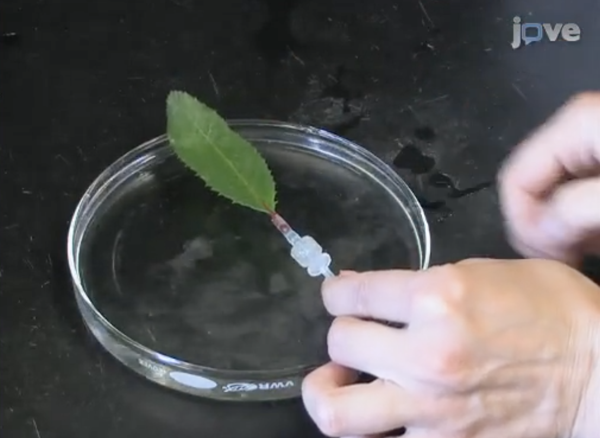

Synthesis
=========

So far in the course we have look at components of Terrestrial Carbon and Modelling and Monitoring methods in isolation. However, in many projects and papers these are brought together. Here we will present two case studies to summarise this synthesis process. 

CASE STUDY 1 - Forest Biomass and NPP
~~~~~~~~~~~~~~~~~~~~~~~~~~~~~~~~~~~~~~~~

The processes discussed so far in the course lead to the sequestration of carbon into biomass. How can we observe this process and how does it relate to productivity levels?

The largest contribution to global Terrestrial Biomass comes from forest where the majority of the Biomass is with the trunks, branches and roots of trees. This overall size of a tree has been summarised by a single value over a long history of forestry surveys. This value is "Diameter at Breast Height" or DBH. The value relates to a measurement easily and repeatably performed by a single person on foot. These values are then extrapolated using allometric relationships to estimate the total biomass of a tree. While there is large amounts of uncertainty in this method, by performing repeated and consistent surveys of different forests, variations in biomass between biome and over time can be investigated.

Recently these single value estimations have been improved by the use of "Terrestrial Laser Scanning" as developed here at UCL. Instead of a single measurement to represent a tree, a point cloud is observed that can be used to directly observe the volume of a tree, or even a forest. This is then combined with the weight of a felled tree to get accurate knowledge of a trees biomass.

.. figure:: figures/disney_tls.png
    :width: 90%

[Source: `Disney et al. 2019, <https://doi.org/10.1007/s10712-019-09527-x>`_]

However, while this new technique is much more accurate than surveys of DBH, there is a still a place for the older method. There is a long history of DBHY data, and in some locations it is not feasible to perform a TLS scan of a whole forest, or the volume of data produced may be too high to work with. The new method can be used to improve the allometric relationships that rely of DBH, and reveal where the uncertainties lie.

.. figure:: figures/disney_dbh.png
    :width: 60%

[Source: `Disney et al. 2019, <https://doi.org/10.1007/s10712-019-09527-x>`_]

Moving from a tree and forest level to global data, a new method is needed. It is not feasible to survey all of the worlds forests, let alone observing changes to these forests. For this there is satellite remote sensing data available.

The Laser Altimeter `GEDI, <https://www.earthdata.nasa.gov/data/projects/gedi>`_ onboard the ISS is designed to monitor terrestrial carbon systems and forests. However, from orbit it is not possible to observed the single trees measured by DBH or TLS systems so we need a new value to investigate - Canopy Height. The laser instrument of GEDI can show the difference between the elevation of the ground and top of a forest canopy. This height is directly related to the size of a tree, and thus the biomass contained in a forest. To get accurate values from GEDI data the canopy height needs to be compared to the detailed data obtained from TLS surveys, and the wide coverage and variations seen in DBH surveys.

Another aspect than can be investigated using this data is the total productivity of a forest. A   taller thicker canopy cover will contain more leaves and will thus have a higher photosynthetic potential. However, there are more complications to deal here. There are key variations in photosynthesis levels between species and age of a tree. Future work in this field will aim to understand all these variations.

[Source: `He et al. 2012, <https://onlinelibrary.wiley.com/doi/abs/10.1029/2010GB003942>`_]

CASE STUDY 2 - Stomatal Conductance
~~~~~~~~~~~~~~~~~~~~~~~~~~~~~~~~~~~~~~~~

Stomatal conductance is the measure of gas exchange from the inside of a leaf to air around. Specifically, if is a measure of the rate of passage of carbon dioxide (CO2) exiting, or water vapour entering through the stomata of a leaf (e.g. in mmol m-2 s-2). The term conductance comes from analogy with electrical circuitry. It is controlled by the guard cells of the leaf stomata and controls transpiration rates and CO2 diffusion rates (along with gradients of water vapour and CO2).

Due to C02 restrictions on the rate of photosynthesis, stomatal conductance is a crucial control of a plants NPP. Guard cells at a leafs stomata will close to conserve water within a plant. This process is a key part of the process of water stress stopping the productivity of a plant. The accurate modelling of stomatal conductance is therefore a key part of DGVMs.

Knowledge of stomatal conductance starts at the leaf level. This can be investigated at the lab level with an individual leaf connected to an artificial water source and expose to varying light, temperature and ambient humidity levels. Sack and Scoffoni cover the process in extensive detail in this `video journal of the experimental methods <https://doi.org/10.3791/4179>`_ .

[Source: `Sack, L. and Scoffoni, C. 2012, <https://doi.org/10.3791/4179>`_]

These lab methods can be repeated for different species showing how different leafs specialise for different locations and environments. The crucial controls are also explored. Transpiration rates will change with changing ambient humidity and the guard cells will adjust to maintain the necessary stomal conductance for photosynthesis. The water supply can then be adjust to investigate how the leaf will respond to water stress. At what point or rate is transpiration reduced in order to maintain leaf level water levels? How does this relate to the leafs overall photosynthesis rate?

[Source: `Sack, L. and Scoffoni, C. 2012, <https://doi.org/10.3791/4179>`_]

In order to build this knowledge up to the biome and ultimately global scales needed within a DGVM, the lab based leaf level knowledge needs to be explored in a real setting. The next level of observations are at a forest level, with observation available from flux towers. While it is not possible to directly control the ambient conditions and water stress as performed in the lab, these variables can be all observed, for example the soil moisture levels.

The observations of ambient conditions rather than the direct controls available in lab settings make the interpretation of results more challenging. In the case of `Wang, 2012. <https://doi.org/10.1175/JHM-D-11-043.1>`_ the context an interpretation of results is achieved by using the various observations to fit the parameterisations of stomatal conductance used in many DGVMs. By seeing how well these parameterisations can be fitted and how these relate to prior results and usage the accuracy an applicability of the modelling methods can be assessed.

So these levels of knowledge of this example process has lead to a parameterisation of a DGVM. How can we assess the accuracy of the model on a global level? Compare to a PEM model. 

A PEM will not have the detail representation of Stomatal conductance within it's design, but the comparison is still useful if we select a good model. In particular the model needs to represent variations in ambient humidity and soil moisture. By selecting a PEM that incorporates this information (using humidity and precipitation form an atmospheric reanalysis for example), spatial and time correlations between water stress and plant activity can be represented. Can our DGVM with a parameterisation of stomatal conductance replicate these variations?

Reading
-------
* Disney, M. et al. 2019. Innovations in Ground and Airborne Technologies as Reference and for Training and Validation: Terrestrial Laser Scanning (TLS). Surveys in Geophysics. 40, 4 (Jul. 2019), 937–958. DOI:https://doi.org/10.1007/s10712-019-09527-x.
* He, L. et al. 2012. Relationships between net primary productivity and forest stand age in U.S. forests. Global Biogeochemical Cycles. 26, 3 (2012). DOI:https://doi.org/10.1029/2010GB003942.
* Sack, L. and Scoffoni, C. 2012. Measurement of Leaf Hydraulic Conductance and Stomatal Conductance and Their Responses to Irradiance and Dehydration Using the Evaporative Flux Method (EFM). Journal of Visualized Experiments (JoVE). 70 (Dec. 2012), e4179. DOI:https://doi.org/10.3791/4179.
* Tamiminia, H. et al. 2024. State-wide forest canopy height and aboveground biomass map for New York with 10 m resolution, integrating GEDI, Sentinel-1, and Sentinel-2 data. Ecological Informatics. 79, (Mar. 2024), 102404. DOI:https://doi.org/10.1016/j.ecoinf.2023.102404.
* Vorster, A.G. et al. 2020. Variability and uncertainty in forest biomass estimates from the tree to landscape scale: the role of allometric equations. Carbon Balance and Management. 15, 1 (May 2020), 8. DOI:https://doi.org/10.1186/s13021-020-00143-6.
* Wang, S. 2012. Evaluation of Water Stress Impact on the Parameter Values in Stomatal Conductance Models Using Tower Flux Measurement of a Boreal Aspen Forest. Journal of Hydrometeorology. 13, 1 (Feb. 2012), 239–254. DOI:https://doi.org/10.1175/JHM-D-11-043.1.
* Wang, S. et al. 2011. Relationships between net primary productivity and stand age for several forest types and their influence on China’s carbon balance. Journal of Environmental Management. 92, 6 (Jun. 2011), 1651–1662. DOI:https://doi.org/10.1016/j.jenvman.2011.01.024.

